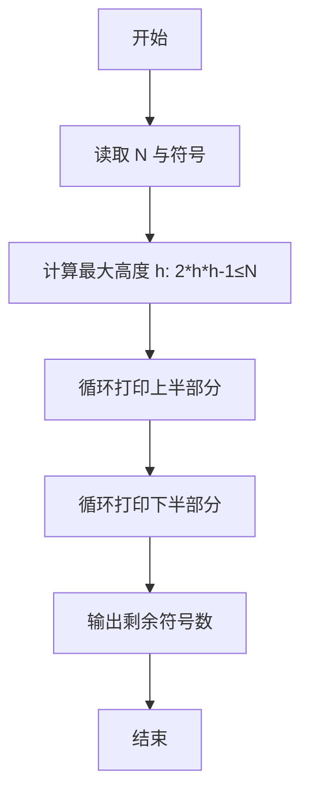
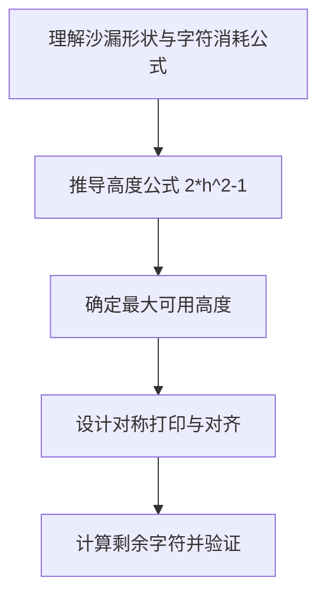

# L1-002 - 打印沙漏（20 分）

- **时间限制**: 400 ms
- **内存限制**: 65536 KB
- **代码长度限制**: 16 KB

---

## 题目描述


本题要求你写个程序把给定的符号打印成沙漏的形状。例如给定17个“*”，要求按下列格式打印
```
*****
 ***
  *
 ***
*****
```

所谓“沙漏形状”，是指每行输出奇数个符号；各行符号中心对齐；相邻两行符号数差2；符号数先从大到小顺序递减到1，再从小到大顺序递增；首尾符号数相等。

给定任意N个符号，不一定能正好组成一个沙漏。要求打印出的沙漏能用掉尽可能多的符号。

### 输入格式:

输入在一行给出1个正整数N（$$\le$$1000）和一个符号，中间以空格分隔。

### 输出格式:

首先打印出由给定符号组成的最大的沙漏形状，最后在一行中输出剩下没用掉的符号数。

### 输入样例:
```in
19 *
```

### 输出样例:
```out
*****
 ***
  *
 ***
*****
2
```

## 示例

### 示例 1

**输入:**
```
19 *
```

**输出:**
```
*****
 ***
  *
 ***
*****
2
```

### 解题思路

本题的核心逻辑为：高度为 $h$ 的沙漏共使用 $2h^2-1$ 个字符。逐步增加 $h$，找到不超过 $N$ 的最大值；再按奇数宽度打印上下两半。根据题意将输入转化为可计算的模型后，直接按规则求解即可。

数据结构上主要使用 字符串重复拼接（`string.rep`）、循环枚举。通过 Lua 的基础控制结构（条件与循环）配合字符串/数值处理完成核心判断与转换，逻辑直观易于实现。

关键步骤在于准确解析输入、按题面规则处理边界（如空格、符号、进制、整除等）并保证输出格式与样例完全一致。整体时间复杂度多为线性或常数级，满足限制。

### 代码流程说明

1. **读取输入**：通过 `io.read` 读取输入数据（按行或按 token 解析），并按需转换为数值或字符串。
2. **核心处理**：高度为 $h$ 的沙漏共使用 $2h^2-1$ 个字符。逐步增加 $h$，找到不超过 $N$ 的最大值；再按奇数宽度打印上下两半。
3. **格式化构造**：使用字符串重复/拼接构造输出行。
4. **输出结果**：按题目指定格式通过 `print`/`io.write` 输出答案。

### 代码实现

```lua
-- 实现原理：高度为 h 的沙漏共使用 2*h*h-1 个字符。
-- 逐步增加 h，找到不超过 N 的最大值；再按奇数宽度打印上下两半。
local n, ch = io.read("*n"), io.read("*l"):match("%S")
local h = 1
while 2 * (h + 1) * (h + 1) - 1 <= n do h = h + 1 end

for row = h, 1, -1 do
    print(string.rep(" ", h - row) .. string.rep(ch, 2 * row - 1))
end
for row = 2, h do
    print(string.rep(" ", h - row) .. string.rep(ch, 2 * row - 1))
end
print(n - (2 * h * h - 1))
```

### 代码流程图



### 解题流程图


