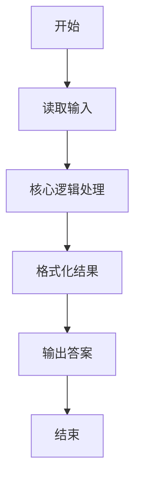
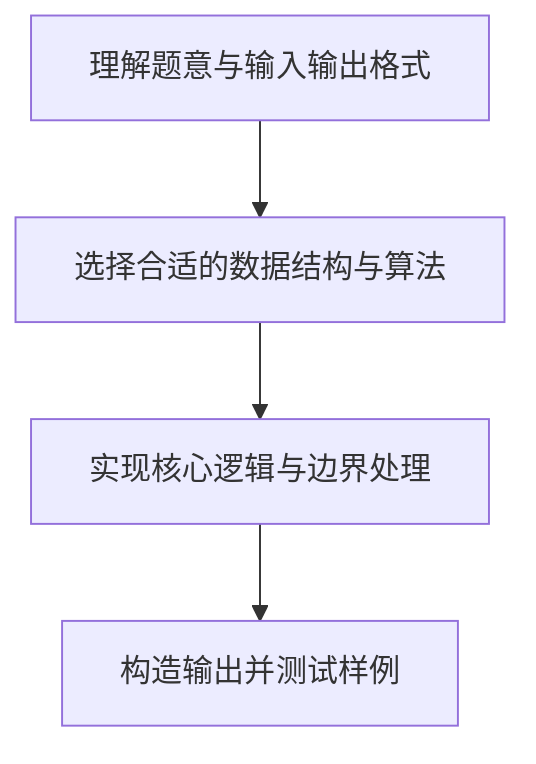

# L1-003 - 个位数统计（15 分）

- **时间限制**: 400 ms
- **内存限制**: 65536 KB
- **代码长度限制**: 16 KB

---

## 题目描述


给定一个 $k$ 位整数 $N = d_{k-1}10^{k-1} + \cdots + d_1 10^1 + d_0$ ($0\le d_i \le 9$, $i=0,\cdots ,k-1$, $d_{k-1}>0$)，请编写程序统计每种不同的个位数字出现的次数。例如：给定 $N = 100311$，则有 2 个 0，3 个 1，和 1 个 3。

### 输入格式:

每个输入包含 1 个测试用例，即一个不超过 1000 位的正整数 $N$。

### 输出格式:

对 $N$ 中每一种不同的个位数字，以 `D:M` 的格式在一行中输出该位数字 `D` 及其在 $N$ 中出现的次数 `M`。要求按 `D` 的升序输出。

### 输入样例:
```in
100311
```

### 输出样例:
```out
0:2
1:3
3:1
```

## 示例

### 示例 1

**输入:**
```
100311
```

**输出:**
```
0:2
1:3
3:1
```

### 解题思路

本题的核心逻辑为：将大整数按字符串读取，避免数值范围限制；统计每个字符数字的出现次数。根据题意将输入转化为可计算的模型后，直接按规则求解即可。

数据结构上主要使用 模式匹配遍历（`gmatch`）、循环遍历。通过 Lua 的基础控制结构（条件与循环）配合字符串/数值处理完成核心判断与转换，逻辑直观易于实现。

关键步骤在于准确解析输入、按题面规则处理边界（如空格、符号、进制、整除等）并保证输出格式与样例完全一致。整体时间复杂度多为线性或常数级，满足限制。

### 代码流程说明

1. **读取输入**：通过 `io.read` 读取输入数据（按行或按 token 解析），并按需转换为数值或字符串。
2. **核心处理**：将大整数按字符串读取，避免数值范围限制；统计每个字符数字的出现次数。
3. **逻辑判断/计算**：通过循环与条件分支完成题面要求的判定或累计。
4. **输出结果**：按题目指定格式通过 `print`/`io.write` 输出答案。

### 代码实现

```lua
-- 实现原理：将大整数按字符串读取，避免数值范围限制；统计每个字符数字的出现次数。
local s = io.read("*l")
local count = {}
for i = 0, 9 do count[i] = 0 end
for digit in s:gmatch("%d") do
    local value = tonumber(digit)
    count[value] = count[value] + 1
end
for i = 0, 9 do
    if count[i] > 0 then print(i .. ":" .. count[i]) end
end
```

### 代码流程图



### 解题流程图


