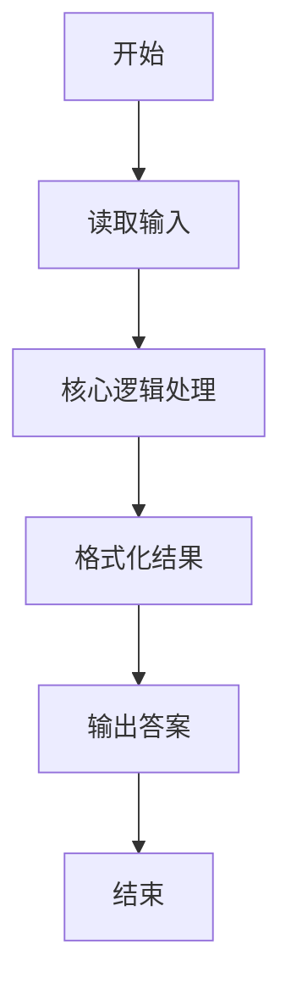
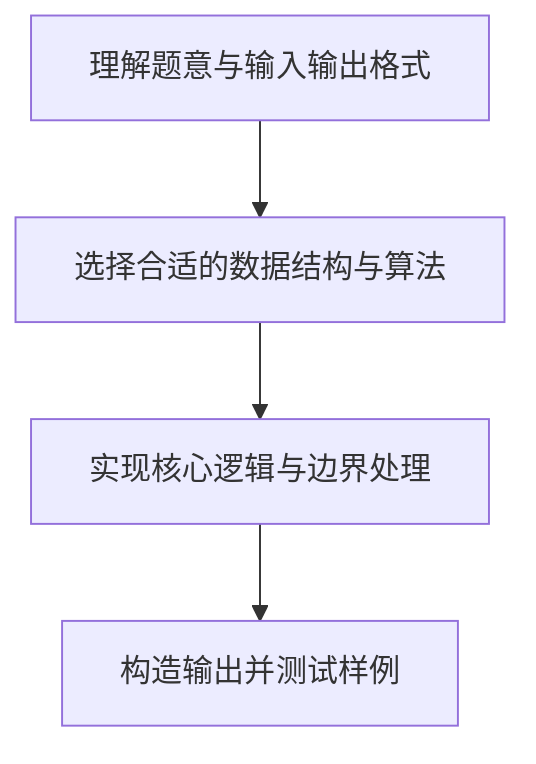

# L1-005 - 考试座位号（15 分）

- **时间限制**: 200 ms
- **内存限制**: 65536 KB
- **代码长度限制**: 16 KB

---

## 题目描述


每个 PAT 考生在参加考试时都会被分配两个座位号，一个是试机座位，一个是考试座位。正常情况下，考生在入场时先得到试机座位号码，入座进入试机状态后，系统会显示该考生的考试座位号码，考试时考生需要换到考试座位就座。但有些考生迟到了，试机已经结束，他们只能拿着领到的试机座位号码求助于你，从后台查出他们的考试座位号码。

### 输入格式:

输入第一行给出一个正整数 $N$（$\le 1000$），随后 $N$ 行，每行给出一个考生的信息：`准考证号 试机座位号 考试座位号`。其中`准考证号`由 16 位数字组成，座位从 1 到 $N$ 编号。输入保证每个人的准考证号都不同，并且任何时候都不会把两个人分配到同一个座位上。

考生信息之后，给出一个正整数 $M$（$\le N$），随后一行中给出 $M$ 个待查询的试机座位号码，以空格分隔。

### 输出格式:

对应每个需要查询的试机座位号码，在一行中输出对应考生的准考证号和考试座位号码，中间用 1 个空格分隔。

### 输入样例:
```in
4
3310120150912233 2 4
3310120150912119 4 1
3310120150912126 1 3
3310120150912002 3 2
2
3 4
```

### 输出样例:
```out
3310120150912002 2
3310120150912119 1
```

## 示例

### 示例 1

**输入:**
```
4
3310120150912233 2 4
3310120150912119 4 1
3310120150912126 1 3
3310120150912002 3 2
2
3 4
```

**输出:**
```
3310120150912002 2
3310120150912119 1
```

### 解题思路

本题的核心逻辑为：以试机座位号为键建立哈希表，查询时可 O(1) 找到准考证号和考试座位号。根据题意将输入转化为可计算的模型后，直接按规则求解即可。

数据结构上主要使用 模式匹配遍历（`gmatch`）、循环遍历。通过 Lua 的基础控制结构（条件与循环）配合字符串/数值处理完成核心判断与转换，逻辑直观易于实现。

关键步骤在于准确解析输入、按题面规则处理边界（如空格、符号、进制、整除等）并保证输出格式与样例完全一致。整体时间复杂度多为线性或常数级，满足限制。

### 代码流程说明

1. **读取输入**：通过 `io.read` 读取输入数据（按行或按 token 解析），并按需转换为数值或字符串。
2. **核心处理**：以试机座位号为键建立哈希表，查询时可 O(1) 找到准考证号和考试座位号。
3. **逻辑判断/计算**：通过循环与条件分支完成题面要求的判定或累计。
4. **输出结果**：按题目指定格式通过 `print`/`io.write` 输出答案。

### 代码实现

```lua
-- 实现原理：以试机座位号为键建立哈希表，查询时可 O(1) 找到准考证号和考试座位号。
local n = tonumber(io.read("*l"))
local seats = {}
for _ = 1, n do
    local id, machine, exam = io.read("*l"):match("(%S+)%s+(%d+)%s+(%d+)")
    seats[tonumber(machine)] = { id = id, exam = exam }
end
local m = tonumber(io.read("*l"))
local query = io.read("*l")
local answered = 0
for machine in query:gmatch("%d+") do
    local student = seats[tonumber(machine)]
    print(student.id .. " " .. student.exam)
    answered = answered + 1
    if answered == m then break end
end
```

### 代码流程图



### 解题流程图


