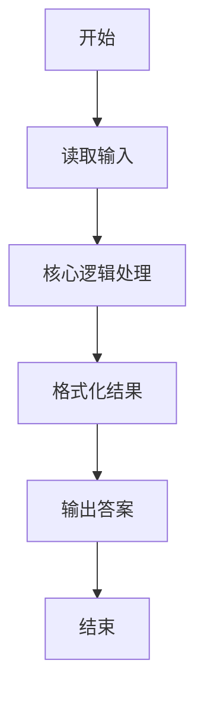
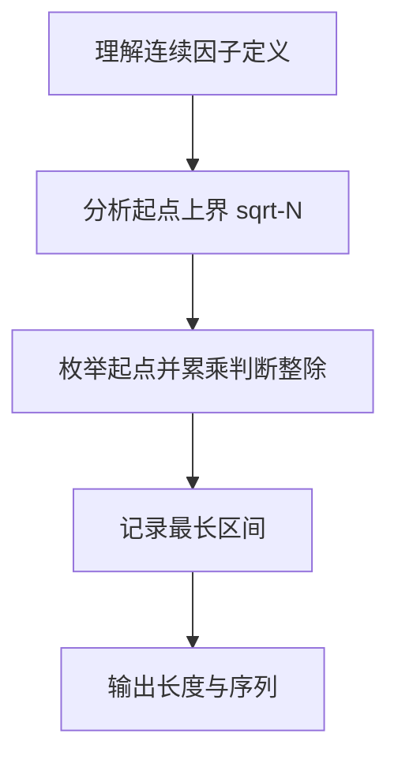

# L1-006 - 连续因子（20 分）

- **时间限制**: 400 ms
- **内存限制**: 65536 KB
- **代码长度限制**: 16 KB

---

## 题目描述


一个正整数 $$N$$ 的因子中可能存在若干连续的数字。例如 630 可以分解为 3$$\times$$5$$\times$$6$$\times$$7，其中 5、6、7 就是 3 个连续的数字。给定任一正整数 $$N$$，要求编写程序求出最长连续因子的个数，并输出最小的连续因子序列。

### 输入格式:

输入在一行中给出一个正整数 $$N$$（$$1<N<2^{31}$$）。

### 输出格式:

首先在第 1 行输出最长连续因子的个数；然后在第 2 行中按 `因子1*因子2*……*因子k` 的格式输出最小的连续因子序列，其中因子按递增顺序输出，1 不算在内。

### 输入样例:
```in
630
```

### 输出样例:
```out
3
5*6*7
```

## 示例

### 示例 1

**输入:**
```
630
```

**输出:**
```
3
5*6*7
```

### 解题思路

本题的核心逻辑为：连续因子的起点不会超过 sqrt(N)。 从每个起点依次累乘连续整数，积仍能整除 N 时更新最长答案。根据题意将输入转化为可计算的模型后，直接按规则求解即可。

数据结构上仅需标量与数组，利用连续整数的累乘判断整除性；通过枚举起点与累乘长度寻找最长区间。

关键在于起点不超过 sqrt(N) 的剪枝，以及乘积溢出与整除的中断条件，保证在 2^31 范围内快速求解。

### 代码流程说明

1. **读取输入**：通过 `io.read` 读取输入数据（按行或按 token 解析），并按需转换为数值或字符串。
2. **核心处理**：连续因子的起点不会超过 sqrt(N)。 从每个起点依次累乘连续整数，积仍能整除 N 时更新最长答案。
3. **逻辑判断/计算**：通过循环与条件分支完成题面要求的判定或累计。
4. **输出结果**：按题目指定格式通过 `print`/`io.write` 输出答案。

### 代码实现

```lua
-- 实现原理：连续因子的起点不会超过 sqrt(N)。
-- 从每个起点依次累乘连续整数，积仍能整除 N 时更新最长答案。
local n = tonumber(io.read("*l"))
local best_len, best_start = 1, n
local limit = math.floor(math.sqrt(n))

for start = 2, limit do
    local product, length = 1, 0
    for value = start, limit + 1 do
        product = product * value
        if product > n or n % product ~= 0 then break end
        length = length + 1
        if length > best_len then
            best_len, best_start = length, start
        end
    end
end

local factors = {}
for value = best_start, best_start + best_len - 1 do factors[#factors + 1] = value end
print(best_len)
print(table.concat(factors, "*"))
```

### 代码流程图



### 解题流程图


