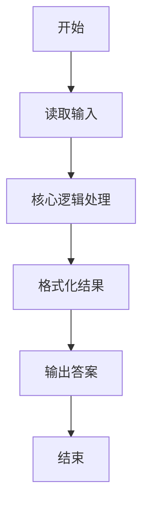
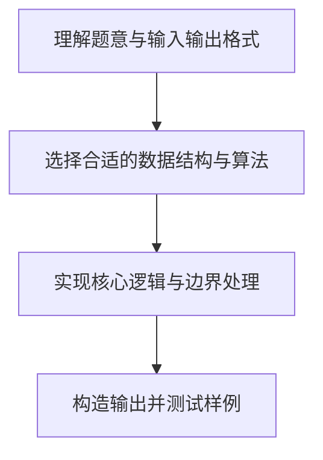

# L1-007 - 念数字（10 分）

- **时间限制**: 400 ms
- **内存限制**: 65536 KB
- **代码长度限制**: 16 KB

---

## 题目描述


输入一个整数，输出每个数字对应的拼音。当整数为负数时，先输出`fu`字。十个数字对应的拼音如下：
```
0: ling
1: yi
2: er
3: san
4: si
5: wu
6: liu
7: qi
8: ba
9: jiu
```

### 输入格式:

输入在一行中给出一个整数，如：`1234`。

<b>提示：整数包括负数、零和正数。</b>

### 输出格式:

在一行中输出这个整数对应的拼音，每个数字的拼音之间用空格分开，行末没有最后的空格。如
`yi er san si`。

### 输入样例:
```in
-600
```

### 输出样例:
```out
fu liu ling ling
```

## 示例

### 示例 1

**输入:**
```
-600
```

**输出:**
```
fu liu ling ling
```

### 解题思路

本题的核心逻辑为：将整数作为字符串处理，负号单独映射为 fu，其余字符查表转换为拼音。根据题意将输入转化为可计算的模型后，直接按规则求解即可。

数据结构上主要使用 循环遍历。通过 Lua 的基础控制结构（条件与循环）配合字符串/数值处理完成核心判断与转换，逻辑直观易于实现。

关键步骤在于准确解析输入、按题面规则处理边界（如空格、符号、进制、整除等）并保证输出格式与样例完全一致。整体时间复杂度多为线性或常数级，满足限制。

### 代码流程说明

1. **读取输入**：通过 `io.read` 读取输入数据（按行或按 token 解析），并按需转换为数值或字符串。
2. **核心处理**：将整数作为字符串处理，负号单独映射为 fu，其余字符查表转换为拼音。
3. **逻辑判断/计算**：通过循环与条件分支完成题面要求的判定或累计。
4. **输出结果**：按题目指定格式通过 `print`/`io.write` 输出答案。

### 代码实现

```lua
-- 实现原理：将整数作为字符串处理，负号单独映射为 fu，其余字符查表转换为拼音。
local names = { ["0"] = "ling", ["1"] = "yi", ["2"] = "er", ["3"] = "san", ["4"] = "si",
                ["5"] = "wu", ["6"] = "liu", ["7"] = "qi", ["8"] = "ba", ["9"] = "jiu" }
local s = io.read("*l")
local result = {}
if s:sub(1, 1) == "-" then
    result[#result + 1] = "fu"
    s = s:sub(2)
end
for i = 1, #s do result[#result + 1] = names[s:sub(i, i)] end
print(table.concat(result, " "))
```

### 代码流程图



### 解题流程图


