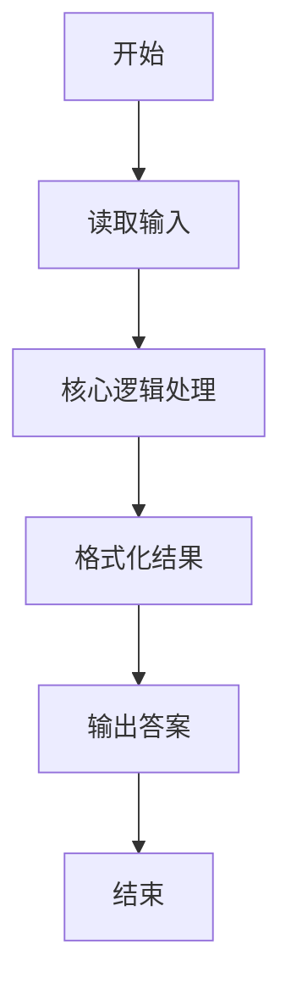
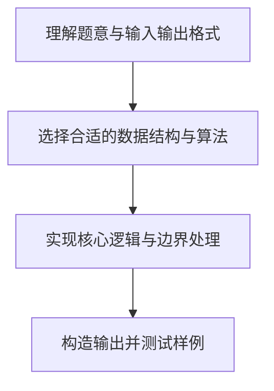

# L1-008 - 求整数段和（10 分）

- **时间限制**: 400 ms
- **内存限制**: 65536 KB
- **代码长度限制**: 16 KB

---

## 题目描述


给定两个整数$A$和$B$，输出从$A$到$B$的所有整数以及这些数的和。

### 输入格式:

输入在一行中给出2个整数$A$和$B$，其中$-100\le A\le B\le 100$，其间以空格分隔。

### 输出格式:

首先顺序输出从$A$到$B$的所有整数，每5个数字占一行，每个数字占5个字符宽度，向右对齐。最后在一行中按`Sum = X`的格式输出全部数字的和`X`。

### 输入样例:
```in
-3 8
```

### 输出样例:
```out
-3   -2   -1    0    1
    2    3    4    5    6
    7    8
Sum = 30
```

## 示例

### 示例 1

**输入:**
```
-3 8
```

**输出:**
```
-3   -2   -1    0    1
    2    3    4    5    6
    7    8
Sum = 30
```

### 解题思路

本题的核心逻辑为：顺序枚举 [A, B]，每行累积 5 个右对齐数字，同时累加总和。根据题意将输入转化为可计算的模型后，直接按规则求解即可。

数据结构上主要使用 循环遍历。通过 Lua 的基础控制结构（条件与循环）配合字符串/数值处理完成核心判断与转换，逻辑直观易于实现。

关键步骤在于准确解析输入、按题面规则处理边界（如空格、符号、进制、整除等）并保证输出格式与样例完全一致。整体时间复杂度多为线性或常数级，满足限制。

### 代码流程说明

1. **读取输入**：通过 `io.read` 读取输入数据（按行或按 token 解析），并按需转换为数值或字符串。
2. **核心处理**：顺序枚举 [A, B]，每行累积 5 个右对齐数字，同时累加总和。
3. **逻辑判断/计算**：通过循环与条件分支完成题面要求的判定或累计。
4. **输出结果**：按题目指定格式通过 `print`/`io.write` 输出答案。

### 代码实现

```lua
-- 实现原理：顺序枚举 [A, B]，每行累积 5 个右对齐数字，同时累加总和。
local line = io.read("*l")
local a, b = line:match("(-?%d+)%s+(-?%d+)")
a, b = tonumber(a), tonumber(b)
local sum = 0
for value = a, b do
    io.write(string.format("%5d", value))
    if (value - a + 1) % 5 == 0 or value == b then io.write("\n") end
    sum = sum + value
end
print("Sum = " .. sum)
```

### 代码流程图



### 解题流程图


