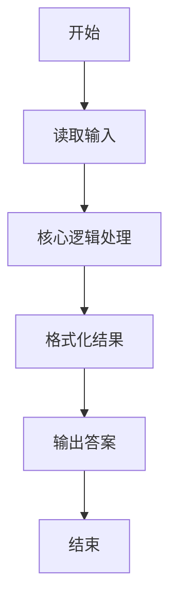
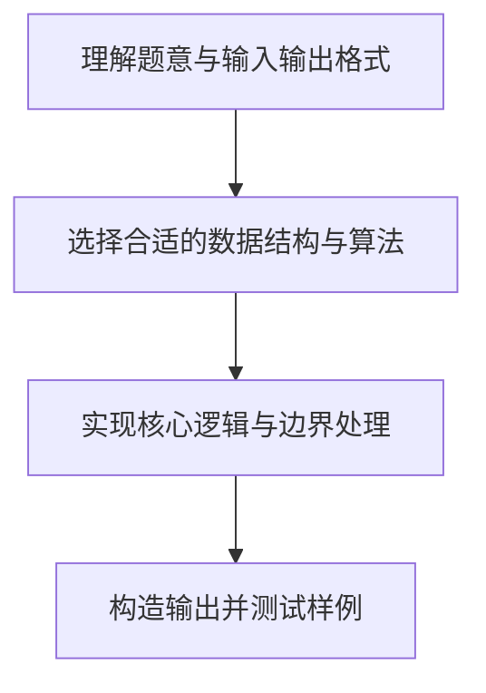

# L1-009 - N个数求和（20 分）

- **时间限制**: 400 ms
- **内存限制**: 65536 KB
- **代码长度限制**: 16 KB

---

## 题目描述


本题的要求很简单，就是求`N`个数字的和。麻烦的是，这些数字是以有理数`分子/分母`的形式给出的，你输出的和也必须是有理数的形式。

### 输入格式:

输入第一行给出一个正整数`N`（$$\le$$100）。随后一行按格式`a1/b1 a2/b2 ...`给出`N`个有理数。题目保证所有分子和分母都在长整型范围内。另外，负数的符号一定出现在分子前面。

### 输出格式:

输出上述数字和的最简形式 —— 即将结果写成`整数部分 分数部分`，其中分数部分写成`分子/分母`，要求分子小于分母，且它们没有公因子。如果结果的整数部分为0，则只输出分数部分。

### 输入样例 1：
```in
5
2/5 4/15 1/30 -2/60 8/3
```

### 输出样例 1：
```out
3 1/3
```

### 输入样例 2：
```in
2
4/3 2/3
```

### 输出样例 2：
```out
2
```

### 输入样例 3：
```in
3
1/3 -1/6 1/8
```

### 输出样例 3：
```out
7/24
```

## 示例

### 示例 1

**输入:**
```
5
2/5 4/15 1/30 -2/60 8/3
```

**输出:**
```
3 1/3
```

### 示例 2

**输入:**
```
2
4/3 2/3
```

**输出:**
```
2
```

### 示例 3

**输入:**
```
3
1/3 -1/6 1/8
```

**输出:**
```
7/24
```

### 解题思路

本题的核心逻辑为：每次按 a/b + c/d = (ad+bc)/(bd) 合并分数，并用最大公约数约分。 最后用整数除法拆出整数部分和真分数部分。根据题意将输入转化为可计算的模型后，直接按规则求解即可。

数据结构上主要使用 模式匹配遍历（`gmatch`）、数学库（`math`）、最大公约数约分。通过 Lua 的基础控制结构（条件与循环）配合字符串/数值处理完成核心判断与转换，逻辑直观易于实现。

关键步骤在于准确解析输入、按题面规则处理边界（如空格、符号、进制、整除等）并保证输出格式与样例完全一致。整体时间复杂度多为线性或常数级，满足限制。

### 代码流程说明

1. **读取输入**：通过 `io.read` 读取输入数据（按行或按 token 解析），并按需转换为数值或字符串。
2. **核心处理**：每次按 a/b + c/d = (ad+bc)/(bd) 合并分数，并用最大公约数约分。 最后用整数除法拆出整数部分和真分数部分。
3. **约分化简**：通过最大公约数对分数进行约分并分离整数部分。
4. **输出结果**：按题目指定格式通过 `print`/`io.write` 输出答案。

### 代码实现

```lua
-- 实现原理：每次按 a/b + c/d = (ad+bc)/(bd) 合并分数，并用最大公约数约分。
-- 最后用整数除法拆出整数部分和真分数部分。
local function gcd(a, b)
    a, b = math.abs(a), math.abs(b)
    while b ~= 0 do a, b = b, a % b end
    return a
end

local function reduce(num, den)
    if den < 0 then num, den = -num, -den end
    local g = gcd(num, den)
    return num // g, den // g
end

local n = tonumber(io.read("*l"))
local line = io.read("*l")
local numerator, denominator = 0, 1
for token in line:gmatch("%S+") do
    local a, b = token:match("(-?%d+)/(%d+)")
    a, b = tonumber(a), tonumber(b)
    numerator = numerator * b + a * denominator
    denominator = denominator * b
    numerator, denominator = reduce(numerator, denominator)
end

local sign = numerator < 0 and "-" or ""
local absolute = math.abs(numerator)
local integer = absolute // denominator
local remainder = absolute % denominator
if remainder == 0 then
    print(sign .. integer)
elseif integer == 0 then
    print(sign .. remainder .. "/" .. denominator)
else
    print(sign .. integer .. " " .. remainder .. "/" .. denominator)
end
```

### 代码流程图



### 解题流程图


