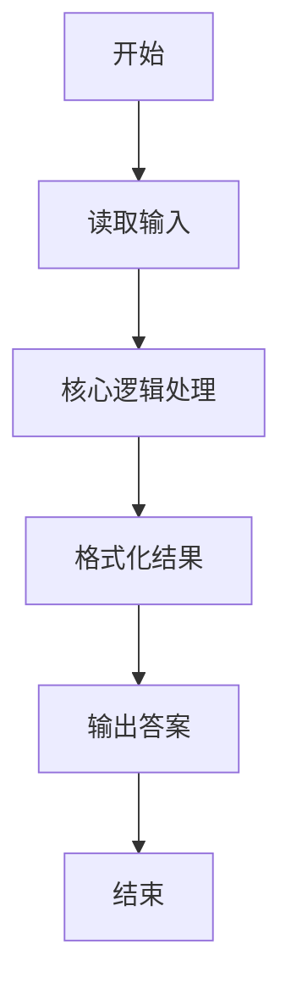
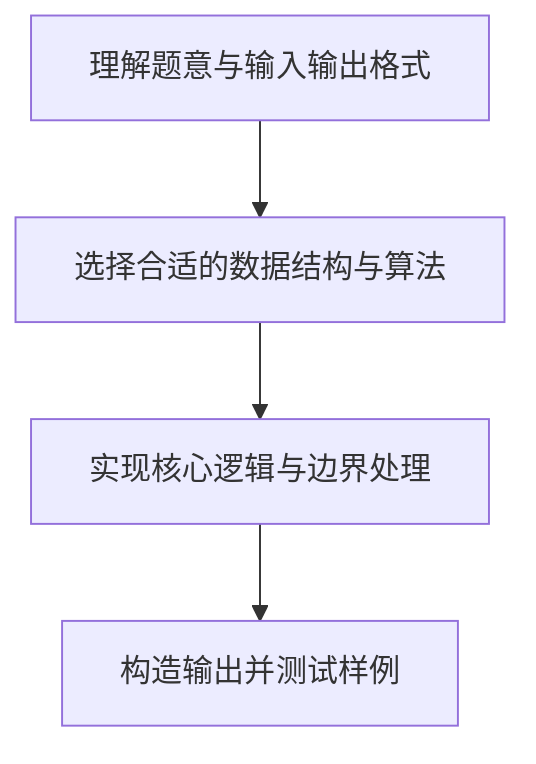

# L1-010 - 比较大小（10 分）

- **时间限制**: 400 ms
- **内存限制**: 65536 KB
- **代码长度限制**: 16 KB

---

## 题目描述


本题要求将输入的任意3个整数从小到大输出。

### 输入格式:

输入在一行中给出3个整数，其间以空格分隔。

### 输出格式:

在一行中将3个整数从小到大输出，其间以“->”相连。

### 输入样例:
```in
4 2 8
```

### 输出样例:
```out
2->4->8
```

## 示例

### 示例 1

**输入:**
```
4 2 8
```

**输出:**
```
2->4->8
```

### 解题思路

本题的核心逻辑为：读入三个整数后用 table.sort 升序排序，再用 -> 连接输出。根据题意将输入转化为可计算的模型后，直接按规则求解即可。

数据结构上主要使用 数组+排序（`table.sort`）、模式匹配遍历（`gmatch`）、循环遍历。通过 Lua 的基础控制结构（条件与循环）配合字符串/数值处理完成核心判断与转换，逻辑直观易于实现。

关键步骤在于准确解析输入、按题面规则处理边界（如空格、符号、进制、整除等）并保证输出格式与样例完全一致。整体时间复杂度多为线性或常数级，满足限制。

### 代码流程说明

1. **读取输入**：通过 `io.read` 读取输入数据（按行或按 token 解析），并按需转换为数值或字符串。
2. **核心处理**：读入三个整数后用 table.sort 升序排序，再用 -> 连接输出。
3. **排序/整理**：对数据进行排序或去重，得到有序结果。
4. **输出结果**：按题目指定格式通过 `print`/`io.write` 输出答案。

### 代码实现

```lua
-- 实现原理：读入三个整数后用 table.sort 升序排序，再用 -> 连接输出。
local values = {}
for number in io.read("*l"):gmatch("-?%d+") do values[#values + 1] = tonumber(number) end
table.sort(values)
print(table.concat(values, "->"))
```

### 代码流程图



### 解题流程图


