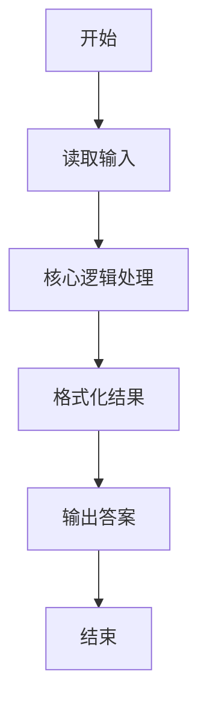
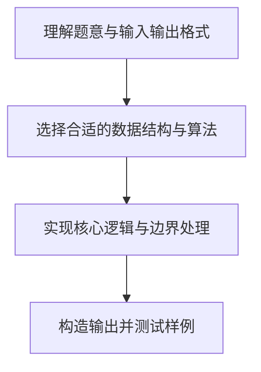

# L1-011 - A-B（20 分）

- **时间限制**: 150 ms
- **内存限制**: 65536 KB
- **代码长度限制**: 16 KB

---

## 题目描述


本题要求你计算$$A-B$$。不过麻烦的是，$$A$$和$$B$$都是字符串 —— 即从字符串$$A$$中把字符串$$B$$所包含的字符全删掉，剩下的字符组成的就是字符串$$A-B$$。

### 输入格式:

输入在2行中先后给出字符串$$A$$和$$B$$。两字符串的长度都不超过$$10^4$$，并且保证每个字符串都是由可见的ASCII码和空白字符组成，最后以换行符结束。

### 输出格式:

在一行中打印出$$A-B$$的结果字符串。

### 输入样例:
```in
I love GPLT!  It's a fun game!
aeiou
```

### 输出样例:
```out
I lv GPLT!  It's  fn gm!
```

## 示例

### 示例 1

**输入:**
```
I love GPLT!  It's a fun game!
aeiou
```

**输出:**
```
I lv GPLT!  It's  fn gm!
```

### 解题思路

本题的核心逻辑为：把字符串 B 中出现过的字符标记到集合中，再过滤字符串 A。根据题意将输入转化为可计算的模型后，直接按规则求解即可。

数据结构上主要使用 循环遍历。通过 Lua 的基础控制结构（条件与循环）配合字符串/数值处理完成核心判断与转换，逻辑直观易于实现。

关键步骤在于准确解析输入、按题面规则处理边界（如空格、符号、进制、整除等）并保证输出格式与样例完全一致。整体时间复杂度多为线性或常数级，满足限制。

### 代码流程说明

1. **读取输入**：通过 `io.read` 读取输入数据（按行或按 token 解析），并按需转换为数值或字符串。
2. **核心处理**：把字符串 B 中出现过的字符标记到集合中，再过滤字符串 A。
3. **逻辑判断/计算**：通过循环与条件分支完成题面要求的判定或累计。
4. **输出结果**：按题目指定格式通过 `print`/`io.write` 输出答案。

### 代码实现

```lua
-- 实现原理：把字符串 B 中出现过的字符标记到集合中，再过滤字符串 A。
local a = io.read("*l")
local b = io.read("*l")
local forbidden, answer = {}, {}
for i = 1, #b do forbidden[b:sub(i, i)] = true end
for i = 1, #a do
    local ch = a:sub(i, i)
    if not forbidden[ch] then answer[#answer + 1] = ch end
end
print(table.concat(answer))
```

### 代码流程图



### 解题流程图


