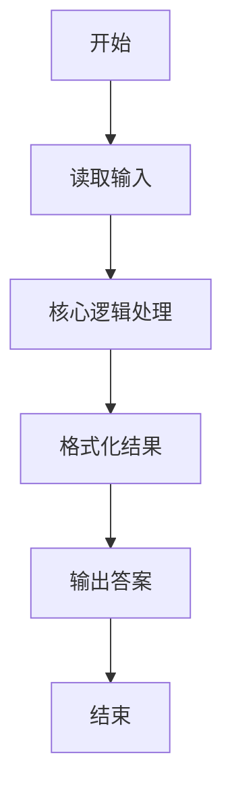
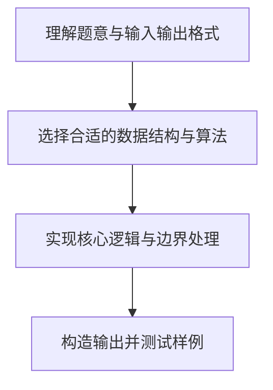

# L1-015 - 跟奥巴马一起画方块（15 分）

- **时间限制**: 400 ms
- **内存限制**: 65536 KB
- **代码长度限制**: 16 KB

---

## 题目描述


美国总统奥巴马不仅呼吁所有人都学习编程，甚至以身作则编写代码，成为美国历史上首位编写计算机代码的总统。2014年底，为庆祝“计算机科学教育周”正式启动，奥巴马编写了很简单的计算机代码：在屏幕上画一个正方形。现在你也跟他一起画吧！

### 输入格式:

输入在一行中给出正方形边长$N$（$3\le N\le 21$）和组成正方形边的某种字符`C`，间隔一个空格。

### 输出格式:

输出由给定字符`C`画出的正方形。但是注意到行间距比列间距大，所以为了让结果看上去更像正方形，我们输出的行数实际上是列数的50%（四舍五入取整）。

### 输入样例:
```in
10 a
```

### 输出样例:
```out
aaaaaaaaaa
aaaaaaaaaa
aaaaaaaaaa
aaaaaaaaaa
aaaaaaaaaa
```

## 示例

### 示例 1

**输入:**
```
10 a
```

**输出:**
```
aaaaaaaaaa
aaaaaaaaaa
aaaaaaaaaa
aaaaaaaaaa
aaaaaaaaaa
```

### 解题思路

本题的核心逻辑为：每行输出 N 个字符，行数取 N 的一半并按四舍五入取整。根据题意将输入转化为可计算的模型后，直接按规则求解即可。

数据结构上主要使用 字符串重复拼接（`string.rep`）、数学库（`math`）、循环遍历。通过 Lua 的基础控制结构（条件与循环）配合字符串/数值处理完成核心判断与转换，逻辑直观易于实现。

关键步骤在于准确解析输入、按题面规则处理边界（如空格、符号、进制、整除等）并保证输出格式与样例完全一致。整体时间复杂度多为线性或常数级，满足限制。

### 代码流程说明

1. **读取输入**：通过 `io.read` 读取输入数据（按行或按 token 解析），并按需转换为数值或字符串。
2. **核心处理**：每行输出 N 个字符，行数取 N 的一半并按四舍五入取整。
3. **格式化构造**：使用字符串重复/拼接构造输出行。
4. **输出结果**：按题目指定格式通过 `print`/`io.write` 输出答案。

### 代码实现

```lua
-- 实现原理：每行输出 N 个字符，行数取 N 的一半并按四舍五入取整。
local n, ch = io.read("*l"):match("(%d+)%s+(%S)")
n = tonumber(n)
local rows = math.floor(n / 2 + 0.5)
for _ = 1, rows do print(string.rep(ch, n)) end
```

### 代码流程图



### 解题流程图


