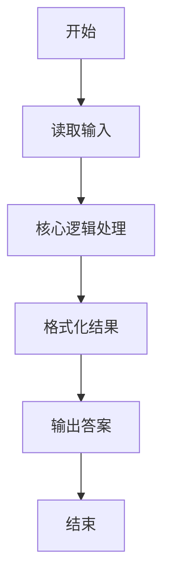
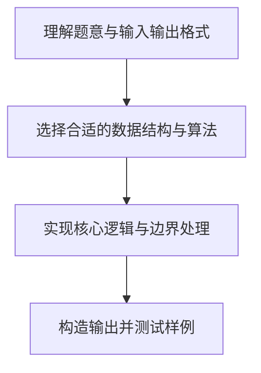

# L1-016 - 查验身份证（15 分）

- **时间限制**: 400 ms
- **内存限制**: 65536 KB
- **代码长度限制**: 16 KB

---

## 题目描述


一个合法的身份证号码由17位地区、日期编号和顺序编号加1位校验码组成。校验码的计算规则如下：

首先对前17位数字加权求和，权重分配为：{7，9，10，5，8，4，2，1，6，3，7，9，10，5，8，4，2}；然后将计算的和对11取模得到值`Z`；最后按照以下关系对应`Z`值与校验码`M`的值：
```
Z：0 1 2 3 4 5 6 7 8 9 10
M：1 0 X 9 8 7 6 5 4 3 2
```
现在给定一些身份证号码，请你验证校验码的有效性，并输出有问题的号码。

### 输入格式:

输入第一行给出正整数$N$（$\le 100$）是输入的身份证号码的个数。随后$N$行，每行给出1个18位身份证号码。

### 输出格式:

按照输入的顺序每行输出1个有问题的身份证号码。这里并不检验前17位是否合理，只检查前17位是否全为数字且最后1位校验码计算准确。如果所有号码都正常，则输出`All passed`。

### 输入样例 1：
```in
4
320124198808240056
12010X198901011234
110108196711301866
37070419881216001X
```

### 输出样例 1：
```out
12010X198901011234
110108196711301866
37070419881216001X
```

### 输入样例 2：
```in
2
320124198808240056
110108196711301862
```

### 输出样例 2：
```out
All passed
```

## 示例

### 示例 1

**输入:**
```
4
320124198808240056
12010X198901011234
110108196711301866
37070419881216001X
```

**输出:**
```
12010X198901011234
110108196711301866
37070419881216001X
```

### 示例 2

**输入:**
```
2
320124198808240056
110108196711301862
```

**输出:**
```
All passed
```

### 解题思路

本题的核心逻辑为：按给定权重计算前 17 位加权和，模 11 后查询校验码表。根据题意将输入转化为可计算的模型后，直接按规则求解即可。

数据结构上主要使用 循环遍历。通过 Lua 的基础控制结构（条件与循环）配合字符串/数值处理完成核心判断与转换，逻辑直观易于实现。

关键步骤在于准确解析输入、按题面规则处理边界（如空格、符号、进制、整除等）并保证输出格式与样例完全一致。整体时间复杂度多为线性或常数级，满足限制。

### 代码流程说明

1. **读取输入**：通过 `io.read` 读取输入数据（按行或按 token 解析），并按需转换为数值或字符串。
2. **核心处理**：按给定权重计算前 17 位加权和，模 11 后查询校验码表。
3. **逻辑判断/计算**：通过循环与条件分支完成题面要求的判定或累计。
4. **输出结果**：按题目指定格式通过 `print`/`io.write` 输出答案。

### 代码实现

```lua
-- 实现原理：按给定权重计算前 17 位加权和，模 11 后查询校验码表。
local weights = {7, 9, 10, 5, 8, 4, 2, 1, 6, 3, 7, 9, 10, 5, 8, 4, 2}
local checks = {"1", "0", "X", "9", "8", "7", "6", "5", "4", "3", "2"}
local n = tonumber(io.read("*l"))
local all_valid = true
for _ = 1, n do
    local id = io.read("*l")
    local sum, valid = 0, true
    for i = 1, 17 do
        local digit = tonumber(id:sub(i, i))
        if not digit then valid = false break end
        sum = sum + digit * weights[i]
    end
    if valid and checks[sum % 11 + 1] ~= id:sub(18, 18) then valid = false end
    if not valid then print(id); all_valid = false end
end
if all_valid then print("All passed") end
```

### 代码流程图



### 解题流程图


