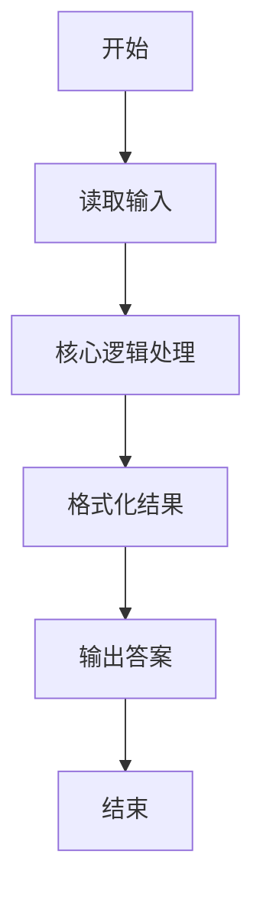
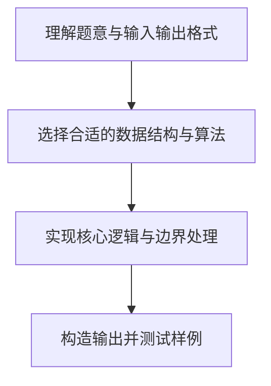

# L1-017 - 到底有多二（15 分）

- **时间限制**: 400 ms
- **内存限制**: 65536 KB
- **代码长度限制**: 16 KB

---

## 题目描述


一个整数“**犯二的程度**”定义为该数字中包含2的个数与其位数的比值。如果这个数是负数，则程度增加0.5倍；如果还是个偶数，则再增加1倍。例如数字`-13142223336`是个11位数，其中有3个2，并且是负数，也是偶数，则它的犯二程度计算为：$3/11\times 1.5\times 2\times 100\%$，约为81.82%。本题就请你计算一个给定整数到底有多二。

### 输入格式:

输入第一行给出一个不超过50位的整数`N`。

### 输出格式:

在一行中输出`N`犯二的程度，保留小数点后两位。

### 输入样例:
```in
-13142223336
```

### 输出样例:
```out
81.82%
```

## 示例

### 示例 1

**输入:**
```
-13142223336
```

**输出:**
```
81.82%
```

### 解题思路

本题的核心逻辑为：按字符串统计数字 2 的个数，随后根据负数与偶数条件乘以对应系数。根据题意将输入转化为可计算的模型后，直接按规则求解即可。

数据结构上主要使用 正则/模式替换（`string.gsub`）。通过 Lua 的基础控制结构（条件与循环）配合字符串/数值处理完成核心判断与转换，逻辑直观易于实现。

关键步骤在于准确解析输入、按题面规则处理边界（如空格、符号、进制、整除等）并保证输出格式与样例完全一致。整体时间复杂度多为线性或常数级，满足限制。

### 代码流程说明

1. **读取输入**：通过 `io.read` 读取输入数据（按行或按 token 解析），并按需转换为数值或字符串。
2. **核心处理**：按字符串统计数字 2 的个数，随后根据负数与偶数条件乘以对应系数。
3. **逻辑判断/计算**：通过循环与条件分支完成题面要求的判定或累计。
4. **输出结果**：按题目指定格式通过 `print`/`io.write` 输出答案。

### 代码实现

```lua
-- 实现原理：按字符串统计数字 2 的个数，随后根据负数与偶数条件乘以对应系数。
local s = io.read("*l")
local negative = s:sub(1, 1) == "-"
local digits = negative and s:sub(2) or s
local count = select(2, digits:gsub("2", ""))
local ratio = count / #digits * 100
if negative then ratio = ratio * 1.5 end
if tonumber(digits:sub(-1)) % 2 == 0 then ratio = ratio * 2 end
print(string.format("%.2f%%", ratio))
```

### 代码流程图



### 解题流程图


