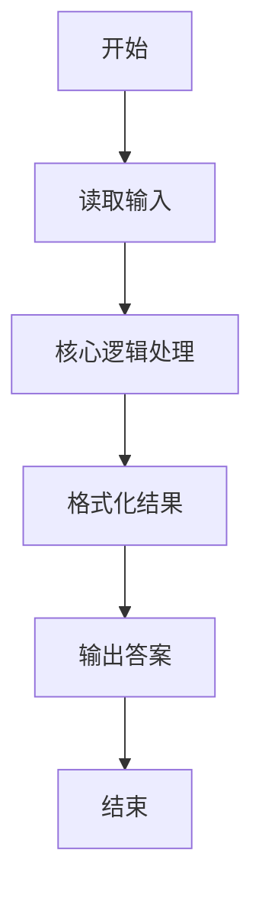
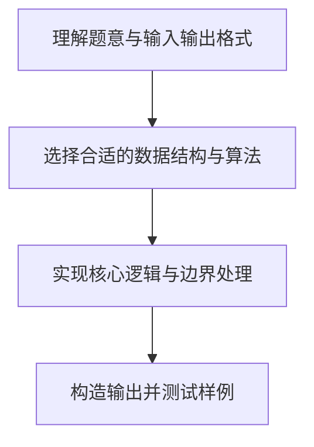

# L1-018 - 大笨钟（10 分）

- **时间限制**: 400 ms
- **内存限制**: 65536 KB
- **代码长度限制**: 16 KB

---

## 题目描述


微博上有个自称“大笨钟V”的家伙，每天敲钟催促码农们爱惜身体早点睡觉。不过由于笨钟自己作息也不是很规律，所以敲钟并不定时。一般敲钟的点数是根据敲钟时间而定的，如果正好在某个整点敲，那么“当”数就等于那个整点数；如果过了整点，就敲下一个整点数。另外，虽然一天有24小时，钟却是只在后半天敲1~12下。例如在23:00敲钟，就是“当当当当当当当当当当当”，而到了23:01就会是“当当当当当当当当当当当当”。在午夜00:00到中午12:00期间（端点时间包括在内），笨钟是不敲的。

下面就请你写个程序，根据当前时间替大笨钟敲钟。

### 输入格式:

输入第一行按照`hh:mm`的格式给出当前时间。其中`hh`是小时，在00到23之间；`mm`是分钟，在00到59之间。

### 输出格式:

根据当前时间替大笨钟敲钟，即在一行中输出相应数量个`Dang`。如果不是敲钟期，则输出：

```
Only hh:mm.  Too early to Dang.
```

其中`hh:mm`是输入的时间。

### 输入样例 1：
```in
19:05
```

### 输出样例 1：
```out
DangDangDangDangDangDangDangDang
```

### 输入样例 2：
```in
07:05
```

### 输出样例 2：
```out
Only 07:05.  Too early to Dang.
```

## 示例

### 示例 1

**输入:**
```
19:05
```

**输出:**
```
DangDangDangDangDangDangDangDang
```

### 示例 2

**输入:**
```
07:05
```

**输出:**
```
Only 07:05.  Too early to Dang.
```

### 解题思路

本题的核心逻辑为：中午 12:00 前（含）不报时；之后报“下一个整点”的 12 小时制次数。根据题意将输入转化为可计算的模型后，直接按规则求解即可。

数据结构上主要使用 字符串重复拼接（`string.rep`）。通过 Lua 的基础控制结构（条件与循环）配合字符串/数值处理完成核心判断与转换，逻辑直观易于实现。

关键步骤在于准确解析输入、按题面规则处理边界（如空格、符号、进制、整除等）并保证输出格式与样例完全一致。整体时间复杂度多为线性或常数级，满足限制。

### 代码流程说明

1. **读取输入**：通过 `io.read` 读取输入数据（按行或按 token 解析），并按需转换为数值或字符串。
2. **核心处理**：中午 12:00 前（含）不报时；之后报“下一个整点”的 12 小时制次数。
3. **格式化构造**：使用字符串重复/拼接构造输出行。
4. **输出结果**：按题目指定格式通过 `print`/`io.write` 输出答案。

### 代码实现

```lua
-- 实现原理：中午 12:00 前（含）不报时；之后报“下一个整点”的 12 小时制次数。
local time = io.read("*l")
local hour, minute = time:match("(%d%d):(%d%d)")
hour, minute = tonumber(hour), tonumber(minute)
if hour < 12 or (hour == 12 and minute == 0) then
    print("Only " .. time .. ".  Too early to Dang.")
else
    local times = hour - 12 + (minute > 0 and 1 or 0)
    print(string.rep("Dang", times))
end
```

### 代码流程图



### 解题流程图


