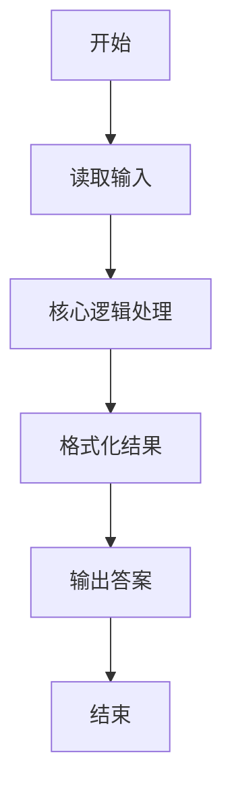
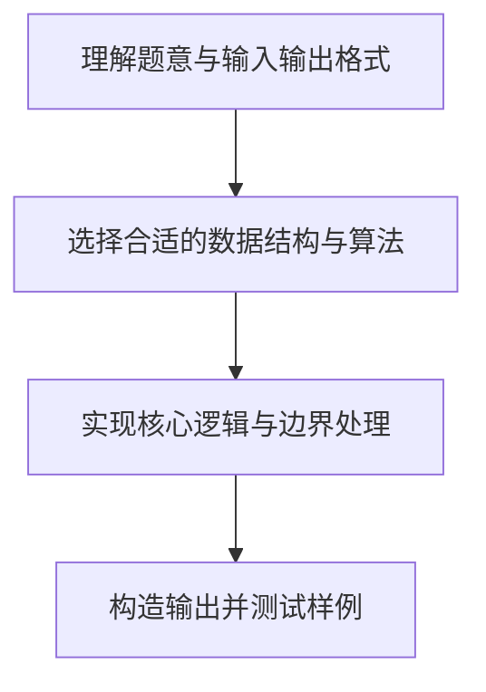

# L1-019 - 谁先倒（15 分）

- **时间限制**: 400 ms
- **内存限制**: 65536 KB
- **代码长度限制**: 16 KB

---

## 题目描述


划拳是古老中国酒文化的一个有趣的组成部分。酒桌上两人划拳的方法为：每人口中喊出一个数字，同时用手比划出一个数字。如果谁比划出的数字正好等于两人喊出的数字之和，谁就输了，输家罚一杯酒。两人同赢或两人同输则继续下一轮，直到唯一的赢家出现。

下面给出甲、乙两人的酒量（最多能喝多少杯不倒）和划拳记录，请你判断两个人谁先倒。

### 输入格式:

输入第一行先后给出甲、乙两人的酒量（不超过100的非负整数），以空格分隔。下一行给出一个正整数`N`（$$\le 100$$），随后`N`行，每行给出一轮划拳的记录，格式为：

```
甲喊 甲划 乙喊 乙划
```

其中`喊`是喊出的数字，`划`是划出的数字，均为不超过100的正整数（两只手一起划）。

### 输出格式:

在第一行中输出先倒下的那个人：`A`代表甲，`B`代表乙。第二行中输出没倒的那个人喝了多少杯。题目保证有一个人倒下。注意程序处理到有人倒下就终止，后面的数据不必处理。

### 输入样例:
```in
1 1
6
8 10 9 12
5 10 5 10
3 8 5 12
12 18 1 13
4 16 12 15
15 1 1 16
```

### 输出样例:
```out
A
1
```

## 示例

### 示例 1

**输入:**
```
1 1
6
8 10 9 12
5 10 5 10
3 8 5 12
12 18 1 13
4 16 12 15
15 1 1 16
```

**输出:**
```
A
1
```

### 解题思路

本题的核心逻辑为：每轮仅当一人猜中双方喊数之和时，该人喝一杯；超过酒量即倒下。根据题意将输入转化为可计算的模型后，直接按规则求解即可。

数据结构上主要使用 循环遍历。通过 Lua 的基础控制结构（条件与循环）配合字符串/数值处理完成核心判断与转换，逻辑直观易于实现。

关键步骤在于准确解析输入、按题面规则处理边界（如空格、符号、进制、整除等）并保证输出格式与样例完全一致。整体时间复杂度多为线性或常数级，满足限制。

### 代码流程说明

1. **读取输入**：通过 `io.read` 读取输入数据（按行或按 token 解析），并按需转换为数值或字符串。
2. **核心处理**：每轮仅当一人猜中双方喊数之和时，该人喝一杯；超过酒量即倒下。
3. **逻辑判断/计算**：通过循环与条件分支完成题面要求的判定或累计。
4. **输出结果**：按题目指定格式通过 `print`/`io.write` 输出答案。

### 代码实现

```lua
-- 实现原理：每轮仅当一人猜中双方喊数之和时，该人喝一杯；超过酒量即倒下。
local a_limit, b_limit = io.read("*l"):match("(%d+)%s+(%d+)")
a_limit, b_limit = tonumber(a_limit), tonumber(b_limit)
local n = tonumber(io.read("*l"))
local a_drunk, b_drunk = 0, 0
for _ = 1, n do
    local a_call, a_gesture, b_call, b_gesture = io.read("*l"):match("(%d+)%s+(%d+)%s+(%d+)%s+(%d+)")
    a_call, a_gesture = tonumber(a_call), tonumber(a_gesture)
    b_call, b_gesture = tonumber(b_call), tonumber(b_gesture)
    local sum = a_call + b_call
    local a_loses, b_loses = a_gesture == sum, b_gesture == sum
    if a_loses ~= b_loses then
        if a_loses then a_drunk = a_drunk + 1 else b_drunk = b_drunk + 1 end
        if a_drunk > a_limit then print("A"); print(b_drunk); break end
        if b_drunk > b_limit then print("B"); print(a_drunk); break end
    end
end
```

### 代码流程图



### 解题流程图


