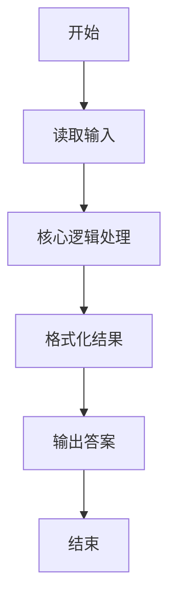
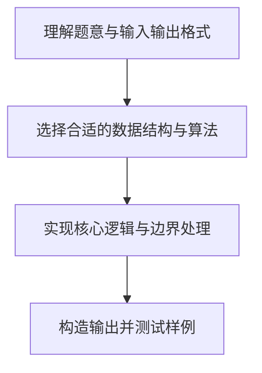

# L1-020 - 帅到没朋友（20 分）

- **时间限制**: 200 ms
- **内存限制**: 65536 KB
- **代码长度限制**: 16 KB

---

## 题目描述


当芸芸众生忙着在朋友圈中发照片的时候，总有一些人因为太帅而没有朋友。本题就要求你找出那些帅到没有朋友的人。

### 输入格式:

输入第一行给出一个正整数`N`（$\le 100$），是已知朋友圈的个数；随后`N`行，每行首先给出一个正整数`K`（$\le 1000$），为朋友圈中的人数，然后列出一个朋友圈内的所有人——为方便起见，每人对应一个ID号，为5位数字（从00000到99999），ID间以空格分隔；之后给出一个正整数`M`（$\le 10000$），为待查询的人数；随后一行中列出`M`个待查询的ID，以空格分隔。

注意：没有朋友的人可以是根本没安装“朋友圈”，也可以是只有自己一个人在朋友圈的人。虽然有个别自恋狂会自己把自己反复加进朋友圈，但题目保证所有`K`超过1的朋友圈里都至少有2个不同的人。

### 输出格式:

按输入的顺序输出那些帅到没朋友的人。ID间用1个空格分隔，行的首尾不得有多余空格。如果没有人太帅，则输出`No one is handsome`。

注意：同一个人可以被查询多次，但只输出一次。

### 输入样例 1：
```in
3
3 11111 22222 55555
2 33333 44444
4 55555 66666 99999 77777
8
55555 44444 10000 88888 22222 11111 23333 88888
```

### 输出样例 1：
```out
10000 88888 23333
```

### 输入样例 2：
```in
3
3 11111 22222 55555
2 33333 44444
4 55555 66666 99999 77777
4
55555 44444 22222 11111
```

### 输出样例 2：
```out
No one is handsome
```

## 示例

### 示例 1

**输入:**
```
3
3 11111 22222 55555
2 33333 44444
4 55555 66666 99999 77777
8
55555 44444 10000 88888 22222 11111 23333 88888
```

**输出:**
```
10000 88888 23333
```

### 示例 2

**输入:**
```
3
3 11111 22222 55555
2 33333 44444
4 55555 66666 99999 77777
4
55555 44444 22222 11111
```

**输出:**
```
No one is handsome
```

### 解题思路

本题的核心逻辑为：人数大于 1 的朋友圈中的成员都“有朋友”，记录到集合后过滤查询名单。根据题意将输入转化为可计算的模型后，直接按规则求解即可。

数据结构上主要使用 模式匹配遍历（`gmatch`）、循环遍历。通过 Lua 的基础控制结构（条件与循环）配合字符串/数值处理完成核心判断与转换，逻辑直观易于实现。

关键步骤在于准确解析输入、按题面规则处理边界（如空格、符号、进制、整除等）并保证输出格式与样例完全一致。整体时间复杂度多为线性或常数级，满足限制。

### 代码流程说明

1. **读取输入**：通过 `io.read` 读取输入数据（按行或按 token 解析），并按需转换为数值或字符串。
2. **核心处理**：人数大于 1 的朋友圈中的成员都“有朋友”，记录到集合后过滤查询名单。
3. **逻辑判断/计算**：通过循环与条件分支完成题面要求的判定或累计。
4. **输出结果**：按题目指定格式通过 `print`/`io.write` 输出答案。

### 代码实现

```lua
-- 实现原理：人数大于 1 的朋友圈中的成员都“有朋友”，记录到集合后过滤查询名单。
local n = tonumber(io.read("*l"))
local social = {}
for _ = 1, n do
    local ids = {}
    for token in io.read("*l"):gmatch("%S+") do ids[#ids + 1] = token end
    if tonumber(ids[1]) > 1 then
        for i = 2, #ids do social[ids[i]] = true end
    end
end
local m = tonumber(io.read("*l"))
local answer, printed = {}, {}
for id in io.read("*l"):gmatch("%S+") do
    if not social[id] and not printed[id] then
        answer[#answer + 1] = id
        printed[id] = true
    end
end
if #answer == 0 then print("No one is handsome") else print(table.concat(answer, " ")) end
```

### 代码流程图



### 解题流程图


