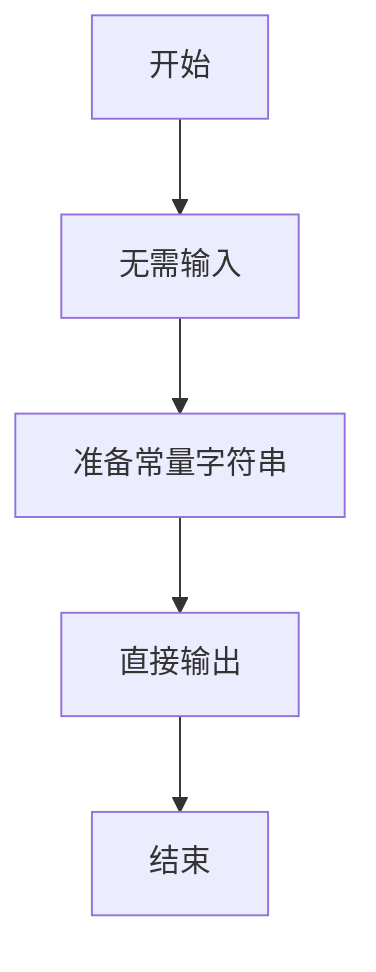
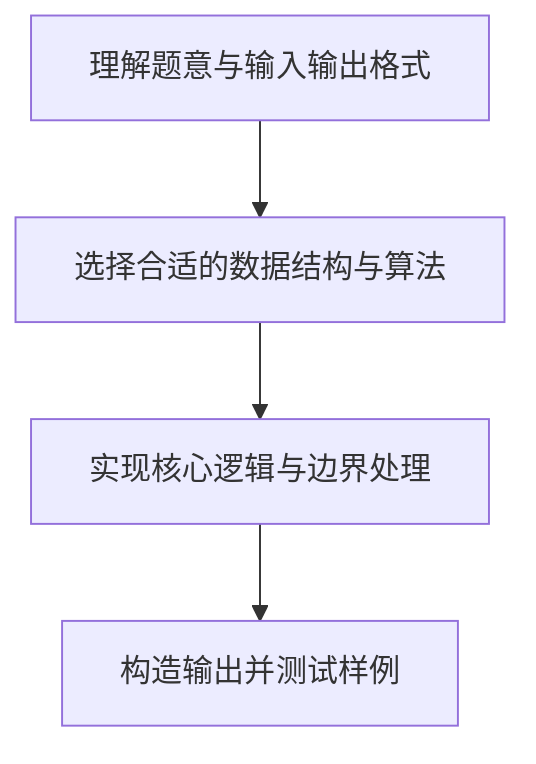

# L1-021 - 重要的话说三遍（5 分）

- **时间限制**: 400 ms
- **内存限制**: 65536 KB
- **代码长度限制**: 16 KB

---

## 题目描述


这道超级简单的题目没有任何输入。

你只需要把这句很重要的话 —— “I'm gonna WIN!”——连续输出三遍就可以了。

注意每遍占一行，除了每行的回车不能有任何多余字符。

### 输入样例:
```in
无
```

### 输出样例:
```out
I'm gonna WIN!
I'm gonna WIN!
I'm gonna WIN!
```

## 示例

### 示例 1

**输入:**
```
无
```

**输出:**
```
I'm gonna WIN!
I'm gonna WIN!
I'm gonna WIN!
```

### 解题思路

本题属于无输入直接输出类型。题目没有输入，连续三行输出指定文本，无需复杂算法，程序启动后直接输出指定内容即可。

数据结构上主要使用 循环遍历。通过 Lua 的基础控制结构（条件与循环）配合字符串/数值处理完成核心判断与转换，逻辑直观易于实现。

关键步骤在于准确解析输入、按题面规则处理边界（如空格、符号、进制、整除等）并保证输出格式与样例完全一致。整体时间复杂度多为线性或常数级，满足限制。

### 代码流程说明

1. **初始化**：无需读取输入，程序直接准备输出常量。
2. **核心处理**：题目没有输入，连续三行输出指定文本。
3. **逻辑判断/计算**：通过循环与条件分支完成题面要求的判定或累计。
4. **输出结果**：按题目指定格式通过 `print`/`io.write` 输出答案。

### 代码实现

```lua
-- 实现原理：题目没有输入，连续三行输出指定文本。
for _ = 1, 3 do print("I'm gonna WIN!") end
```

### 代码流程图



### 解题流程图


