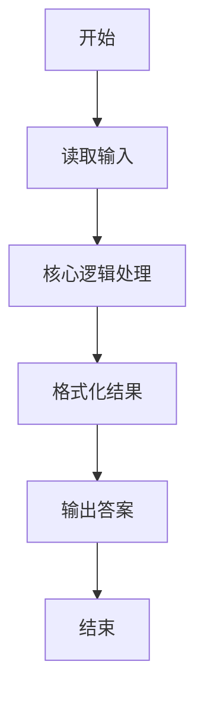
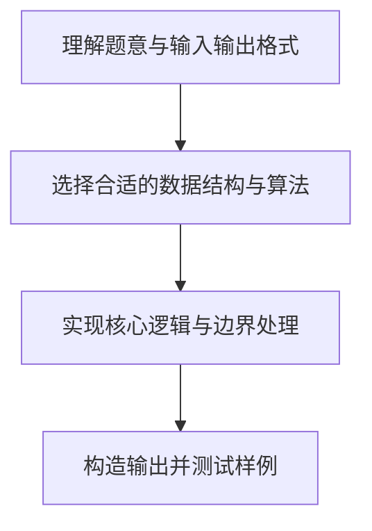

# L1-022 - 奇偶分家（10 分）

- **时间限制**: 400 ms
- **内存限制**: 65536 KB
- **代码长度限制**: 16 KB

---

## 题目描述


给定`N`个正整数，请统计奇数和偶数各有多少个？

### 输入格式:

输入第一行给出一个正整`N`（$\le 1000$）；第2行给出`N`个非负整数，以空格分隔。

### 输出格式:

在一行中先后输出奇数的个数、偶数的个数。中间以1个空格分隔。

### 输入样例:
```in
9
88 74 101 26 15 0 34 22 77
```

### 输出样例:
```out
3 6
```

## 示例

### 示例 1

**输入:**
```
9
88 74 101 26 15 0 34 22 77
```

**输出:**
```
3 6
```

### 解题思路

本题的核心逻辑为：遍历输入数列，按模 2 的结果分别计数。根据题意将输入转化为可计算的模型后，直接按规则求解即可。

数据结构上主要使用 模式匹配遍历（`gmatch`）、循环遍历。通过 Lua 的基础控制结构（条件与循环）配合字符串/数值处理完成核心判断与转换，逻辑直观易于实现。

关键步骤在于准确解析输入、按题面规则处理边界（如空格、符号、进制、整除等）并保证输出格式与样例完全一致。整体时间复杂度多为线性或常数级，满足限制。

### 代码流程说明

1. **读取输入**：通过 `io.read` 读取输入数据（按行或按 token 解析），并按需转换为数值或字符串。
2. **核心处理**：遍历输入数列，按模 2 的结果分别计数。
3. **逻辑判断/计算**：通过循环与条件分支完成题面要求的判定或累计。
4. **输出结果**：按题目指定格式通过 `print`/`io.write` 输出答案。

### 代码实现

```lua
-- 实现原理：遍历输入数列，按模 2 的结果分别计数。
local n = tonumber(io.read("*l"))
local odd = 0
for value in io.read("*l"):gmatch("%d+") do
    if tonumber(value) % 2 == 1 then odd = odd + 1 end
end
print(odd .. " " .. (n - odd))
```

### 代码流程图



### 解题流程图


