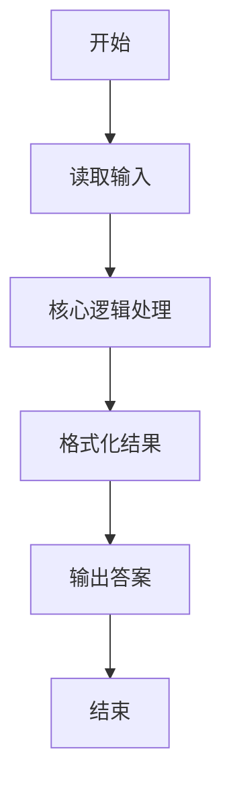
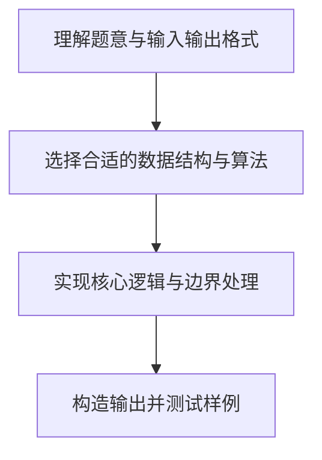

# L1-023 - 输出GPLT（20 分）

- **时间限制**: 150 ms
- **内存限制**: 65536 KB
- **代码长度限制**: 16 KB

---

## 题目描述


给定一个长度不超过10000的、仅由英文字母构成的字符串。请将字符重新调整顺序，按`GPLTGPLT....`这样的顺序输出，并忽略其它字符。当然，四种字符（不区分大小写）的个数不一定是一样多的，若某种字符已经输出完，则余下的字符仍按`GPLT`的顺序打印，直到所有字符都被输出。

### 输入格式:

输入在一行中给出一个长度不超过10000的、仅由英文字母构成的非空字符串。

### 输出格式:

在一行中按题目要求输出排序后的字符串。题目保证输出非空。

### 输入样例:
```in
pcTclnGloRgLrtLhgljkLhGFauPewSKgt
```

### 输出样例:
```out
GPLTGPLTGLTGLGLL
```

## 示例

### 示例 1

**输入:**
```
pcTclnGloRgLrtLhgljkLhGFauPewSKgt
```

**输出:**
```
GPLTGPLTGLTGLGLL
```

### 解题思路

本题的核心逻辑为：统计 G、P、L、T（忽略大小写）的数量，再循环按 GPLT 顺序尽量输出。根据题意将输入转化为可计算的模型后，直接按规则求解即可。

数据结构上主要使用 模式匹配遍历（`gmatch`）、哈希表/字典、循环枚举。通过 Lua 的基础控制结构（条件与循环）配合字符串/数值处理完成核心判断与转换，逻辑直观易于实现。

关键步骤在于准确解析输入、按题面规则处理边界（如空格、符号、进制、整除等）并保证输出格式与样例完全一致。整体时间复杂度多为线性或常数级，满足限制。

### 代码流程说明

1. **读取输入**：通过 `io.read` 读取输入数据（按行或按 token 解析），并按需转换为数值或字符串。
2. **核心处理**：统计 G、P、L、T（忽略大小写）的数量，再循环按 GPLT 顺序尽量输出。
3. **逻辑判断/计算**：通过循环与条件分支完成题面要求的判定或累计。
4. **输出结果**：按题目指定格式通过 `print`/`io.write` 输出答案。

### 代码实现

```lua
-- 实现原理：统计 G、P、L、T（忽略大小写）的数量，再循环按 GPLT 顺序尽量输出。
local count = { G = 0, P = 0, L = 0, T = 0 }
for ch in io.read("*l"):upper():gmatch(".") do
    if count[ch] then count[ch] = count[ch] + 1 end
end
local answer, order = {}, {"G", "P", "L", "T"}
while count.G + count.P + count.L + count.T > 0 do
    for _, ch in ipairs(order) do
        if count[ch] > 0 then
            answer[#answer + 1] = ch
            count[ch] = count[ch] - 1
        end
    end
end
print(table.concat(answer))
```

### 代码流程图



### 解题流程图


