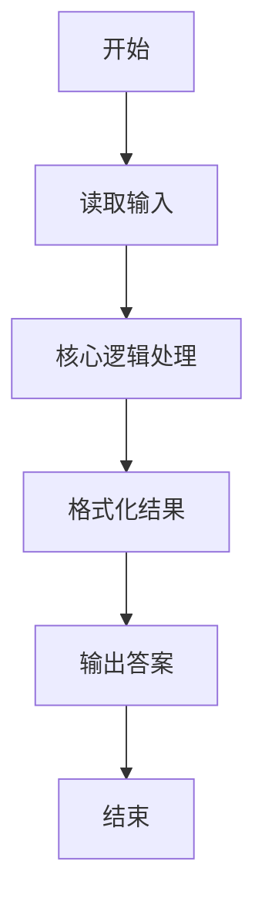
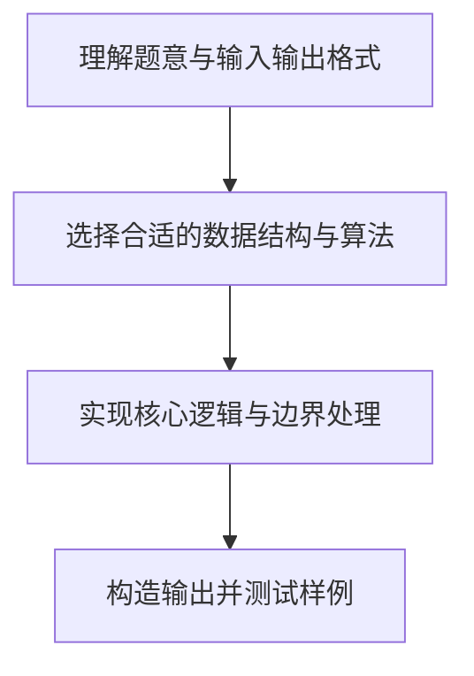

# L1-025 - 正整数A+B（15 分）

- **时间限制**: 400 ms
- **内存限制**: 65536 KB
- **代码长度限制**: 16 KB

---

## 题目描述


题的目标很简单，就是求两个正整数`A`和`B`的和，其中`A`和`B`都在区间[1,1000]。稍微有点麻烦的是，输入并不保证是两个正整数。

### 输入格式:

输入在一行给出`A`和`B`，其间以空格分开。问题是`A`和`B`不一定是满足要求的正整数，有时候可能是超出范围的数字、负数、带小数点的实数、甚至是一堆乱码。

注意：我们把输入中出现的第1个空格认为是`A`和`B`的分隔。题目保证至少存在一个空格，并且`B`不是一个空字符串。

### 输出格式:

如果输入的确是两个正整数，则按格式`A + B = 和`输出。如果某个输入不合要求，则在相应位置输出`?`，显然此时和也是`?`。

### 输入样例 1：
```in
123 456
```

### 输出样例 1：
```out
123 + 456 = 579
```

### 输入样例 2：
```in
22. 18
```

### 输出样例 2：
```out
? + 18 = ?
```

### 输入样例 3：
```in
-100 blabla bla...33
```

### 输出样例 3：
```out
? + ? = ?
```

## 示例

### 示例 1

**输入:**
```
123 456
```

**输出:**
```
123 + 456 = 579
```

### 示例 2

**输入:**
```
22. 18
```

**输出:**
```
? + 18 = ?
```

### 示例 3

**输入:**
```
-100 blabla bla...33
```

**输出:**
```
? + ? = ?
```

### 解题思路

本题的核心逻辑为：第一个空格前后分别是 A、B；用完整数字匹配和范围判断输入是否合法。根据题意将输入转化为可计算的模型后，直接按规则求解即可。

数据结构上主要使用 基础变量与条件分支。通过 Lua 的基础控制结构（条件与循环）配合字符串/数值处理完成核心判断与转换，逻辑直观易于实现。

关键步骤在于准确解析输入、按题面规则处理边界（如空格、符号、进制、整除等）并保证输出格式与样例完全一致。整体时间复杂度多为线性或常数级，满足限制。

### 代码流程说明

1. **读取输入**：通过 `io.read` 读取输入数据（按行或按 token 解析），并按需转换为数值或字符串。
2. **核心处理**：第一个空格前后分别是 A、B；用完整数字匹配和范围判断输入是否合法。
3. **逻辑判断/计算**：通过循环与条件分支完成题面要求的判定或累计。
4. **输出结果**：按题目指定格式通过 `print`/`io.write` 输出答案。

### 代码实现

```lua
-- 实现原理：第一个空格前后分别是 A、B；用完整数字匹配和范围判断输入是否合法。
local line = io.read("*l")
local left, right = line:match("^(.-) (.*)$")
local function parse(s)
    if not s:match("^%d+$") then return nil end
    local value = tonumber(s)
    if value < 1 or value > 1000 then return nil end
    return value
end
local a, b = parse(left), parse(right)
local shown_a, shown_b = a or "?", b or "?"
if a and b then
    print(shown_a .. " + " .. shown_b .. " = " .. (a + b))
else
    print(shown_a .. " + " .. shown_b .. " = ?")
end
```

### 代码流程图



### 解题流程图


