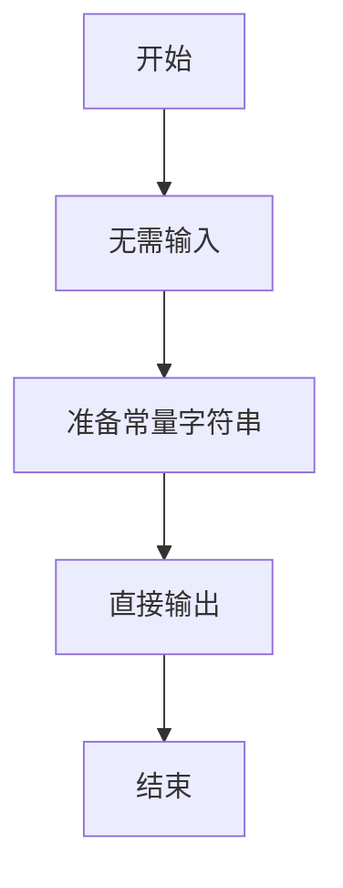
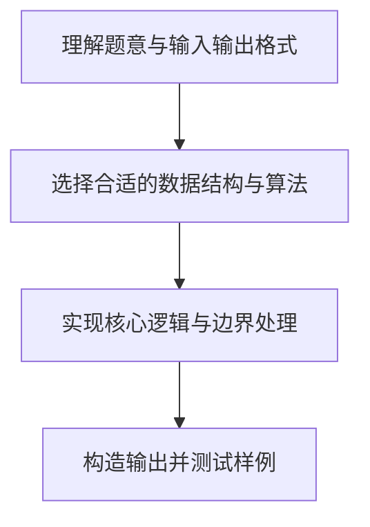

# L1-026 - I Love GPLT（5 分）

- **时间限制**: 400 ms
- **内存限制**: 65536 KB
- **代码长度限制**: 16 KB

---

## 题目描述


这道超级简单的题目没有任何输入。

你只需要把这句很重要的话 —— “I Love GPLT”——竖着输出就可以了。

所谓“竖着输出”，是指每个字符占一行（包括空格），即每行只能有1个字符和回车。

### 输入样例:
```in
无
```

### 输出样例:
```out
I
 
L
o
v
e
 
G
P
L
T
```

## 示例

### 示例 1

**输入:**
```
无
```

**输出:**
```
I
 
L
o
v
e
 
G
P
L
T
```

### 解题思路

本题的核心逻辑为：逐字符输出固定字符串，空格也作为独立的一行保留。根据题意将输入转化为可计算的模型后，直接按规则求解即可。

数据结构上主要使用 模式匹配遍历（`gmatch`）、循环遍历。通过 Lua 的基础控制结构（条件与循环）配合字符串/数值处理完成核心判断与转换，逻辑直观易于实现。

关键步骤在于准确解析输入、按题面规则处理边界（如空格、符号、进制、整除等）并保证输出格式与样例完全一致。整体时间复杂度多为线性或常数级，满足限制。

### 代码流程说明

1. **初始化**：无需读取输入，程序直接准备输出常量。
2. **核心处理**：逐字符输出固定字符串，空格也作为独立的一行保留。
3. **逻辑判断/计算**：通过循环与条件分支完成题面要求的判定或累计。
4. **输出结果**：按题目指定格式通过 `print`/`io.write` 输出答案。

### 代码实现

```lua
-- 实现原理：逐字符输出固定字符串，空格也作为独立的一行保留。
for ch in ("I Love GPLT"):gmatch(".") do print(ch) end
```

### 代码流程图



### 解题流程图


