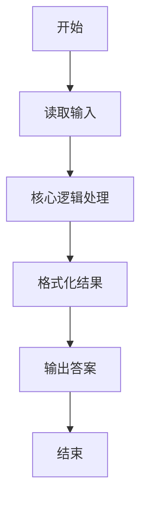
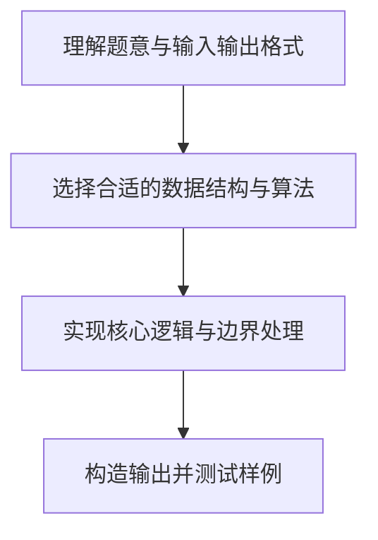

# L1-027 - 出租（20 分）

- **时间限制**: 400 ms
- **内存限制**: 65536 KB
- **代码长度限制**: 16 KB

---

## 题目描述


下面是新浪微博上曾经很火的一张图：


一时间网上一片求救声，急问这个怎么破。其实这段代码很简单，`index`数组就是`arr`数组的下标，`index[0]=2` 对应 `arr[2]=1`，`index[1]=0` 对应 `arr[0]=8`，`index[2]=3` 对应 `arr[3]=0`，以此类推…… 很容易得到电话号码是`18013820100`。

本题要求你编写一个程序，为任何一个电话号码生成这段代码 —— 事实上，只要生成最前面两行就可以了，后面内容是不变的。

### 输入格式:

输入在一行中给出一个由11位数字组成的手机号码。

### 输出格式:

为输入的号码生成代码的前两行，其中`arr`中的数字必须按递减顺序给出。

### 输入样例:
```in
18013820100
```

### 输出样例:
```out
int[] arr = new int[]{8,3,2,1,0};
int[] index = new int[]{3,0,4,3,1,0,2,4,3,4,4};
```

## 示例

### 示例 1

**输入:**
```
18013820100
```

**输出:**
```
int[] arr = new int[]{8,3,2,1,0};
int[] index = new int[]{3,0,4,3,1,0,2,4,3,4,4};
```

### 解题思路

本题的核心逻辑为：收集号码中出现的数字，降序排列为 arr；每一位在 arr 中的位置组成 index。根据题意将输入转化为可计算的模型后，直接按规则求解即可。

数据结构上主要使用 模式匹配遍历（`gmatch`）、循环遍历。通过 Lua 的基础控制结构（条件与循环）配合字符串/数值处理完成核心判断与转换，逻辑直观易于实现。

关键步骤在于准确解析输入、按题面规则处理边界（如空格、符号、进制、整除等）并保证输出格式与样例完全一致。整体时间复杂度多为线性或常数级，满足限制。

### 代码流程说明

1. **读取输入**：通过 `io.read` 读取输入数据（按行或按 token 解析），并按需转换为数值或字符串。
2. **核心处理**：收集号码中出现的数字，降序排列为 arr；每一位在 arr 中的位置组成 index。
3. **逻辑判断/计算**：通过循环与条件分支完成题面要求的判定或累计。
4. **输出结果**：按题目指定格式通过 `print`/`io.write` 输出答案。

### 代码实现

```lua
-- 实现原理：收集号码中出现的数字，降序排列为 arr；每一位在 arr 中的位置组成 index。
local phone = io.read("*l")
local present = {}
for digit in phone:gmatch("%d") do present[tonumber(digit)] = true end
local arr = {}
for digit = 9, 0, -1 do if present[digit] then arr[#arr + 1] = digit end end
local position = {}
for i, digit in ipairs(arr) do position[digit] = i - 1 end
local index = {}
for digit in phone:gmatch("%d") do index[#index + 1] = position[tonumber(digit)] end
print("int[] arr = new int[]{" .. table.concat(arr, ",") .. "};")
print("int[] index = new int[]{" .. table.concat(index, ",") .. "};")
```

### 代码流程图



### 解题流程图


