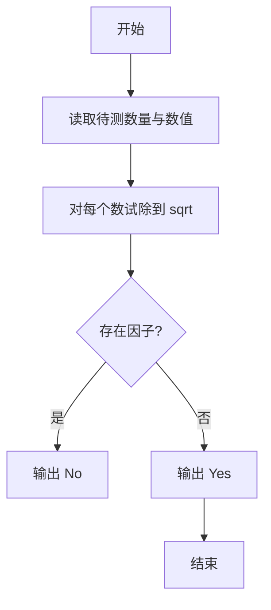
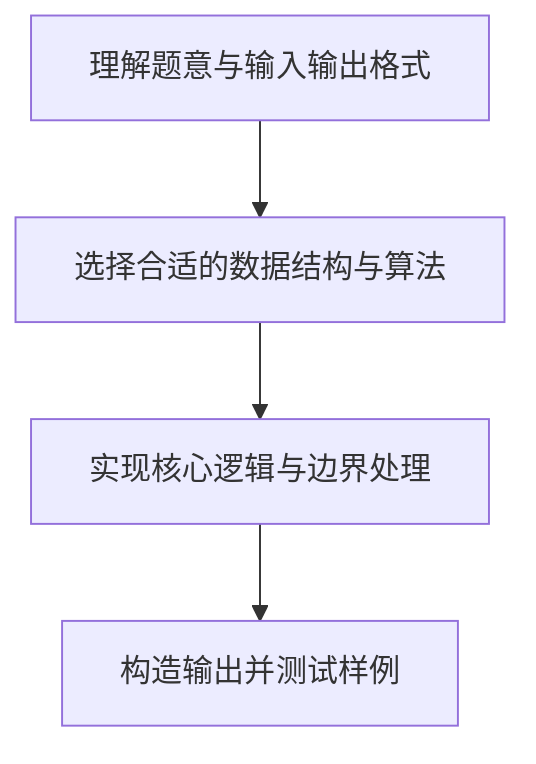

# L1-028 - 判断素数（10 分）

- **时间限制**: 400 ms
- **内存限制**: 65536 KB
- **代码长度限制**: 16 KB

---

## 题目描述


本题的目标很简单，就是判断一个给定的正整数是否素数。

### 输入格式:

输入在第一行给出一个正整数`N`（$$\le$$ 10），随后`N`行，每行给出一个小于$$2^{31}$$的需要判断的正整数。

### 输出格式:

对每个需要判断的正整数，如果它是素数，则在一行中输出`Yes`，否则输出`No`。

### 输入样例:
```in
2
11
111
```

### 输出样例:
```out
Yes
No
```

## 示例

### 示例 1

**输入:**
```
2
11
111
```

**输出:**
```
Yes
No
```

### 解题思路

本题的核心逻辑为：试除到平方根即可；若不存在整除因子，则该数为素数。根据题意将输入转化为可计算的模型后，直接按规则求解即可。

数据结构上主要使用 数学库（`math`）、循环遍历。通过 Lua 的基础控制结构（条件与循环）配合字符串/数值处理完成核心判断与转换，逻辑直观易于实现。

关键步骤在于准确解析输入、按题面规则处理边界（如空格、符号、进制、整除等）并保证输出格式与样例完全一致。整体时间复杂度多为线性或常数级，满足限制。

### 代码流程说明

1. **读取输入**：通过 `io.read` 读取输入数据（按行或按 token 解析），并按需转换为数值或字符串。
2. **核心处理**：试除到平方根即可；若不存在整除因子，则该数为素数。
3. **逻辑判断/计算**：通过循环与条件分支完成题面要求的判定或累计。
4. **输出结果**：按题目指定格式通过 `print`/`io.write` 输出答案。

### 代码实现

```lua
-- 实现原理：试除到平方根即可；若不存在整除因子，则该数为素数。
local function is_prime(n)
    if n < 2 then return false end
    if n == 2 then return true end
    if n % 2 == 0 then return false end
    for divisor = 3, math.floor(math.sqrt(n)), 2 do
        if n % divisor == 0 then return false end
    end
    return true
end
local count = tonumber(io.read("*l"))
for _ = 1, count do
    print(is_prime(tonumber(io.read("*l"))) and "Yes" or "No")
end
```

### 代码流程图



### 解题流程图


