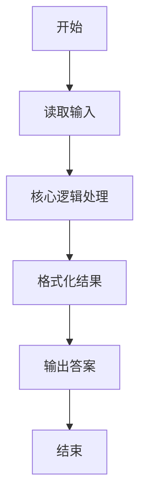
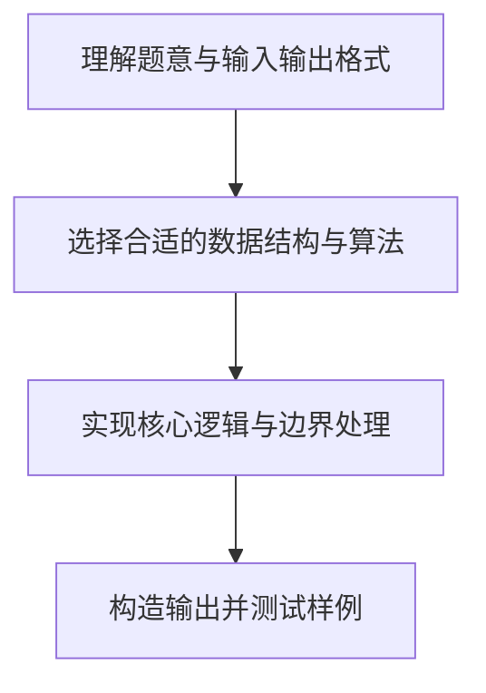

# L1-029 - 是不是太胖了（5 分）

- **时间限制**: 400 ms
- **内存限制**: 65536 KB
- **代码长度限制**: 16 KB

---

## 题目描述


据说一个人的标准体重应该是其身高（单位：厘米）减去100、再乘以0.9所得到的公斤数。已知市斤的数值是公斤数值的两倍。现给定某人身高，请你计算其标准体重应该是多少？（顺便也悄悄给自己算一下吧……）

### 输入格式:

输入第一行给出一个正整数`H`（100 $$<$$ `H` $$\le$$ 300），为某人身高。

### 输出格式:

在一行中输出对应的标准体重，单位为市斤，保留小数点后1位。

### 输入样例:
```in
169
```

### 输出样例:
```out
124.2
```

## 示例

### 示例 1

**输入:**
```
169
```

**输出:**
```
124.2
```

### 解题思路

本题的核心逻辑为：标准体重（市斤）为 (身高 - 100) * 0.9 * 2，按一位小数输出。根据题意将输入转化为可计算的模型后，直接按规则求解即可。

数据结构上主要使用 基础变量与条件分支。通过 Lua 的基础控制结构（条件与循环）配合字符串/数值处理完成核心判断与转换，逻辑直观易于实现。

关键步骤在于准确解析输入、按题面规则处理边界（如空格、符号、进制、整除等）并保证输出格式与样例完全一致。整体时间复杂度多为线性或常数级，满足限制。

### 代码流程说明

1. **读取输入**：通过 `io.read` 读取输入数据（按行或按 token 解析），并按需转换为数值或字符串。
2. **核心处理**：标准体重（市斤）为 (身高 - 100) * 0.9 * 2，按一位小数输出。
3. **逻辑判断/计算**：通过循环与条件分支完成题面要求的判定或累计。
4. **输出结果**：按题目指定格式通过 `print`/`io.write` 输出答案。

### 代码实现

```lua
-- 实现原理：标准体重（市斤）为 (身高 - 100) * 0.9 * 2，按一位小数输出。
local height = tonumber(io.read("*l"))
print(string.format("%.1f", (height - 100) * 1.8))
```

### 代码流程图



### 解题流程图


