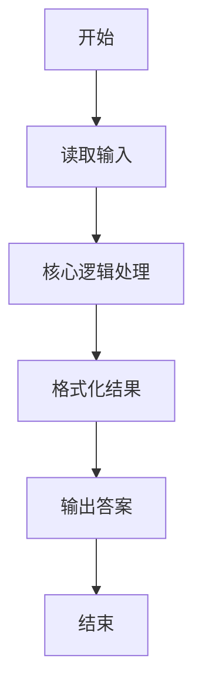
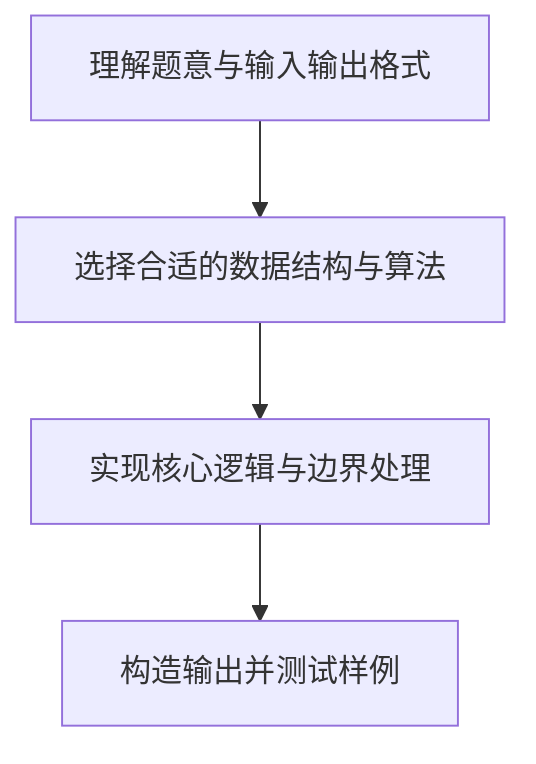

# L1-030 - 一帮一（15 分）

- **时间限制**: 400 ms
- **内存限制**: 65536 KB
- **代码长度限制**: 16 KB

---

## 题目描述


“一帮一学习小组”是中小学中常见的学习组织方式，老师把学习成绩靠前的学生跟学习成绩靠后的学生排在一组。本题就请你编写程序帮助老师自动完成这个分配工作，即在得到全班学生的排名后，在当前尚未分组的学生中，将名次最靠前的学生与名次最靠后的**异性**学生分为一组。

### 输入格式:

输入第一行给出正偶数`N`（$\le$50），即全班学生的人数。此后`N`行，按照名次从高到低的顺序给出每个学生的性别（0代表女生，1代表男生）和姓名（不超过8个英文字母的非空字符串），其间以1个空格分隔。这里保证本班男女比例是1:1，并且没有并列名次。

### 输出格式:

每行输出一组两个学生的姓名，其间以1个空格分隔。名次高的学生在前，名次低的学生在后。小组的输出顺序按照前面学生的名次从高到低排列。

### 输入样例:
```in
8
0 Amy
1 Tom
1 Bill
0 Cindy
0 Maya
1 John
1 Jack
0 Linda
```

### 输出样例:
```out
Amy Jack
Tom Linda
Bill Maya
Cindy John
```

## 示例

### 示例 1

**输入:**
```
8
0 Amy
1 Tom
1 Bill
0 Cindy
0 Maya
1 John
1 Jack
0 Linda
```

**输出:**
```
Amy Jack
Tom Linda
Bill Maya
Cindy John
```

### 解题思路

本题的核心逻辑为：依次取排名最高的未配对学生，并从末尾找排名最低的异性配对。根据题意将输入转化为可计算的模型后，直接按规则求解即可。

数据结构上主要使用 循环遍历。通过 Lua 的基础控制结构（条件与循环）配合字符串/数值处理完成核心判断与转换，逻辑直观易于实现。

关键步骤在于准确解析输入、按题面规则处理边界（如空格、符号、进制、整除等）并保证输出格式与样例完全一致。整体时间复杂度多为线性或常数级，满足限制。

### 代码流程说明

1. **读取输入**：通过 `io.read` 读取输入数据（按行或按 token 解析），并按需转换为数值或字符串。
2. **核心处理**：依次取排名最高的未配对学生，并从末尾找排名最低的异性配对。
3. **逻辑判断/计算**：通过循环与条件分支完成题面要求的判定或累计。
4. **输出结果**：按题目指定格式通过 `print`/`io.write` 输出答案。

### 代码实现

```lua
-- 实现原理：依次取排名最高的未配对学生，并从末尾找排名最低的异性配对。
local n = tonumber(io.read("*l"))
local students, used = {}, {}
for i = 1, n do
    local gender, name = io.read("*l"):match("(%d)%s+(%S+)")
    students[i] = { gender = gender, name = name }
end
for i = 1, n do
    if not used[i] then
        for j = n, i + 1, -1 do
            if not used[j] and students[i].gender ~= students[j].gender then
                print(students[i].name .. " " .. students[j].name)
                used[i], used[j] = true, true
                break
            end
        end
    end
end
```

### 代码流程图



### 解题流程图


