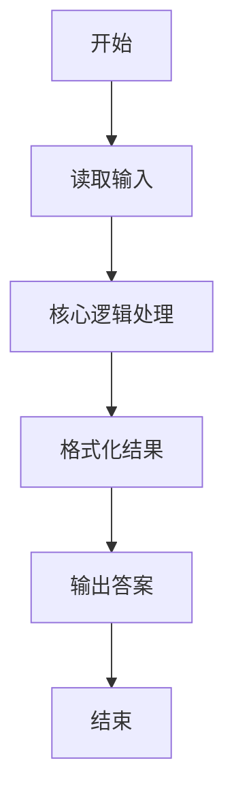
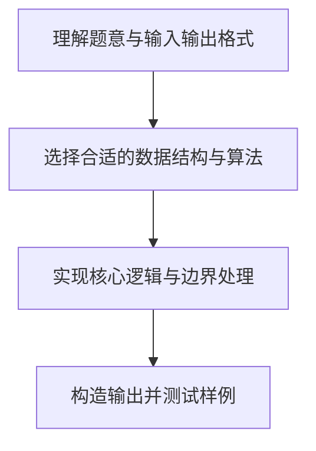

# L1-031 - 到底是不是太胖了（10 分）

- **时间限制**: 400 ms
- **内存限制**: 65536 KB
- **代码长度限制**: 16 KB

---

## 题目描述


据说一个人的标准体重应该是其身高（单位：厘米）减去100、再乘以0.9所得到的公斤数。真实体重与标准体重误差在10%以内都是完美身材（即 | 真实体重 $-$ 标准体重 | $<$ 标准体重$\times 10\%$）。已知 1 公斤等于 2 市斤。现给定一群人的身高和实际体重，请你告诉他们是否太胖或太瘦了。

### 输入格式:

输入第一行给出一个正整数`N`（$\le$ 20）。随后`N`行，每行给出两个整数，分别是一个人的身高`H`（120 $<$ `H` $<$ 200；单位：厘米）和真实体重`W`（50 $<$ `W` $\le$ 300；单位：市斤），其间以空格分隔。

### 输出格式:

为每个人输出一行结论：如果是完美身材，输出`You are wan mei!`；如果太胖了，输出`You are tai pang le!`；否则输出`You are tai shou le!`。

### 输入样例:
```in
3
169 136
150 81
178 155
```

### 输出样例:
```out
You are wan mei!
You are tai shou le!
You are tai pang le!
```

## 示例

### 示例 1

**输入:**
```
3
169 136
150 81
178 155
```

**输出:**
```
You are wan mei!
You are tai shou le!
You are tai pang le!
```

### 解题思路

本题的核心逻辑为：以标准体重为基准，比较真实体重是否落在其 90% 到 110% 的开区间内。根据题意将输入转化为可计算的模型后，直接按规则求解即可。

数据结构上主要使用 数学库（`math`）、循环遍历。通过 Lua 的基础控制结构（条件与循环）配合字符串/数值处理完成核心判断与转换，逻辑直观易于实现。

关键步骤在于准确解析输入、按题面规则处理边界（如空格、符号、进制、整除等）并保证输出格式与样例完全一致。整体时间复杂度多为线性或常数级，满足限制。

### 代码流程说明

1. **读取输入**：通过 `io.read` 读取输入数据（按行或按 token 解析），并按需转换为数值或字符串。
2. **核心处理**：以标准体重为基准，比较真实体重是否落在其 90% 到 110% 的开区间内。
3. **逻辑判断/计算**：通过循环与条件分支完成题面要求的判定或累计。
4. **输出结果**：按题目指定格式通过 `print`/`io.write` 输出答案。

### 代码实现

```lua
-- 实现原理：以标准体重为基准，比较真实体重是否落在其 90% 到 110% 的开区间内。
local n = tonumber(io.read("*l"))
for _ = 1, n do
    local h, w = io.read("*l"):match("(%d+)%s+(%d+)")
    local standard = (tonumber(h) - 100) * 1.8 -- 换算为市斤
    w = tonumber(w)
    if math.abs(w - standard) < standard * 0.1 then
        print("You are wan mei!")
    elseif w > standard then
        print("You are tai pang le!")
    else
        print("You are tai shou le!")
    end
end
```

### 代码流程图



### 解题流程图


