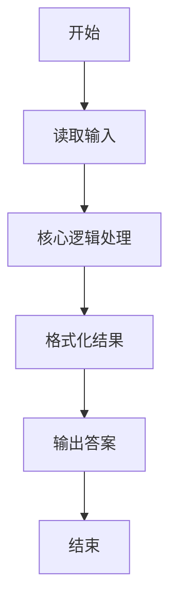
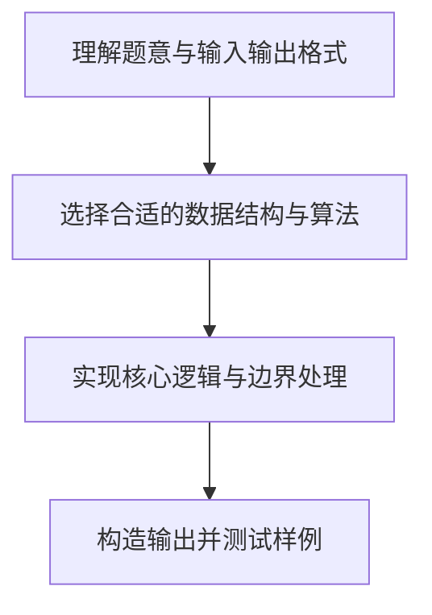

# L1-032 - Left-pad（20 分）

- **时间限制**: 400 ms
- **内存限制**: 65536 KB
- **代码长度限制**: 16 KB

---

## 题目描述


根据新浪微博上的消息，有一位开发者不满NPM（Node Package Manager）的做法，收回了自己的开源代码，其中包括一个叫left-pad的模块，就是这个模块把javascript里面的React/Babel干瘫痪了。这是个什么样的模块？就是在字符串前填充一些东西到一定的长度。例如用`*`去填充字符串`GPLT`，使之长度为10，调用left-pad的结果就应该是`******GPLT`。Node社区曾经对left-pad紧急发布了一个替代，被严重吐槽。下面就请你来实现一下这个模块。

### 输入格式:

输入在第一行给出一个正整数`N`（$\le 10^4$）和一个字符，分别是填充结果字符串的长度和用于填充的字符，中间以1个空格分开。第二行给出原始的非空字符串，以回车结束。

### 输出格式:

在一行中输出结果字符串。

### 输入样例 1：
```in
15 _
I love GPLT
```

### 输出样例 1：
```out
____I love GPLT
```

### 输入样例 2：
```in
4 *
this is a sample for cut
```

### 输出样例 2：
```out
cut
```

## 示例

### 示例 1

**输入:**
```
15 _
I love GPLT
```

**输出:**
```
____I love GPLT
```

### 示例 2

**输入:**
```
4 *
this is a sample for cut
```

**输出:**
```
cut
```

### 解题思路

本题的核心逻辑为：原串长度不足 N 时在左侧补字符，否则截取其最右侧 N 个字符。根据题意将输入转化为可计算的模型后，直接按规则求解即可。

数据结构上主要使用 字符串重复拼接（`string.rep`）。通过 Lua 的基础控制结构（条件与循环）配合字符串/数值处理完成核心判断与转换，逻辑直观易于实现。

关键步骤在于准确解析输入、按题面规则处理边界（如空格、符号、进制、整除等）并保证输出格式与样例完全一致。整体时间复杂度多为线性或常数级，满足限制。

### 代码流程说明

1. **读取输入**：通过 `io.read` 读取输入数据（按行或按 token 解析），并按需转换为数值或字符串。
2. **核心处理**：原串长度不足 N 时在左侧补字符，否则截取其最右侧 N 个字符。
3. **格式化构造**：使用字符串重复/拼接构造输出行。
4. **输出结果**：按题目指定格式通过 `print`/`io.write` 输出答案。

### 代码实现

```lua
-- 实现原理：原串长度不足 N 时在左侧补字符，否则截取其最右侧 N 个字符。
local n, pad = io.read("*l"):match("(%d+)%s+(%S)")
n = tonumber(n)
local s = io.read("*l")
if #s < n then
    print(string.rep(pad, n - #s) .. s)
else
    print(s:sub(#s - n + 1))
end
```

### 代码流程图



### 解题流程图


