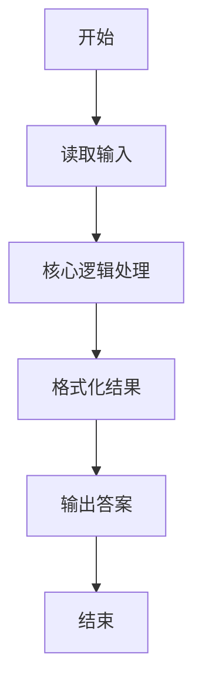
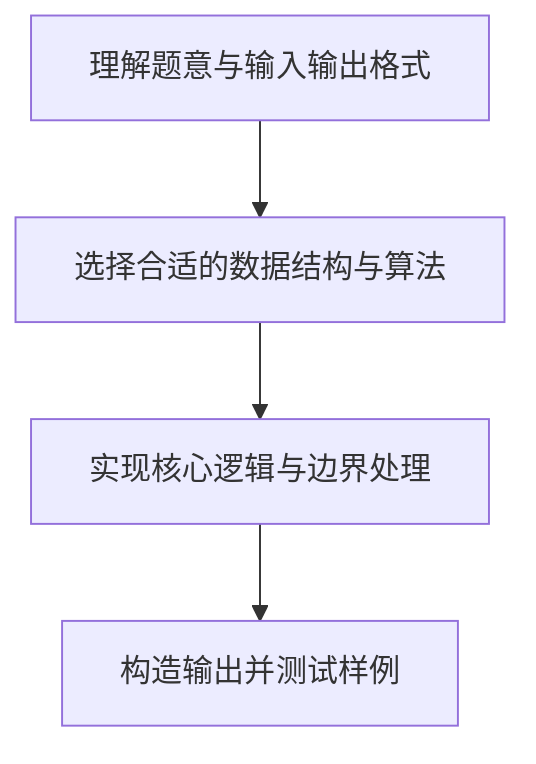

# L1-034 - 点赞（20 分）

- **时间限制**: 200 ms
- **内存限制**: 65536 KB
- **代码长度限制**: 16 KB

---

## 题目描述


微博上有个“点赞”功能，你可以为你喜欢的博文点个赞表示支持。每篇博文都有一些刻画其特性的标签，而你点赞的博文的类型，也间接刻画了你的特性。本题就要求你写个程序，通过统计一个人点赞的纪录，分析这个人的特性。

### 输入格式:

输入在第一行给出一个正整数$$N$$（$$\le 1000$$），是该用户点赞的博文数量。随后$$N$$行，每行给出一篇被其点赞的博文的特性描述，格式为“$$K$$ $$F_1\cdots F_K$$”，其中$$1\le K\le 10$$，$$F_i$$（$$i=1, \cdots , K$$）是特性标签的编号，我们将所有特性标签从1到1000编号。数字间以空格分隔。

### 输出格式:

统计所有被点赞的博文中最常出现的那个特性标签，在一行中输出它的编号和出现次数，数字间隔1个空格。如果有并列，则输出编号最大的那个。

### 输入样例:
```in
4
3 889 233 2
5 100 3 233 2 73
4 3 73 889 2
2 233 123
```

### 输出样例:
```out
233 3
```

## 示例

### 示例 1

**输入:**
```
4
3 889 233 2
5 100 3 233 2 73
4 3 73 889 2
2 233 123
```

**输出:**
```
233 3
```

### 解题思路

本题的核心逻辑为：累加每个标签的出现次数，更新时将“次数更大、编号更大”作为优先条件。根据题意将输入转化为可计算的模型后，直接按规则求解即可。

数据结构上主要使用 模式匹配遍历（`gmatch`）、循环遍历。通过 Lua 的基础控制结构（条件与循环）配合字符串/数值处理完成核心判断与转换，逻辑直观易于实现。

关键步骤在于准确解析输入、按题面规则处理边界（如空格、符号、进制、整除等）并保证输出格式与样例完全一致。整体时间复杂度多为线性或常数级，满足限制。

### 代码流程说明

1. **读取输入**：通过 `io.read` 读取输入数据（按行或按 token 解析），并按需转换为数值或字符串。
2. **核心处理**：累加每个标签的出现次数，更新时将“次数更大、编号更大”作为优先条件。
3. **逻辑判断/计算**：通过循环与条件分支完成题面要求的判定或累计。
4. **输出结果**：按题目指定格式通过 `print`/`io.write` 输出答案。

### 代码实现

```lua
-- 实现原理：累加每个标签的出现次数，更新时将“次数更大、编号更大”作为优先条件。
local n = tonumber(io.read("*l"))
local count, best_id, best_count = {}, 0, 0
for _ = 1, n do
    local tags = {}
    for value in io.read("*l"):gmatch("%d+") do tags[#tags + 1] = tonumber(value) end
    for i = 2, #tags do
        local id = tags[i]
        count[id] = (count[id] or 0) + 1
        if count[id] > best_count or (count[id] == best_count and id > best_id) then
            best_id, best_count = id, count[id]
        end
    end
end
print(best_id .. " " .. best_count)
```

### 代码流程图



### 解题流程图


