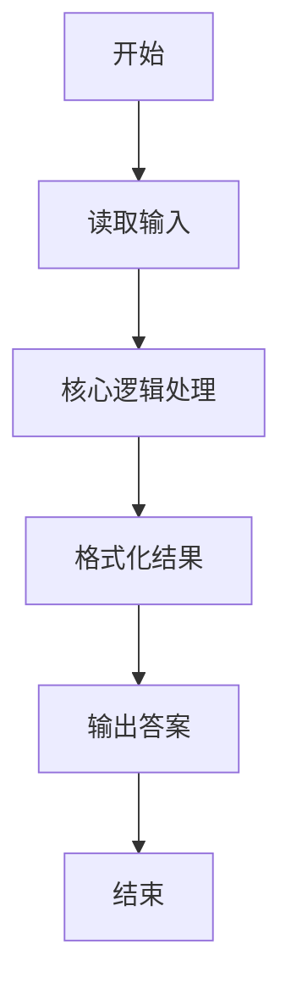
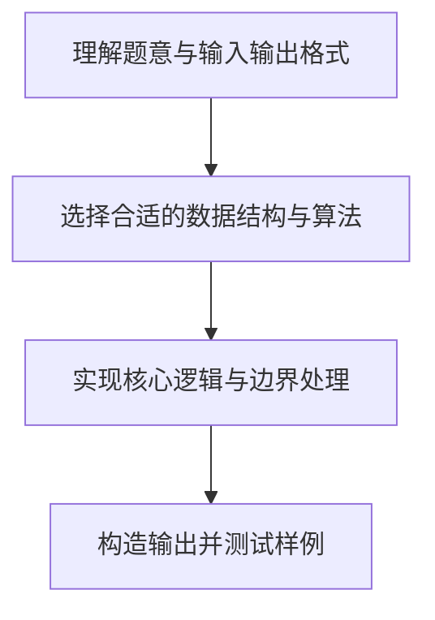

# L1-035 - 情人节（15 分）

- **时间限制**: 400 ms
- **内存限制**: 65536 KB
- **代码长度限制**: 16 KB

---

## 题目描述


以上是朋友圈中一奇葩贴：“2月14情人节了，我决定造福大家。第2个赞和第14个赞的，我介绍你俩认识…………咱三吃饭…你俩请…”。现给出此贴下点赞的朋友名单，请你找出那两位要请客的倒霉蛋。

### 输入格式:

输入按照点赞的先后顺序给出不知道多少个点赞的人名，每个人名占一行，为不超过10个英文字母的非空单词，以回车结束。一个英文句点`.`标志输入的结束，这个符号不算在点赞名单里。

### 输出格式:

根据点赞情况在一行中输出结论：若存在第2个人A和第14个人B，则输出“A and B are inviting you to dinner...”；若只有A没有B，则输出“A is the only one for you...”；若连A都没有，则输出“Momo... No one is for you ...”。

### 输入样例 1：
```in
GaoXZh
Magi
Einst
Quark
LaoLao
FatMouse
ZhaShen
fantacy
latesum
SenSen
QuanQuan
whatever
whenever
Potaty
hahaha
.
```

### 输出样例 1：
```out
Magi and Potaty are inviting you to dinner...
```

### 输入样例 2：
```in
LaoLao
FatMouse
whoever
.
```

### 输出样例 2：
```out
FatMouse is the only one for you...
```

### 输入样例 3：
```in
LaoLao
.
```

### 输出样例 3：
```out
Momo... No one is for you ...
```

## 示例

### 示例 1

**输入:**
```
GaoXZh
Magi
Einst
Quark
LaoLao
FatMouse
ZhaShen
fantacy
latesum
SenSen
QuanQuan
whatever
whenever
Potaty
hahaha
.
```

**输出:**
```
Magi and Potaty are inviting you to dinner...
```

### 示例 2

**输入:**
```
LaoLao
FatMouse
whoever
.
```

**输出:**
```
FatMouse is the only one for you...
```

### 示例 3

**输入:**
```
LaoLao
.
```

**输出:**
```
Momo... No one is for you ...
```

### 解题思路

本题的核心逻辑为：顺序记录点赞者；第 2 位和第 14 位存在时按不同情况拼接固定句式。根据题意将输入转化为可计算的模型后，直接按规则求解即可。

数据结构上主要使用 循环枚举。通过 Lua 的基础控制结构（条件与循环）配合字符串/数值处理完成核心判断与转换，逻辑直观易于实现。

关键步骤在于准确解析输入、按题面规则处理边界（如空格、符号、进制、整除等）并保证输出格式与样例完全一致。整体时间复杂度多为线性或常数级，满足限制。

### 代码流程说明

1. **读取输入**：通过 `io.read` 读取输入数据（按行或按 token 解析），并按需转换为数值或字符串。
2. **核心处理**：顺序记录点赞者；第 2 位和第 14 位存在时按不同情况拼接固定句式。
3. **逻辑判断/计算**：通过循环与条件分支完成题面要求的判定或累计。
4. **输出结果**：按题目指定格式通过 `print`/`io.write` 输出答案。

### 代码实现

```lua
-- 实现原理：顺序记录点赞者；第 2 位和第 14 位存在时按不同情况拼接固定句式。
local names = {}
while true do
    local name = io.read("*l")
    if name == "." then break end
    names[#names + 1] = name
end
if not names[2] then
    print("Momo... No one is for you ...")
elseif not names[14] then
    print(names[2] .. " is the only one for you...")
else
    print(names[2] .. " and " .. names[14] .. " are inviting you to dinner...")
end
```

### 代码流程图



### 解题流程图


