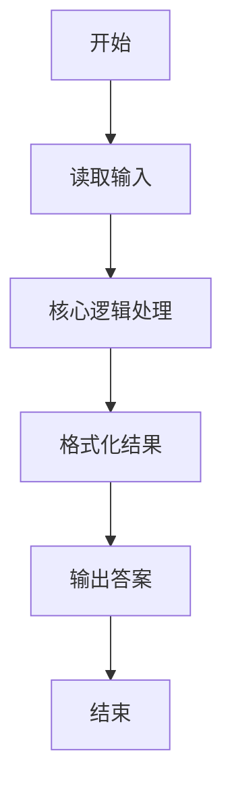
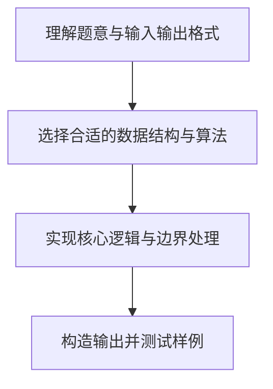

# L1-036 - A乘以B（5 分）

- **时间限制**: 400 ms
- **内存限制**: 65536 KB
- **代码长度限制**: 16 KB

---

## 题目描述


看我没骗你吧 —— 这是一道你可以在 10 秒内完成的题：给定两个绝对值不超过 100 的整数 $$A$$ 和 $$B$$，输出 $$A$$ 乘以 $$B$$ 的值。

### 输入格式:

输入在第一行给出两个整数 $$A$$ 和 $$B$$（$$-100 \le A, B \le 100$$），数字间以空格分隔。

### 输出格式:

在一行中输出 $$A$$ 乘以 $$B$$ 的值。

### 输入样例:
```in
-8 13
```

### 输出样例:
```out
-104
```

## 示例

### 示例 1

**输入:**
```
-8 13
```

**输出:**
```
-104
```

### 解题思路

本题属于无输入直接输出类型。读入两个整数后直接输出它们的乘积，无需复杂算法，程序启动后直接输出指定内容即可。

数据结构上主要使用 基础变量与条件分支。通过 Lua 的基础控制结构（条件与循环）配合字符串/数值处理完成核心判断与转换，逻辑直观易于实现。

关键步骤在于准确解析输入、按题面规则处理边界（如空格、符号、进制、整除等）并保证输出格式与样例完全一致。整体时间复杂度多为线性或常数级，满足限制。

### 代码流程说明

1. **读取输入**：通过 `io.read` 读取输入数据（按行或按 token 解析），并按需转换为数值或字符串。
2. **核心处理**：读入两个整数后直接输出它们的乘积。
3. **逻辑判断/计算**：通过循环与条件分支完成题面要求的判定或累计。
4. **输出结果**：按题目指定格式通过 `print`/`io.write` 输出答案。

### 代码实现

```lua
-- 实现原理：读入两个整数后直接输出它们的乘积。
local a, b = io.read("*l"):match("(-?%d+)%s+(-?%d+)")
print(tonumber(a) * tonumber(b))
```

### 代码流程图



### 解题流程图


