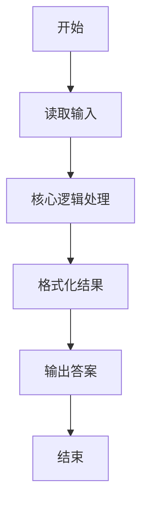
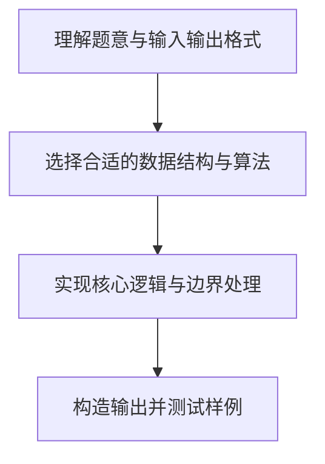

# L1-037 - A除以B（10 分）

- **时间限制**: 400 ms
- **内存限制**: 65536 KB
- **代码长度限制**: 16 KB

---

## 题目描述


真的是简单题哈 —— 给定两个绝对值不超过100的整数$$A$$和$$B$$，要求你按照“$$A/B=$$商”的格式输出结果。

### 输入格式:

输入在第一行给出两个整数$$A$$和$$B$$（$$-100 \le A, B \le 100$$），数字间以空格分隔。

### 输出格式:

在一行中输出结果：如果分母是正数，则输出“$$A/B=$$商”；如果分母是负数，则要用括号把分母括起来输出；如果分母为零，则输出的商应为`Error`。输出的商应保留小数点后2位。

### 输入样例 1：
```in
-1 2
```

### 输出样例 1：
```out
-1/2=-0.50
```

### 输入样例 2：
```in
1 -3
```

### 输出样例 2：
```out
1/(-3)=-0.33
```

### 输入样例 3：
```in
5 0
```

### 输出样例 3：
```out
5/0=Error
```

## 示例

### 示例 1

**输入:**
```
-1 2
```

**输出:**
```
-1/2=-0.50
```

### 示例 2

**输入:**
```
1 -3
```

**输出:**
```
1/(-3)=-0.33
```

### 示例 3

**输入:**
```
5 0
```

**输出:**
```
5/0=Error
```

### 解题思路

本题的核心逻辑为：按分母的符号决定展示格式；分母为 0 时不计算商而输出 Error。根据题意将输入转化为可计算的模型后，直接按规则求解即可。

数据结构上主要使用 基础变量与条件分支。通过 Lua 的基础控制结构（条件与循环）配合字符串/数值处理完成核心判断与转换，逻辑直观易于实现。

关键步骤在于准确解析输入、按题面规则处理边界（如空格、符号、进制、整除等）并保证输出格式与样例完全一致。整体时间复杂度多为线性或常数级，满足限制。

### 代码流程说明

1. **读取输入**：通过 `io.read` 读取输入数据（按行或按 token 解析），并按需转换为数值或字符串。
2. **核心处理**：按分母的符号决定展示格式；分母为 0 时不计算商而输出 Error。
3. **逻辑判断/计算**：通过循环与条件分支完成题面要求的判定或累计。
4. **输出结果**：按题目指定格式通过 `print`/`io.write` 输出答案。

### 代码实现

```lua
-- 实现原理：按分母的符号决定展示格式；分母为 0 时不计算商而输出 Error。
local a, b = io.read("*l"):match("(-?%d+)%s+(-?%d+)")
a, b = tonumber(a), tonumber(b)
local divisor = b < 0 and "(" .. b .. ")" or tostring(b)
if b == 0 then
    print(a .. "/" .. divisor .. "=Error")
else
    print(a .. "/" .. divisor .. "=" .. string.format("%.2f", a / b))
end
```

### 代码流程图



### 解题流程图


