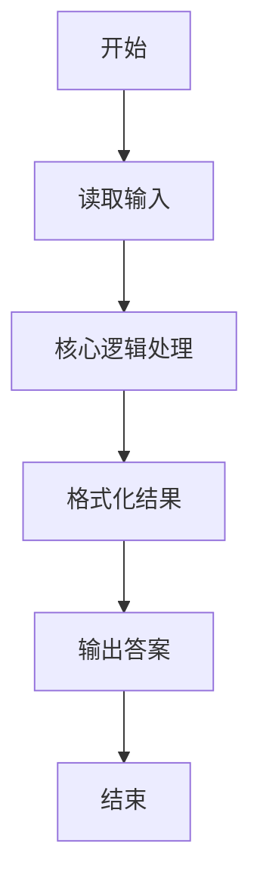
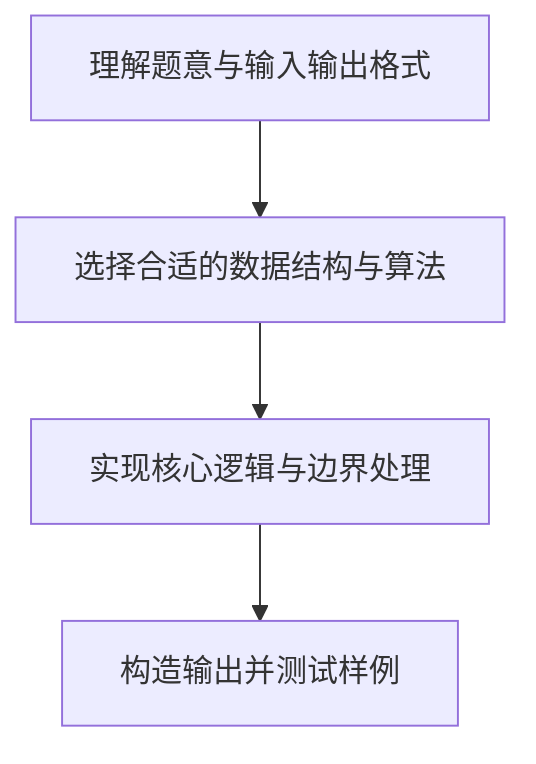

# L1-039 - 古风排版（20 分）

- **时间限制**: 400 ms
- **内存限制**: 65536 KB
- **代码长度限制**: 16 KB

---

## 题目描述


中国的古人写文字，是从右向左竖向排版的。本题就请你编写程序，把一段文字按古风排版。

### 输入格式:

输入在第一行给出一个正整数$$N$$（$$<100$$），是每一列的字符数。第二行给出一个长度不超过1000的非空字符串，以回车结束。

### 输出格式:

按古风格式排版给定的字符串，每列$$N$$个字符（除了最后一列可能不足$$N$$个）。

### 输入样例:
```in
4
This is a test case
```

### 输出样例:
```out
asa T
st ih
e tsi
 ce s
```

## 示例

### 示例 1

**输入:**
```
4
This is a test case
```

**输出:**
```
asa T
st ih
e tsi
 ce s
```

### 解题思路

本题的核心逻辑为：文本从右侧列开始自上而下填入；未填满的位置保留为空格后逐行打印。根据题意将输入转化为可计算的模型后，直接按规则求解即可。

数据结构上主要使用 数学库（`math`）、循环遍历。通过 Lua 的基础控制结构（条件与循环）配合字符串/数值处理完成核心判断与转换，逻辑直观易于实现。

关键步骤在于准确解析输入、按题面规则处理边界（如空格、符号、进制、整除等）并保证输出格式与样例完全一致。整体时间复杂度多为线性或常数级，满足限制。

### 代码流程说明

1. **读取输入**：通过 `io.read` 读取输入数据（按行或按 token 解析），并按需转换为数值或字符串。
2. **核心处理**：文本从右侧列开始自上而下填入；未填满的位置保留为空格后逐行打印。
3. **格式化构造**：使用字符串重复/拼接构造输出行。
4. **输出结果**：按题目指定格式通过 `print`/`io.write` 输出答案。

### 代码实现

```lua
-- 实现原理：文本从右侧列开始自上而下填入；未填满的位置保留为空格后逐行打印。
local rows = tonumber(io.read("*l"))
local text = io.read("*l")
local columns = math.ceil(#text / rows)
local page = {}
for r = 1, rows do
    page[r] = {}
    for c = 1, columns do page[r][c] = " " end
end
for i = 1, #text do
    local column = columns - (i - 1) // rows
    local row = (i - 1) % rows + 1
    page[row][column] = text:sub(i, i)
end
for r = 1, rows do print(table.concat(page[r])) end
```

### 代码流程图



### 解题流程图


