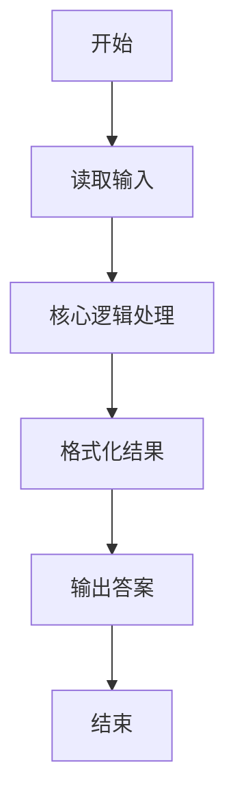
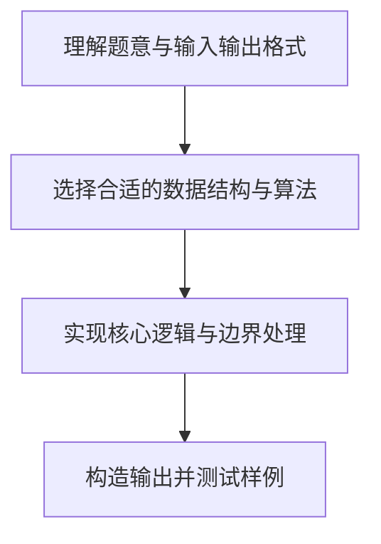

# L1-040 - 最佳情侣身高差（10 分）

- **时间限制**: 400 ms
- **内存限制**: 65536 KB
- **代码长度限制**: 16 KB

---

## 题目描述


专家通过多组情侣研究数据发现，最佳的情侣身高差遵循着一个公式：$\text{女方身高}\times 1.09=\text{男方身高}$。如果符合，你俩的身高差不管是牵手、拥抱、接吻，都是最和谐的差度。

下面就请你写个程序，为任意一位用户计算他/她的情侣的最佳身高。

### 输入格式:

输入第一行给出正整数$N$（$\le 10$），为前来查询的用户数。随后$N$行，每行按照“性别 身高”的格式给出前来查询的用户的性别和身高，其中“性别”为“F”表示女性、“M”表示男性；“身高”为区间 [1.0, 3.0] 之间的实数。

### 输出格式:

对每一个查询，在一行中为该用户计算出其情侣的最佳身高，保留小数点后2位。

### 输入样例:
```in
2
M 1.75
F 1.8
```

### 输出样例:
```out
1.61
1.96
```

## 示例

### 示例 1

**输入:**
```
2
M 1.75
F 1.8
```

**输出:**
```
1.61
1.96
```

### 解题思路

本题的核心逻辑为：女方身高乘 1.09 得男方身高；男用户反向除以 1.09 求女方身高。根据题意将输入转化为可计算的模型后，直接按规则求解即可。

数据结构上主要使用 循环遍历。通过 Lua 的基础控制结构（条件与循环）配合字符串/数值处理完成核心判断与转换，逻辑直观易于实现。

关键步骤在于准确解析输入、按题面规则处理边界（如空格、符号、进制、整除等）并保证输出格式与样例完全一致。整体时间复杂度多为线性或常数级，满足限制。

### 代码流程说明

1. **读取输入**：通过 `io.read` 读取输入数据（按行或按 token 解析），并按需转换为数值或字符串。
2. **核心处理**：女方身高乘 1.09 得男方身高；男用户反向除以 1.09 求女方身高。
3. **逻辑判断/计算**：通过循环与条件分支完成题面要求的判定或累计。
4. **输出结果**：按题目指定格式通过 `print`/`io.write` 输出答案。

### 代码实现

```lua
-- 实现原理：女方身高乘 1.09 得男方身高；男用户反向除以 1.09 求女方身高。
local n = tonumber(io.read("*l"))
for _ = 1, n do
    local gender, height = io.read("*l"):match("(%S+)%s+([%d.]+)")
    height = tonumber(height)
    local partner = gender == "M" and height / 1.09 or height * 1.09
    print(string.format("%.2f", partner))
end
```

### 代码流程图



### 解题流程图


