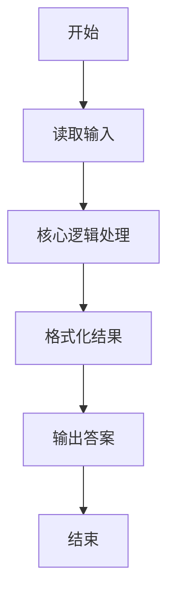
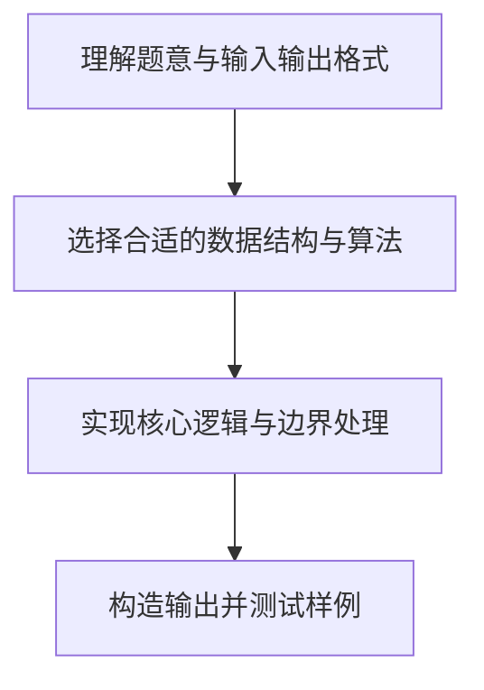

# L1-041 - 寻找250（10 分）

- **时间限制**: 400 ms
- **内存限制**: 65536 KB
- **代码长度限制**: 16 KB

---

## 题目描述


对方不想和你说话，并向你扔了一串数…… 而你必须从这一串数字中找到“250”这个高大上的感人数字。

### 输入格式:

输入在一行中给出不知道多少个绝对值不超过1000的整数，其中保证至少存在一个“250”。

### 输出格式:

在一行中输出第一次出现的“250”是对方扔过来的第几个数字（计数从1开始）。题目保证输出的数字在整型范围内。

### 输入样例:
```in
888 666 123 -233 250 13 250 -222
```

### 输出样例:
```out
5
```

## 示例

### 示例 1

**输入:**
```
888 666 123 -233 250 13 250 -222
```

**输出:**
```
5
```

### 解题思路

本题的核心逻辑为：按输入顺序计数，找到首个值为 250 的位置即输出。根据题意将输入转化为可计算的模型后，直接按规则求解即可。

数据结构上主要使用 模式匹配遍历（`gmatch`）、循环遍历。通过 Lua 的基础控制结构（条件与循环）配合字符串/数值处理完成核心判断与转换，逻辑直观易于实现。

关键步骤在于准确解析输入、按题面规则处理边界（如空格、符号、进制、整除等）并保证输出格式与样例完全一致。整体时间复杂度多为线性或常数级，满足限制。

### 代码流程说明

1. **读取输入**：通过 `io.read` 读取输入数据（按行或按 token 解析），并按需转换为数值或字符串。
2. **核心处理**：按输入顺序计数，找到首个值为 250 的位置即输出。
3. **逻辑判断/计算**：通过循环与条件分支完成题面要求的判定或累计。
4. **输出结果**：按题目指定格式通过 `print`/`io.write` 输出答案。

### 代码实现

```lua
-- 实现原理：按输入顺序计数，找到首个值为 250 的位置即输出。
local index = 0
for token in io.read("*l"):gmatch("-?%d+") do
    index = index + 1
    if tonumber(token) == 250 then print(index); break end
end
```

### 代码流程图



### 解题流程图


