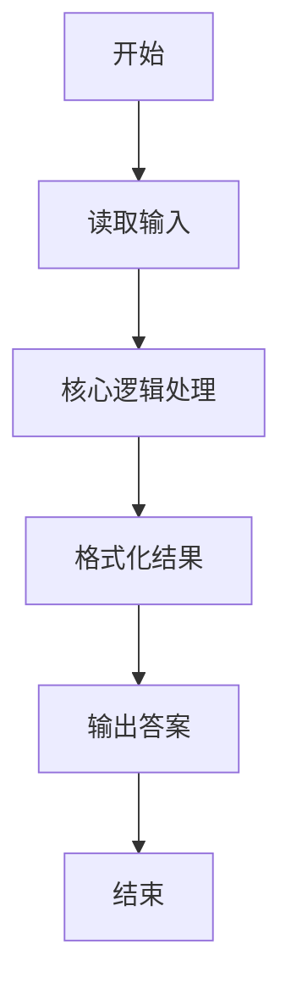
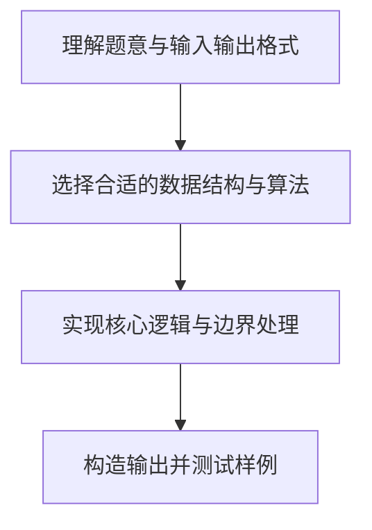

# L1-042 - 日期格式化（5 分）

- **时间限制**: 400 ms
- **内存限制**: 65536 KB
- **代码长度限制**: 16 KB

---

## 题目描述


世界上不同国家有不同的写日期的习惯。比如美国人习惯写成“月-日-年”，而中国人习惯写成“年-月-日”。下面请你写个程序，自动把读入的美国格式的日期改写成中国习惯的日期。

### 输入格式:

输入在一行中按照“mm-dd-yyyy”的格式给出月、日、年。题目保证给出的日期是1900年元旦至今合法的日期。

### 输出格式:

在一行中按照“yyyy-mm-dd”的格式给出年、月、日。

### 输入样例:
```in
03-15-2017
```

### 输出样例:
```out
2017-03-15
```

## 示例

### 示例 1

**输入:**
```
03-15-2017
```

**输出:**
```
2017-03-15
```

### 解题思路

本题的核心逻辑为：按连字符拆分月、日、年，再以 年-月-日 的顺序重组。根据题意将输入转化为可计算的模型后，直接按规则求解即可。

数据结构上主要使用 基础变量与条件分支。通过 Lua 的基础控制结构（条件与循环）配合字符串/数值处理完成核心判断与转换，逻辑直观易于实现。

关键步骤在于准确解析输入、按题面规则处理边界（如空格、符号、进制、整除等）并保证输出格式与样例完全一致。整体时间复杂度多为线性或常数级，满足限制。

### 代码流程说明

1. **读取输入**：通过 `io.read` 读取输入数据（按行或按 token 解析），并按需转换为数值或字符串。
2. **核心处理**：按连字符拆分月、日、年，再以 年-月-日 的顺序重组。
3. **逻辑判断/计算**：通过循环与条件分支完成题面要求的判定或累计。
4. **输出结果**：按题目指定格式通过 `print`/`io.write` 输出答案。

### 代码实现

```lua
-- 实现原理：按连字符拆分月、日、年，再以 年-月-日 的顺序重组。
local month, day, year = io.read("*l"):match("(%d%d)%-(%d%d)%-(%d%d%d%d)")
print(year .. "-" .. month .. "-" .. day)
```

### 代码流程图



### 解题流程图


