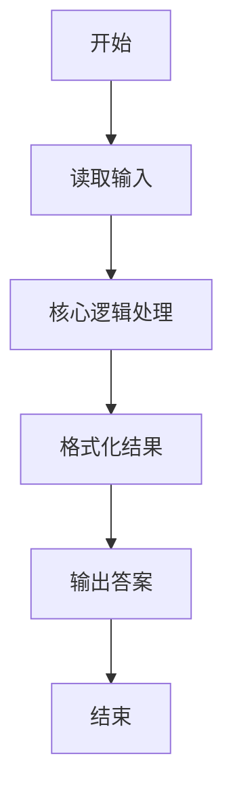
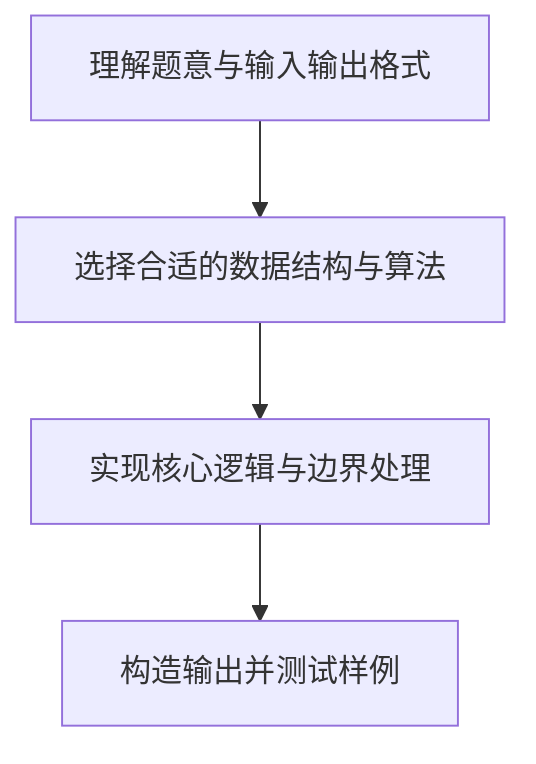

# L1-043 - 阅览室（20 分）

- **时间限制**: 400 ms
- **内存限制**: 65536 KB
- **代码长度限制**: 16 KB

---

## 题目描述


天梯图书阅览室请你编写一个简单的图书借阅统计程序。当读者借书时，管理员输入书号并按下`S`键，程序开始计时；当读者还书时，管理员输入书号并按下`E`键，程序结束计时。书号为不超过1000的正整数。当管理员将0作为书号输入时，表示一天工作结束，你的程序应输出当天的读者借书次数和平均阅读时间。

注意：由于线路偶尔会有故障，可能出现不完整的纪录，即只有`S`没有`E`，或者只有`E`没有`S`的纪录，系统应能自动忽略这种无效纪录。另外，题目保证书号是书的唯一标识，同一本书在任何时间区间内只可能被一位读者借阅。

### 输入格式:

输入在第一行给出一个正整数$$N$$（$$\le 10$$），随后给出$$N$$天的纪录。每天的纪录由若干次借阅操作组成，每次操作占一行，格式为：

`书号`（[1, 1000]内的整数） `键值`（`S`或`E`） `发生时间`（`hh:mm`，其中`hh`是[0,23]内的整数，`mm`是[0, 59]内整数）

每一天的纪录保证按时间递增的顺序给出。

### 输出格式:

对每天的纪录，在一行中输出当天的读者借书次数和平均阅读时间（以分钟为单位的精确到个位的整数时间）。

### 输入样例:
```in
3
1 S 08:10
2 S 08:35
1 E 10:00
2 E 13:16
0 S 17:00
0 S 17:00
3 E 08:10
1 S 08:20
2 S 09:00
1 E 09:20
0 E 17:00
```

### 输出样例:
```out
2 196
0 0
1 60
```

## 示例

### 示例 1

**输入:**
```
3
1 S 08:10
2 S 08:35
1 E 10:00
2 E 13:16
0 S 17:00
0 S 17:00
3 E 08:10
1 S 08:20
2 S 09:00
1 E 09:20
0 E 17:00
```

**输出:**
```
2 196
0 0
1 60
```

### 解题思路

本题的核心逻辑为：用书号记录未完成借阅的开始时刻；匹配到 E 时才计入次数与阅读时长。根据题意将输入转化为可计算的模型后，直接按规则求解即可。

数据结构上主要使用 数学库（`math`）、循环枚举。通过 Lua 的基础控制结构（条件与循环）配合字符串/数值处理完成核心判断与转换，逻辑直观易于实现。

关键步骤在于准确解析输入、按题面规则处理边界（如空格、符号、进制、整除等）并保证输出格式与样例完全一致。整体时间复杂度多为线性或常数级，满足限制。

### 代码流程说明

1. **读取输入**：通过 `io.read` 读取输入数据（按行或按 token 解析），并按需转换为数值或字符串。
2. **核心处理**：用书号记录未完成借阅的开始时刻；匹配到 E 时才计入次数与阅读时长。
3. **逻辑判断/计算**：通过循环与条件分支完成题面要求的判定或累计。
4. **输出结果**：按题目指定格式通过 `print`/`io.write` 输出答案。

### 代码实现

```lua
-- 实现原理：用书号记录未完成借阅的开始时刻；匹配到 E 时才计入次数与阅读时长。
local days = tonumber(io.read("*l"))
for _ = 1, days do
    local starts, count, total = {}, 0, 0
    while true do
        local id, action, time = io.read("*l"):match("(%d+)%s+(%S+)%s+(%d%d:%d%d)")
        id = tonumber(id)
        if id == 0 then break end
        local hour, minute = time:match("(%d%d):(%d%d)")
        local current = tonumber(hour) * 60 + tonumber(minute)
        if action == "S" then
            starts[id] = current
        elseif starts[id] then
            count = count + 1
            total = total + current - starts[id]
            starts[id] = nil
        end
    end
    local average = count == 0 and 0 or math.floor(total / count + 0.5)
    print(count .. " " .. average)
end
```

### 代码流程图



### 解题流程图


