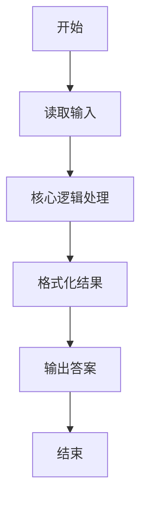
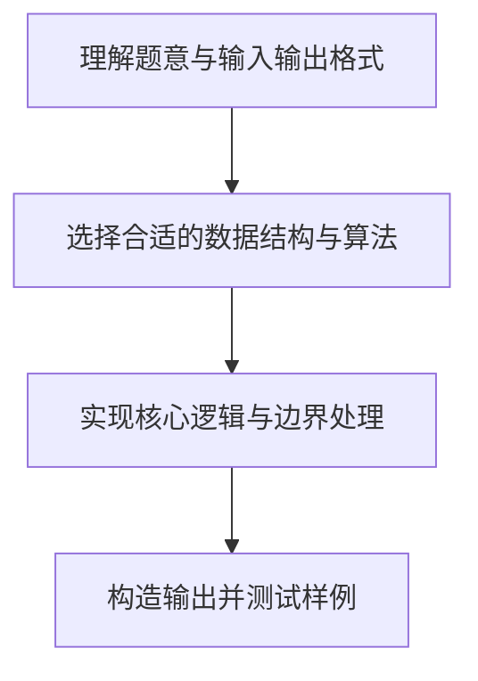

# L1-044 - 稳赢（15 分）

- **时间限制**: 400 ms
- **内存限制**: 65536 KB
- **代码长度限制**: 16 KB

---

## 题目描述


大家应该都会玩“锤子剪刀布”的游戏：两人同时给出手势，胜负规则如图所示：


现要求你编写一个稳赢不输的程序，根据对方的出招，给出对应的赢招。但是！为了不让对方输得太惨，你需要每隔$$K$$次就让一个平局。

### 输入格式:

输入首先在第一行给出正整数$$K$$（$$\le 10$$），即平局间隔的次数。随后每行给出对方的一次出招：`ChuiZi`代表“锤子”、`JianDao`代表“剪刀”、`Bu`代表“布”。`End`代表输入结束，这一行不要作为出招处理。

### 输出格式:

对每一个输入的出招，按要求输出稳赢或平局的招式。每招占一行。

### 输入样例:
```in
2
ChuiZi
JianDao
Bu
JianDao
Bu
ChuiZi
ChuiZi
End
```

### 输出样例:
```out
Bu
ChuiZi
Bu
ChuiZi
JianDao
ChuiZi
Bu
```

## 示例

### 示例 1

**输入:**
```
2
ChuiZi
JianDao
Bu
JianDao
Bu
ChuiZi
ChuiZi
End
```

**输出:**
```
Bu
ChuiZi
Bu
ChuiZi
JianDao
ChuiZi
Bu
```

### 解题思路

本题的核心逻辑为：连续赢 K 次后下一次输出相同招式制造平局；其他轮输出其克制招式。根据题意将输入转化为可计算的模型后，直接按规则求解即可。

数据结构上主要使用 循环迭代。通过 Lua 的基础控制结构（条件与循环）配合字符串/数值处理完成核心判断与转换，逻辑直观易于实现。

关键步骤在于准确解析输入、按题面规则处理边界（如空格、符号、进制、整除等）并保证输出格式与样例完全一致。整体时间复杂度多为线性或常数级，满足限制。

### 代码流程说明

1. **读取输入**：通过 `io.read` 读取输入数据（按行或按 token 解析），并按需转换为数值或字符串。
2. **核心处理**：连续赢 K 次后下一次输出相同招式制造平局；其他轮输出其克制招式。
3. **逻辑判断/计算**：通过循环与条件分支完成题面要求的判定或累计。
4. **输出结果**：按题目指定格式通过 `print`/`io.write` 输出答案。

### 代码实现

```lua
-- 实现原理：连续赢 K 次后下一次输出相同招式制造平局；其他轮输出其克制招式。
local win = { ChuiZi = "Bu", JianDao = "ChuiZi", Bu = "JianDao" }
local k = tonumber(io.read("*l"))
local streak = 0
while true do
    local move = io.read("*l")
    if move == "End" then break end
    if streak == k then
        print(move)
        streak = 0
    else
        print(win[move])
        streak = streak + 1
    end
end
```

### 代码流程图



### 解题流程图


