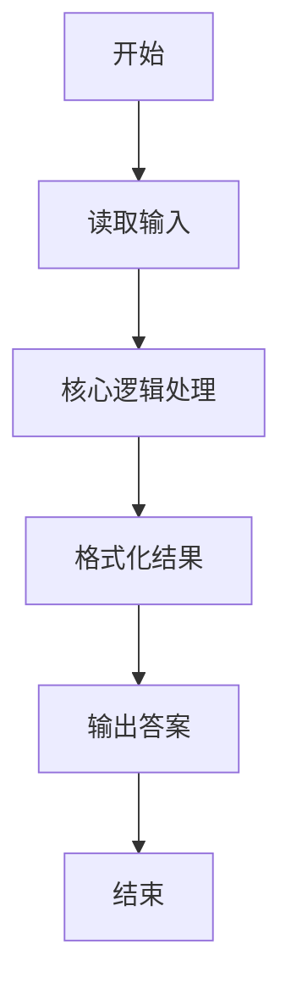
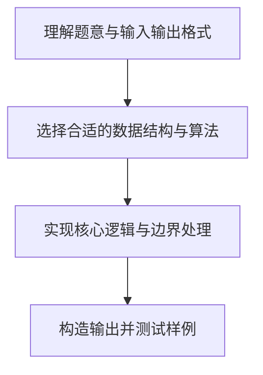

# L1-045 - 宇宙无敌大招呼（5 分）

- **时间限制**: 400 ms
- **内存限制**: 65536 KB
- **代码长度限制**: 16 KB

---

## 题目描述


据说所有程序员学习的第一个程序都是在屏幕上输出一句“Hello World”，跟这个世界打个招呼。作为天梯赛中的程序员，你写的程序得高级一点，要能跟任意指定的星球打招呼。

### 输入格式:

输入在第一行给出一个星球的名字`S`，是一个由不超过7个英文字母组成的单词，以回车结束。

### 输出格式:

在一行中输出`Hello S`，跟输入的`S`星球打个招呼。

### 输入样例:
```in
Mars
```

### 输出样例:
```out
Hello Mars
```

## 示例

### 示例 1

**输入:**
```
Mars
```

**输出:**
```
Hello Mars
```

### 解题思路

本题的核心逻辑为：将输入的星球名称拼接到固定问候语后。根据题意将输入转化为可计算的模型后，直接按规则求解即可。

数据结构上主要使用 基础变量与条件分支。通过 Lua 的基础控制结构（条件与循环）配合字符串/数值处理完成核心判断与转换，逻辑直观易于实现。

关键步骤在于准确解析输入、按题面规则处理边界（如空格、符号、进制、整除等）并保证输出格式与样例完全一致。整体时间复杂度多为线性或常数级，满足限制。

### 代码流程说明

1. **读取输入**：无输入，直接进入输出阶段，并按需转换为数值或字符串。
2. **核心处理**：将输入的星球名称拼接到固定问候语后。
3. **逻辑判断/计算**：通过循环与条件分支完成题面要求的判定或累计。
4. **输出结果**：按题目指定格式通过 `print`/`io.write` 输出答案。

### 代码实现

```lua
-- 实现原理：将输入的星球名称拼接到固定问候语后。
print("Hello " .. io.read("*l"))
```

### 代码流程图



### 解题流程图


