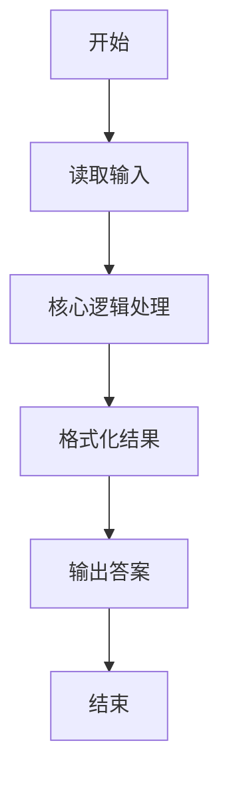
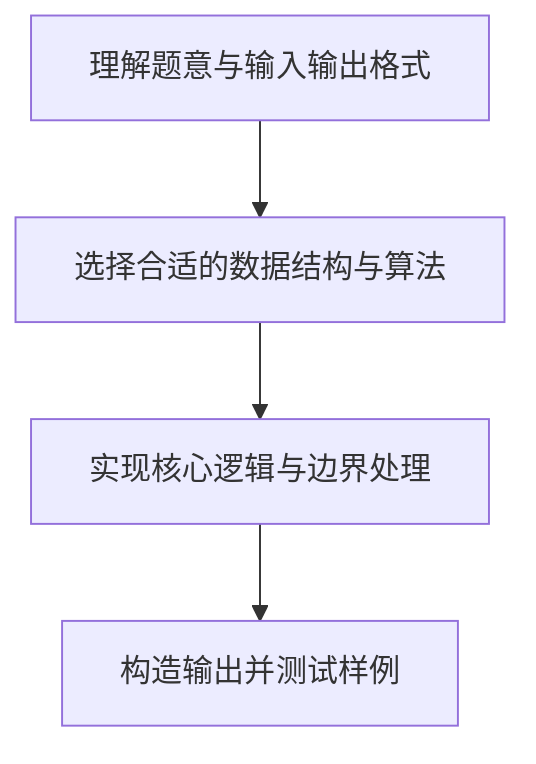

# L1-046 - 整除光棍（20 分）

- **时间限制**: 400 ms
- **内存限制**: 65536 KB
- **代码长度限制**: 16 KB

---

## 题目描述


这里所谓的“光棍”，并不是指单身汪啦~ 说的是全部由1组成的数字，比如1、11、111、1111等。传说任何一个光棍都能被一个不以5结尾的奇数整除。比如，111111就可以被13整除。 现在，你的程序要读入一个整数`x`，这个整数一定是奇数并且不以5结尾。然后，经过计算，输出两个数字：第一个数字`s`，表示`x`乘以`s`是一个光棍，第二个数字`n`是这个光棍的位数。这样的解当然不是唯一的,题目要求你输出最小的解。

提示：一个显然的办法是逐渐增加光棍的位数，直到可以整除`x`为止。但难点在于，`s`可能是个非常大的数 —— 比如，程序输入31，那么就输出3584229390681和15，因为31乘以3584229390681的结果是111111111111111，一共15个1。

### 输入格式:

输入在一行中给出一个不以5结尾的正奇数`x`（$< 1000$）。

### 输出格式:

在一行中输出相应的最小的`s`和`n`，其间以1个空格分隔。

### 输入样例:
```in
31
```

### 输出样例:
```out
3584229390681 15
```

## 示例

### 示例 1

**输入:**
```
31
```

**输出:**
```
3584229390681 15
```

### 解题思路

本题的核心逻辑为：逐位追加数字 1，并按长除法维护余数；余数首次为 0 时得到最短光棍数。根据题意将输入转化为可计算的模型后，直接按规则求解即可。

数据结构上主要使用 基础变量与条件分支。通过 Lua 的基础控制结构（条件与循环）配合字符串/数值处理完成核心判断与转换，逻辑直观易于实现。

关键步骤在于准确解析输入、按题面规则处理边界（如空格、符号、进制、整除等）并保证输出格式与样例完全一致。整体时间复杂度多为线性或常数级，满足限制。

### 代码流程说明

1. **读取输入**：通过 `io.read` 读取输入数据（按行或按 token 解析），并按需转换为数值或字符串。
2. **核心处理**：逐位追加数字 1，并按长除法维护余数；余数首次为 0 时得到最短光棍数。
3. **逻辑判断/计算**：通过循环与条件分支完成题面要求的判定或累计。
4. **输出结果**：按题目指定格式通过 `print`/`io.write` 输出答案。

### 代码实现

```lua
-- 实现原理：逐位追加数字 1，并按长除法维护余数；余数首次为 0 时得到最短光棍数。
local x = tonumber(io.read("*l"))
local remainder, digits, quotient, started = 0, 0, {}, false
repeat
    local value = remainder * 10 + 1
    local q = value // x
    remainder = value % x
    if q ~= 0 or started then
        quotient[#quotient + 1] = q
        started = true
    end
    digits = digits + 1
until remainder == 0
print(table.concat(quotient) .. " " .. digits)
```

### 代码流程图



### 解题流程图


