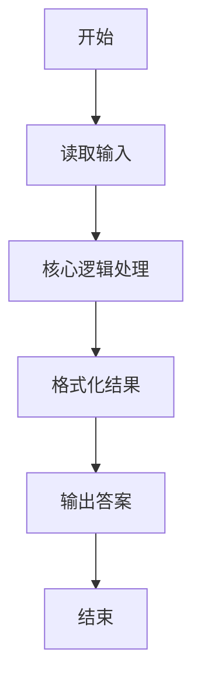
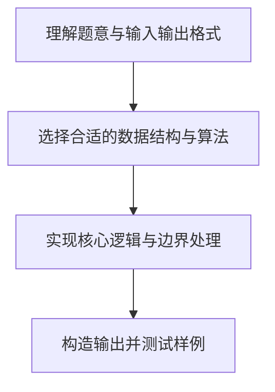

# L1-047 - 装睡（10 分）

- **时间限制**: 400 ms
- **内存限制**: 65536 KB
- **代码长度限制**: 16 KB

---

## 题目描述


你永远叫不醒一个装睡的人 —— 但是通过分析一个人的呼吸频率和脉搏，你可以发现谁在装睡！医生告诉我们，正常人睡眠时的呼吸频率是每分钟15-20次，脉搏是每分钟50-70次。下面给定一系列人的呼吸频率与脉搏，请你找出他们中间有可能在装睡的人，即至少一项指标不在正常范围内的人。

### 输入格式:

输入在第一行给出一个正整数$N$（$\le 10$）。随后$N$行，每行给出一个人的名字（仅由英文字母组成的、长度不超过3个字符的串）、其呼吸频率和脉搏（均为不超过100的正整数）。

### 输出格式:

按照输入顺序检查每个人，如果其至少一项指标不在正常范围内，则输出其名字，每个名字占一行。

### 输入样例:
```in
4
Amy 15 70
Tom 14 60
Joe 18 50
Zoe 21 71
```

### 输出样例:
```out
Tom
Zoe
```

## 示例

### 示例 1

**输入:**
```
4
Amy 15 70
Tom 14 60
Joe 18 50
Zoe 21 71
```

**输出:**
```
Tom
Zoe
```

### 解题思路

本题的核心逻辑为：呼吸次数须在 [15,20]、脉搏须在 [50,70]；任一越界就输出该姓名。根据题意将输入转化为可计算的模型后，直接按规则求解即可。

数据结构上主要使用 循环遍历。通过 Lua 的基础控制结构（条件与循环）配合字符串/数值处理完成核心判断与转换，逻辑直观易于实现。

关键步骤在于准确解析输入、按题面规则处理边界（如空格、符号、进制、整除等）并保证输出格式与样例完全一致。整体时间复杂度多为线性或常数级，满足限制。

### 代码流程说明

1. **读取输入**：通过 `io.read` 读取输入数据（按行或按 token 解析），并按需转换为数值或字符串。
2. **核心处理**：呼吸次数须在 [15,20]、脉搏须在 [50,70]；任一越界就输出该姓名。
3. **逻辑判断/计算**：通过循环与条件分支完成题面要求的判定或累计。
4. **输出结果**：按题目指定格式通过 `print`/`io.write` 输出答案。

### 代码实现

```lua
-- 实现原理：呼吸次数须在 [15,20]、脉搏须在 [50,70]；任一越界就输出该姓名。
local n = tonumber(io.read("*l"))
for _ = 1, n do
    local name, breath, pulse = io.read("*l"):match("(%S+)%s+(%d+)%s+(%d+)")
    breath, pulse = tonumber(breath), tonumber(pulse)
    if breath < 15 or breath > 20 or pulse < 50 or pulse > 70 then print(name) end
end
```

### 代码流程图



### 解题流程图


