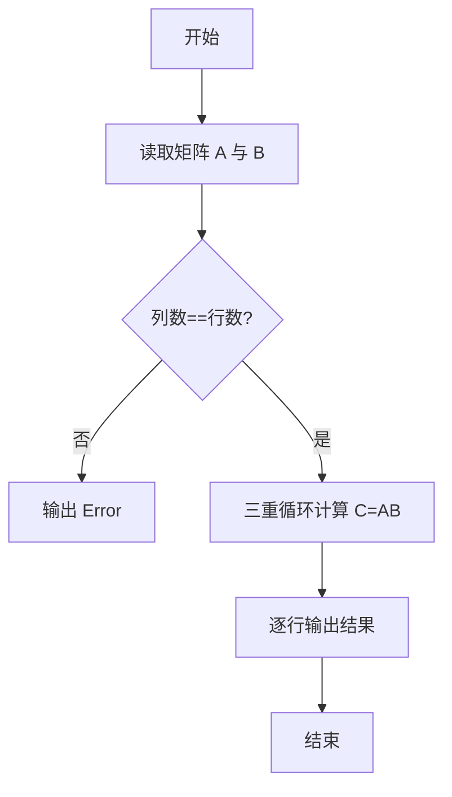
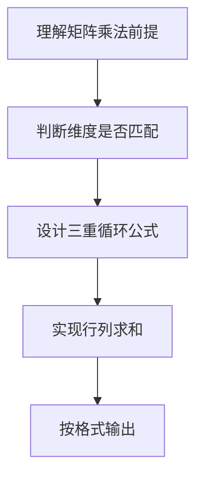

# L1-048 - 矩阵A乘以B（15 分）

- **时间限制**: 400 ms
- **内存限制**: 65536 KB
- **代码长度限制**: 16 KB

---

## 题目描述


给定两个矩阵$$A$$和$$B$$，要求你计算它们的乘积矩阵$$AB$$。需要注意的是，只有规模匹配的矩阵才可以相乘。即若$$A$$有$$R_a$$行、$$C_a$$列，$$B$$有$$R_b$$行、$$C_b$$列，则只有$$C_a$$与$$R_b$$相等时，两个矩阵才能相乘。

### 输入格式:

输入先后给出两个矩阵$$A$$和$$B$$。对于每个矩阵，首先在一行中给出其行数$$R$$和列数$$C$$，随后$$R$$行，每行给出$$C$$个整数，以1个空格分隔，且行首尾没有多余的空格。输入保证两个矩阵的$$R$$和$$C$$都是正数，并且所有整数的绝对值不超过100。

### 输出格式:

若输入的两个矩阵的规模是匹配的，则按照输入的格式输出乘积矩阵$$AB$$，否则输出`Error: Ca != Rb`，其中`Ca`是$$A$$的列数，`Rb`是$$B$$的行数。

### 输入样例 1：
```in
2 3
1 2 3
4 5 6
3 4
7 8 9 0
-1 -2 -3 -4
5 6 7 8
```

### 输出样例 1：
```out
2 4
20 22 24 16
53 58 63 28
```

### 输入样例 2：
```in
3 2
38 26
43 -5
0 17
3 2
-11 57
99 68
81 72
```

### 输出样例 2：
```out
Error: 2 != 3
```

## 示例

### 示例 1

**输入:**
```
2 3
1 2 3
4 5 6
3 4
7 8 9 0
-1 -2 -3 -4
5 6 7 8
```

**输出:**
```
2 4
20 22 24 16
53 58 63 28
```

### 示例 2

**输入:**
```
3 2
38 26
43 -5
0 17
3 2
-11 57
99 68
81 72
```

**输出:**
```
Error: 2 != 3
```

### 解题思路

本题的核心逻辑为：仅在 $A$ 的列数等于 $B$ 的行数时，按 $C_{ij}=\sum_k A_{ik}B_{kj}$ 计算。根据题意将输入转化为可计算的模型后，直接按规则求解即可。

数据结构上使用二维表（`table` 嵌套）存储矩阵 A、B，按行列读取后进行三重循环矩阵乘法。

关键步骤是先判断 A 的列数与 B 的行数是否相等，不等则按题面输出错误信息；相等则计算 C[i][j]=ΣA[i][k]·B[k][j]。

### 代码流程说明

1. **读取输入**：通过 `io.read` 读取输入数据（按行或按 token 解析），并按需转换为数值或字符串。
2. **核心处理**：仅在 $A$ 的列数等于 $B$ 的行数时，按 $C_{ij}=\sum_k A_{ik}B_{kj}$ 计算。
3. **逻辑判断/计算**：通过循环与条件分支完成题面要求的判定或累计。
4. **输出结果**：按题目指定格式通过 `print`/`io.write` 输出答案。

### 代码实现

```lua
-- 实现原理：仅在 A 的列数等于 B 的行数时，按 C[i][j] = ΣA[i][k]B[k][j] 计算。
local function read_numbers()
    local values = {}
    for token in io.read("*l"):gmatch("-?%d+") do values[#values + 1] = tonumber(token) end
    return values
end
local ra, ca = table.unpack(read_numbers())
local a = {}
for i = 1, ra do a[i] = read_numbers() end
local rb, cb = table.unpack(read_numbers())
local b = {}
for i = 1, rb do b[i] = read_numbers() end
if ca ~= rb then
    print("Error: " .. ca .. " != " .. rb)
else
    print(ra .. " " .. cb)
    for i = 1, ra do
        local row = {}
        for j = 1, cb do
            local sum = 0
            for k = 1, ca do sum = sum + a[i][k] * b[k][j] end
            row[j] = sum
        end
        print(table.concat(row, " "))
    end
end
```

### 代码流程图



### 解题流程图


