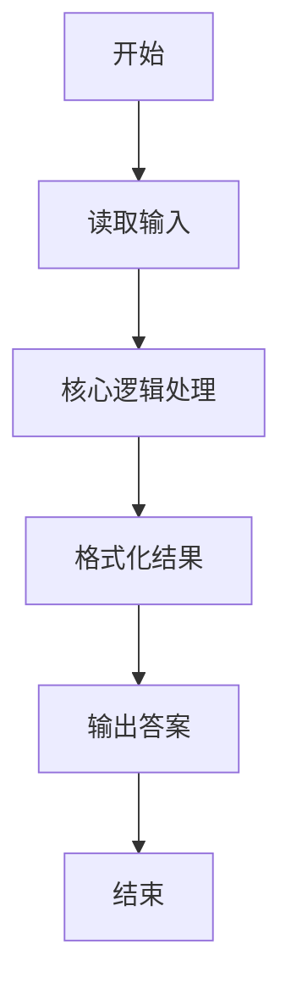
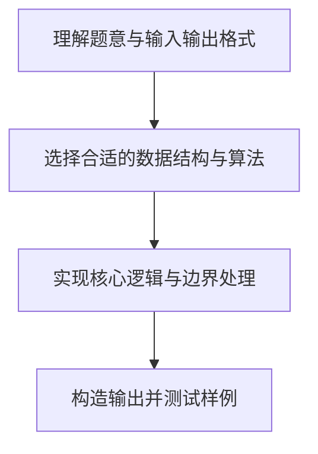

# L1-049 - 天梯赛座位分配（20 分）

- **时间限制**: 400 ms
- **内存限制**: 65536 KB
- **代码长度限制**: 16 KB

---

## 题目描述


天梯赛每年有大量参赛队员，要保证同一所学校的所有队员都不能相邻，分配座位就成为一件比较麻烦的事情。为此我们制定如下策略：假设某赛场有 N 所学校参赛，第 i 所学校有 M[i] 支队伍，每队 10 位参赛选手。令每校选手排成一列纵队，第 i+1 队的选手排在第 i 队选手之后。从第 1 所学校开始，各校的第 1 位队员顺次入座，然后是各校的第 2 位队员…… 以此类推。如果最后只剩下 1 所学校的队伍还没有分配座位，则需要安排他们的队员隔位就坐。本题就要求你编写程序，自动为各校生成队员的座位号，从 1 开始编号。

### 输入格式:

输入在一行中给出参赛的高校数 N （不超过100的正整数）；第二行给出 N 个不超过10的正整数，其中第 i 个数对应第 i 所高校的参赛队伍数，数字间以空格分隔。

### 输出格式:

从第 1 所高校的第 1 支队伍开始，顺次输出队员的座位号。每队占一行，座位号间以 1 个空格分隔，行首尾不得有多余空格。另外，每所高校的第一行按“#X”输出该校的编号X，从 1 开始。

### 输入样例:
```in
3
3 4 2
```

### 输出样例:
```out
#1
1 4 7 10 13 16 19 22 25 28
31 34 37 40 43 46 49 52 55 58
61 63 65 67 69 71 73 75 77 79
#2
2 5 8 11 14 17 20 23 26 29
32 35 38 41 44 47 50 53 56 59
62 64 66 68 70 72 74 76 78 80
82 84 86 88 90 92 94 96 98 100
#3
3 6 9 12 15 18 21 24 27 30
33 36 39 42 45 48 51 54 57 60
```

## 示例

### 示例 1

**输入:**
```
3
3 4 2
```

**输出:**
```
#1
1 4 7 10 13 16 19 22 25 28
31 34 37 40 43 46 49 52 55 58
61 63 65 67 69 71 73 75 77 79
#2
2 5 8 11 14 17 20 23 26 29
32 35 38 41 44 47 50 53 56 59
62 64 66 68 70 72 74 76 78 80
82 84 86 88 90 92 94 96 98 100
#3
3 6 9 12 15 18 21 24 27 30
33 36 39 42 45 48 51 54 57 60
```

### 解题思路

本题的核心逻辑为：多校尚有队员时循环分配相邻座位；只剩一校时座位号每次跳过一个。根据题意将输入转化为可计算的模型后，直接按规则求解即可。

数据结构上主要使用 模式匹配遍历（`gmatch`）、循环枚举。通过 Lua 的基础控制结构（条件与循环）配合字符串/数值处理完成核心判断与转换，逻辑直观易于实现。

关键步骤在于准确解析输入、按题面规则处理边界（如空格、符号、进制、整除等）并保证输出格式与样例完全一致。整体时间复杂度多为线性或常数级，满足限制。

### 代码流程说明

1. **读取输入**：通过 `io.read` 读取输入数据（按行或按 token 解析），并按需转换为数值或字符串。
2. **核心处理**：多校尚有队员时循环分配相邻座位；只剩一校时座位号每次跳过一个。
3. **逻辑判断/计算**：通过循环与条件分支完成题面要求的判定或累计。
4. **输出结果**：按题目指定格式通过 `print`/`io.write` 输出答案。

### 代码实现

```lua
-- 实现原理：多校尚有队员时循环分配相邻座位；只剩一校时座位号每次跳过一个。
local n = tonumber(io.read("*l"))
local teams, remaining, seats = {}, {}, {}
for token in io.read("*l"):gmatch("%d+") do teams[#teams + 1] = tonumber(token) end
for i = 1, n do remaining[i], seats[i] = teams[i] * 10, {} end
local seat = 1
local function active_count()
    local count = 0
    for i = 1, n do if remaining[i] > 0 then count = count + 1 end end
    return count
end
while active_count() > 1 do
    for i = 1, n do
        if remaining[i] > 0 then
            seats[i][#seats[i] + 1] = seat
            remaining[i], seat = remaining[i] - 1, seat + 1
        end
    end
end
for i = 1, n do
    while remaining[i] > 0 do
        seats[i][#seats[i] + 1] = seat
        remaining[i], seat = remaining[i] - 1, seat + 2
    end
end
for i = 1, n do
    print("#" .. i)
    for team = 1, teams[i] do
        local row = {}
        for player = 1, 10 do row[player] = seats[i][(team - 1) * 10 + player] end
        print(table.concat(row, " "))
    end
end
```

### 代码流程图



### 解题流程图


