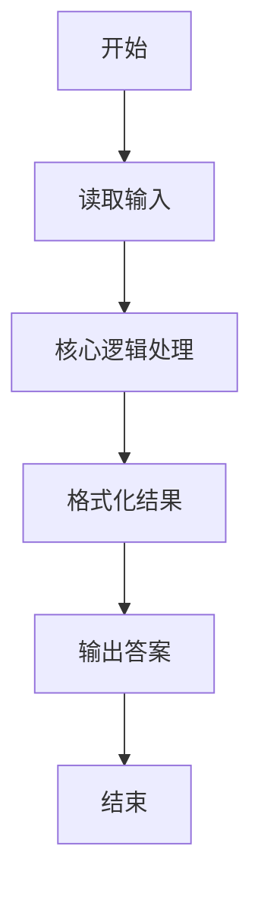
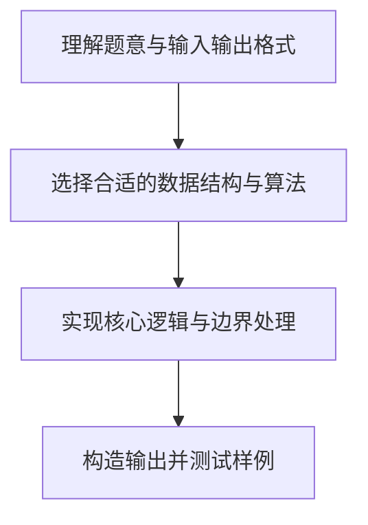

# L1-050 - 倒数第N个字符串（15 分）

- **时间限制**: 400 ms
- **内存限制**: 65536 KB
- **代码长度限制**: 16 KB

---

## 题目描述


给定一个完全由小写英文字母组成的字符串等差递增序列，该序列中的每个字符串的长度固定为 L，从 L 个 a 开始，以 1 为步长递增。例如当 L 为 3 时，序列为 { aaa, aab, aac, ..., aaz, aba, abb, ..., abz, ..., zzz }。这个序列的倒数第27个字符串就是 zyz。对于任意给定的 L，本题要求你给出对应序列倒数第 N 个字符串。

### 输入格式:

输入在一行中给出两个正整数 L（2 $\le$ L $\le$ 6）和 N（$\le 10^5$）。

### 输出格式:

在一行中输出对应序列倒数第 N 个字符串。题目保证这个字符串是存在的。

### 输入样例:
```in
3 7417
```

### 输出样例:
```out
pat
```

## 示例

### 示例 1

**输入:**
```
3 7417
```

**输出:**
```
pat
```

### 解题思路

本题的核心逻辑为：倒数第 $N$ 个等于从 0 开始的 26 进制编号 $26^L-N$，将每位映射为 a 到 z。根据题意将输入转化为可计算的模型后，直接按规则求解即可。

数据结构上主要使用 循环遍历。通过 Lua 的基础控制结构（条件与循环）配合字符串/数值处理完成核心判断与转换，逻辑直观易于实现。

关键步骤在于准确解析输入、按题面规则处理边界（如空格、符号、进制、整除等）并保证输出格式与样例完全一致。整体时间复杂度多为线性或常数级，满足限制。

### 代码流程说明

1. **读取输入**：通过 `io.read` 读取输入数据（按行或按 token 解析），并按需转换为数值或字符串。
2. **核心处理**：倒数第 $N$ 个等于从 0 开始的 26 进制编号 $26^L-N$，将每位映射为 a 到 z。
3. **逻辑判断/计算**：通过循环与条件分支完成题面要求的判定或累计。
4. **输出结果**：按题目指定格式通过 `print`/`io.write` 输出答案。

### 代码实现

```lua
-- 实现原理：倒数第 N 个等于从 0 开始的 26 进制编号 26^L-N，将每位映射为 a 到 z。
local length, n = io.read("*l"):match("(%d+)%s+(%d+)")
length, n = tonumber(length), tonumber(n)
local value = 26 ^ length - n
local chars = {}
for i = length, 1, -1 do
    chars[i] = string.char(string.byte("a") + value % 26)
    value = value // 26
end
print(table.concat(chars))
```

### 代码流程图



### 解题流程图


