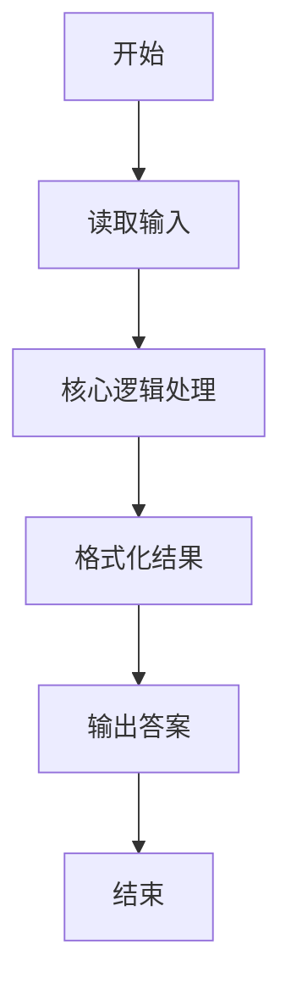
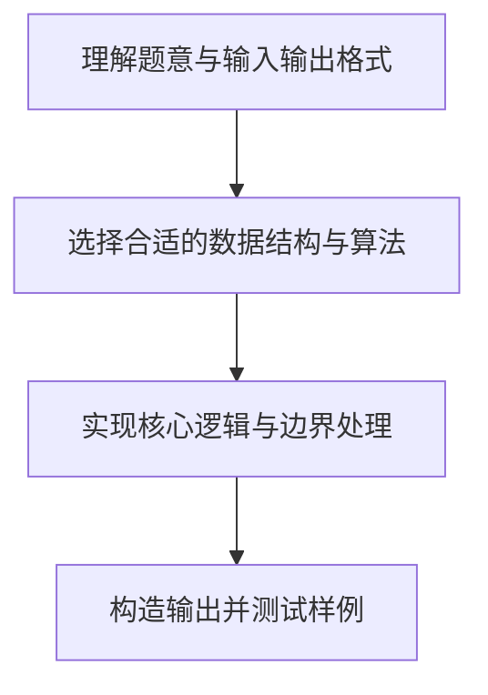

# L1-053 - 电子汪（10 分）

- **时间限制**: 400 ms
- **内存限制**: 65536 KB
- **代码长度限制**: 16 KB

---

## 题目描述


据说汪星人的智商能达到人类 4 岁儿童的水平，更有些聪明汪会做加法计算。比如你在地上放两堆小球，分别有 1 只球和 2 只球，聪明汪就会用“汪！汪！汪！”表示 1 加 2 的结果是 3。

本题要求你为电子宠物汪做一个模拟程序，根据电子眼识别出的两堆小球的个数，计算出和，并且用汪星人的叫声给出答案。

### 输入格式:

输入在一行中给出两个 [1, 9] 区间内的正整数 A 和 B，用空格分隔。

### 输出格式:

在一行中输出 A + B 个`Wang!`。

### 输入样例:
```in
2 1
```

### 输出样例:
```out
Wang!Wang!Wang!
```

## 示例

### 示例 1

**输入:**
```
2 1
```

**输出:**
```
Wang!Wang!Wang!
```

### 解题思路

本题的核心逻辑为：两堆球的总数等于需要连续输出的 Wang! 次数。根据题意将输入转化为可计算的模型后，直接按规则求解即可。

数据结构上主要使用 字符串重复拼接（`string.rep`）。通过 Lua 的基础控制结构（条件与循环）配合字符串/数值处理完成核心判断与转换，逻辑直观易于实现。

关键步骤在于准确解析输入、按题面规则处理边界（如空格、符号、进制、整除等）并保证输出格式与样例完全一致。整体时间复杂度多为线性或常数级，满足限制。

### 代码流程说明

1. **读取输入**：通过 `io.read` 读取输入数据（按行或按 token 解析），并按需转换为数值或字符串。
2. **核心处理**：两堆球的总数等于需要连续输出的 Wang! 次数。
3. **格式化构造**：使用字符串重复/拼接构造输出行。
4. **输出结果**：按题目指定格式通过 `print`/`io.write` 输出答案。

### 代码实现

```lua
-- 实现原理：两堆球的总数等于需要连续输出的 Wang! 次数。
local a, b = io.read("*l"):match("(%d+)%s+(%d+)")
print(string.rep("Wang!", tonumber(a) + tonumber(b)))
```

### 代码流程图



### 解题流程图


