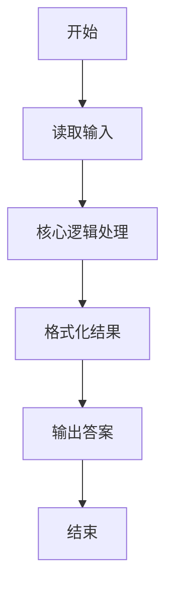
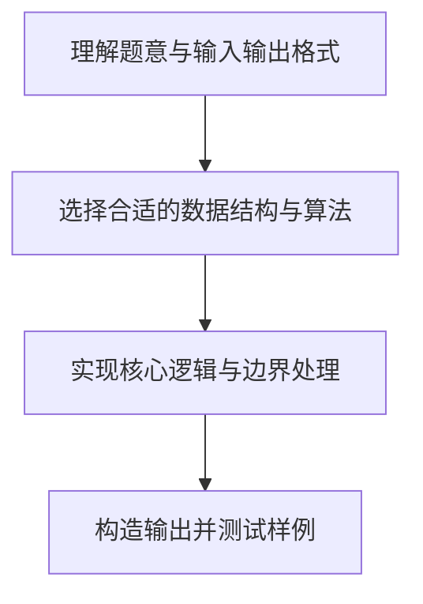

# L1-054 - 福到了（15 分）

- **时间限制**: 400 ms
- **内存限制**: 65536 KB
- **代码长度限制**: 16 KB

---

## 题目描述


“福”字倒着贴，寓意“福到”。不论到底算不算民俗，本题且请你编写程序，把各种汉字倒过来输出。这里要处理的每个汉字是由一个 N $$\times$$ N 的网格组成的，网格中的元素或者为字符 `@` 或者为空格。而倒过来的汉字所用的字符由裁判指定。

### 输入格式:

输入在第一行中给出倒过来的汉字所用的字符、以及网格的规模 N （不超过100的正整数），其间以 1 个空格分隔；随后 N 行，每行给出 N 个字符，或者为 `@` 或者为空格。

### 输出格式:

输出倒置的网格，如样例所示。但是，如果这个字正过来倒过去是一样的，就先输出`bu yong dao le`，然后再用输入指定的字符将其输出。

### 输入样例 1：
```in
$ 9
 @  @@@@@
@@@  @@@ 
 @   @ @ 
@@@  @@@ 
@@@ @@@@@
@@@ @ @ @
@@@ @@@@@
 @  @ @ @
 @  @@@@@
```

### 输出样例 1：
```out
$$$$$  $ 
$ $ $  $ 
$$$$$ $$$
$ $ $ $$$
$$$$$ $$$
 $$$  $$$
 $ $   $ 
 $$$  $$$
$$$$$  $
```

### 输入样例 2：
```in
& 3
@@@
 @ 
@@@
```

### 输出样例 2：
```out
bu yong dao le
&&&
 & 
&&&
```

## 示例

### 示例 1

**输入:**
```
$ 9
 @  @@@@@
@@@  @@@ 
 @   @ @ 
@@@  @@@ 
@@@ @@@@@
@@@ @ @ @
@@@ @@@@@
 @  @ @ @
 @  @@@@@
```

**输出:**
```
$$$$$  $ 
$ $ $  $ 
$$$$$ $$$
$ $ $ $$$
$$$$$ $$$
 $$$  $$$
 $ $   $ 
 $$$  $$$
$$$$$  $
```

### 示例 2

**输入:**
```
& 3
@@@
 @ 
@@@
```

**输出:**
```
bu yong dao le
&&&
 & 
&&&
```

### 解题思路

本题的核心逻辑为：将网格绕中心旋转 180 度；输出时把原图中的 @ 替换为指定字符。根据题意将输入转化为可计算的模型后，直接按规则求解即可。

数据结构上主要使用 循环遍历。通过 Lua 的基础控制结构（条件与循环）配合字符串/数值处理完成核心判断与转换，逻辑直观易于实现。

关键步骤在于准确解析输入、按题面规则处理边界（如空格、符号、进制、整除等）并保证输出格式与样例完全一致。整体时间复杂度多为线性或常数级，满足限制。

### 代码流程说明

1. **读取输入**：通过 `io.read` 读取输入数据（按行或按 token 解析），并按需转换为数值或字符串。
2. **核心处理**：将网格绕中心旋转 180 度；输出时把原图中的 @ 替换为指定字符。
3. **逻辑判断/计算**：通过循环与条件分支完成题面要求的判定或累计。
4. **输出结果**：按题目指定格式通过 `print`/`io.write` 输出答案。

### 代码实现

```lua
-- 实现原理：将网格绕中心旋转 180 度；输出时把原图中的 @ 替换为指定字符。
local symbol, n = io.read("*l"):match("(%S)%s+(%d+)")
n = tonumber(n)
local picture = {}
for i = 1, n do picture[i] = io.read("*l") end
local same = true
for i = 1, n do
    for j = 1, n do
        if picture[i]:sub(j, j) ~= picture[n - i + 1]:sub(n - j + 1, n - j + 1) then same = false end
    end
end
if same then print("bu yong dao le") end
for i = n, 1, -1 do
    local row = {}
    for j = n, 1, -1 do
        local ch = picture[i]:sub(j, j)
        row[#row + 1] = ch == "@" and symbol or " "
    end
    print(table.concat(row))
end
```

### 代码流程图



### 解题流程图


