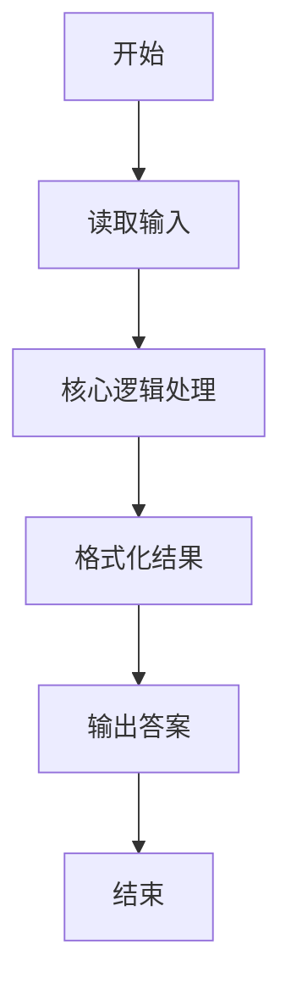
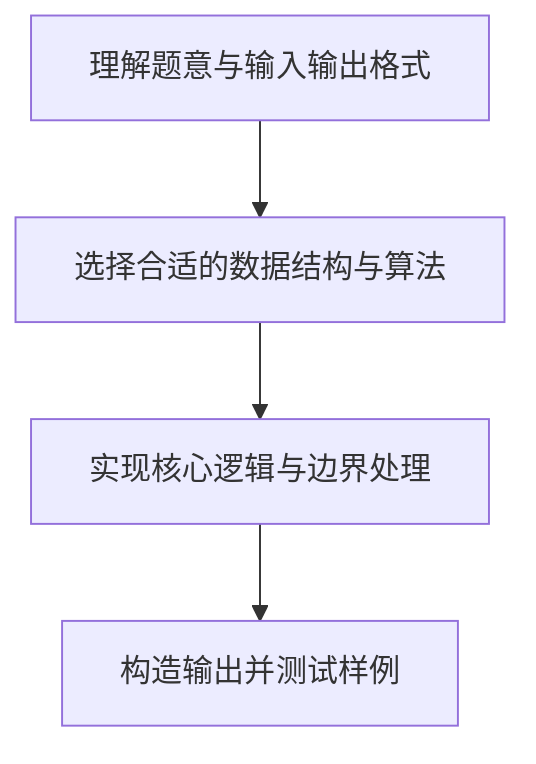

# L1-055 - 谁是赢家（10 分）

- **时间限制**: 400 ms
- **内存限制**: 65536 KB
- **代码长度限制**: 16 KB

---

## 题目描述


某电视台的娱乐节目有个表演评审环节，每次安排两位艺人表演，他们的胜负由观众投票和 3 名评委投票两部分共同决定。规则为：如果一位艺人的观众票数高，且得到至少 1 名评委的认可，该艺人就胜出；或艺人的观众票数低，但得到全部评委的认可，也可以胜出。节目保证投票的观众人数为奇数，所以不存在平票的情况。本题就请你用程序判断谁是赢家。

### 输入格式:

输入第一行给出 2 个不超过 1000 的正整数 Pa 和 Pb，分别是艺人 a 和艺人 b 得到的观众票数。题目保证这两个数字不相等。随后第二行给出 3 名评委的投票结果。数字 0 代表投票给 a，数字 1 代表投票给 b，其间以一个空格分隔。

### 输出格式:

按以下格式输出赢家：

```
The winner is x: P1 + P2
```

其中 `x` 是代表赢家的字母，`P1` 是赢家得到的观众票数，`P2` 是赢家得到的评委票数。

### 输入样例:
```in
327 129
1 0 1
```

### 输出样例:
```out
The winner is a: 327 + 1
```

## 示例

### 示例 1

**输入:**
```
327 129
1 0 1
```

**输出:**
```
The winner is a: 327 + 1
```

### 解题思路

本题的核心逻辑为：统计评委投给 a 的票数，并根据观众票高低套用对应胜出条件。根据题意将输入转化为可计算的模型后，直接按规则求解即可。

数据结构上主要使用 模式匹配遍历（`gmatch`）、循环遍历。通过 Lua 的基础控制结构（条件与循环）配合字符串/数值处理完成核心判断与转换，逻辑直观易于实现。

关键步骤在于准确解析输入、按题面规则处理边界（如空格、符号、进制、整除等）并保证输出格式与样例完全一致。整体时间复杂度多为线性或常数级，满足限制。

### 代码流程说明

1. **读取输入**：通过 `io.read` 读取输入数据（按行或按 token 解析），并按需转换为数值或字符串。
2. **核心处理**：统计评委投给 a 的票数，并根据观众票高低套用对应胜出条件。
3. **逻辑判断/计算**：通过循环与条件分支完成题面要求的判定或累计。
4. **输出结果**：按题目指定格式通过 `print`/`io.write` 输出答案。

### 代码实现

```lua
-- 实现原理：统计评委投给 a 的票数，并根据观众票高低套用对应胜出条件。
local pa, pb = io.read("*l"):match("(%d+)%s+(%d+)")
pa, pb = tonumber(pa), tonumber(pb)
local a_votes = 0
for vote in io.read("*l"):gmatch("%d+") do if vote == "0" then a_votes = a_votes + 1 end end
local a_wins = (pa > pb and a_votes >= 1) or (pa < pb and a_votes == 3)
if a_wins then
    print("The winner is a: " .. pa .. " + " .. a_votes)
else
    print("The winner is b: " .. pb .. " + " .. (3 - a_votes))
end
```

### 代码流程图



### 解题流程图


