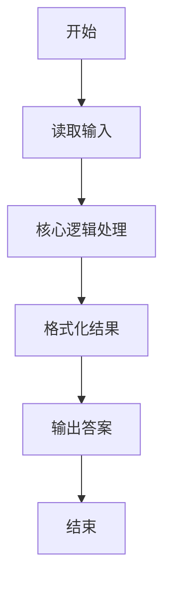
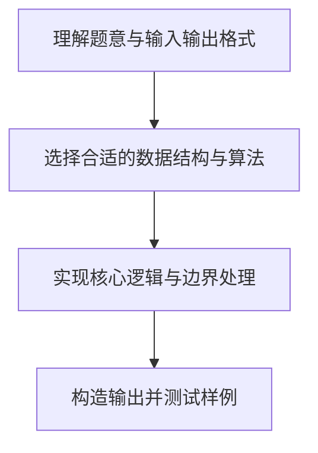

# L1-056 - 猜数字（20 分）

- **时间限制**: 400 ms
- **内存限制**: 65536 KB
- **代码长度限制**: 16 KB

---

## 题目描述


一群人坐在一起，每人猜一个 100 以内的数，谁的数字最接近大家平均数的一半就赢。本题就要求你找出其中的赢家。

### 输入格式:

输入在第一行给出一个正整数N（$$\le 10^4$$）。随后 N 行，每行给出一个玩家的名字（由不超过8个英文字母组成的字符串）和其猜的正整数（$$\le$$ 100）。

### 输出格式:

在一行中顺序输出：大家平均数的一半（只输出整数部分）、赢家的名字，其间以空格分隔。题目保证赢家是唯一的。

### 输入样例:
```in
7
Bob 35
Amy 28
James 98
Alice 11
Jack 45
Smith 33
Chris 62
```

### 输出样例:
```out
22 Amy
```

## 示例

### 示例 1

**输入:**
```
7
Bob 35
Amy 28
James 98
Alice 11
Jack 45
Smith 33
Chris 62
```

**输出:**
```
22 Amy
```

### 解题思路

本题的核心逻辑为：目标为所有猜测总和除以人数再除以 2 的整数部分；选与其距离最小的人。根据题意将输入转化为可计算的模型后，直接按规则求解即可。

数据结构上主要使用 数学库（`math`）、循环遍历。通过 Lua 的基础控制结构（条件与循环）配合字符串/数值处理完成核心判断与转换，逻辑直观易于实现。

关键步骤在于准确解析输入、按题面规则处理边界（如空格、符号、进制、整除等）并保证输出格式与样例完全一致。整体时间复杂度多为线性或常数级，满足限制。

### 代码流程说明

1. **读取输入**：通过 `io.read` 读取输入数据（按行或按 token 解析），并按需转换为数值或字符串。
2. **核心处理**：目标为所有猜测总和除以人数再除以 2 的整数部分；选与其距离最小的人。
3. **逻辑判断/计算**：通过循环与条件分支完成题面要求的判定或累计。
4. **输出结果**：按题目指定格式通过 `print`/`io.write` 输出答案。

### 代码实现

```lua
-- 实现原理：目标为所有猜测总和除以人数再除以 2 的整数部分；选与其距离最小的人。
local n = tonumber(io.read("*l"))
local players, sum = {}, 0
for i = 1, n do
    local name, value = io.read("*l"):match("(%S+)%s+(%d+)")
    players[i] = { name = name, value = tonumber(value) }
    sum = sum + players[i].value
end
local target, winner, distance = (sum // n) // 2, nil, math.huge
for _, player in ipairs(players) do
    local d = math.abs(player.value - target)
    if d < distance then winner, distance = player.name, d end
end
print(target .. " " .. winner)
```

### 代码流程图



### 解题流程图


