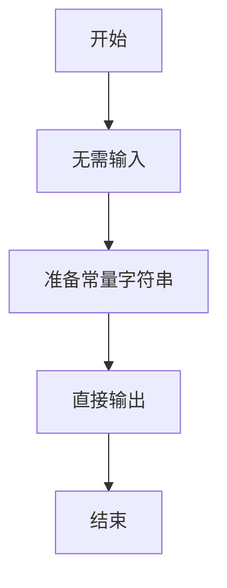
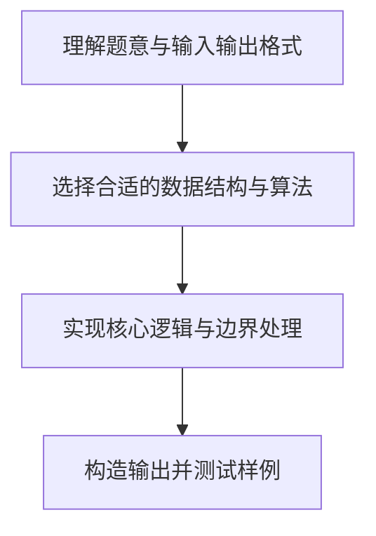

# L1-057 - PTA使我精神焕发（5 分）

- **时间限制**: 400 ms
- **内存限制**: 65536 KB
- **代码长度限制**: 16 KB

---

## 题目描述


以上是湖北经济学院同学的大作。本题就请你用汉语拼音输出这句话。

### 输入格式:

本题没有输入。

### 输出格式:

在一行中按照样例输出，以惊叹号结尾。

### 输入样例:
```in
无
```

### 输出样例:
```out
PTA shi3 wo3 jing1 shen2 huan4 fa1 !
```

## 示例

### 示例 1

**输入:**
```
无
```

**输出:**
```
PTA shi3 wo3 jing1 shen2 huan4 fa1 !
```

### 解题思路

本题的核心逻辑为：题目无输入，输出指定的拼音句子。根据题意将输入转化为可计算的模型后，直接按规则求解即可。

数据结构上主要使用 基础变量与条件分支。通过 Lua 的基础控制结构（条件与循环）配合字符串/数值处理完成核心判断与转换，逻辑直观易于实现。

关键步骤在于准确解析输入、按题面规则处理边界（如空格、符号、进制、整除等）并保证输出格式与样例完全一致。整体时间复杂度多为线性或常数级，满足限制。

### 代码流程说明

1. **初始化**：无需读取输入，程序直接准备输出常量。
2. **核心处理**：题目无输入，输出指定的拼音句子。
3. **逻辑判断/计算**：通过循环与条件分支完成题面要求的判定或累计。
4. **输出结果**：按题目指定格式通过 `print`/`io.write` 输出答案。

### 代码实现

```lua
-- 实现原理：题目无输入，输出指定的拼音句子。
print("PTA shi3 wo3 jing1 shen2 huan4 fa1 !")
```

### 代码流程图



### 解题流程图


