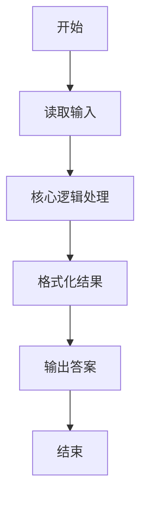
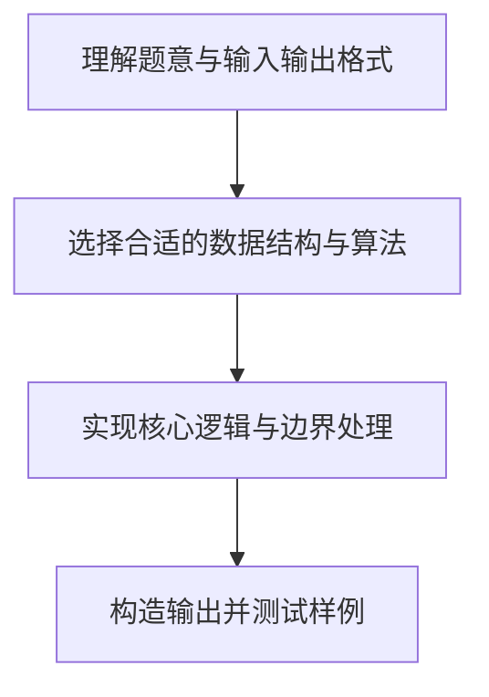

# L1-058 - 6翻了（15 分）

- **时间限制**: 400 ms
- **内存限制**: 65536 KB
- **代码长度限制**: 16 KB

---

## 题目描述


“666”是一种网络用语，大概是表示某人很厉害、我们很佩服的意思。最近又衍生出另一个数字“9”，意思是“6翻了”，实在太厉害的意思。如果你以为这就是厉害的最高境界，那就错啦 —— 目前的最高境界是数字“27”，因为这是 3 个 “9”！

本题就请你编写程序，将那些过时的、只会用一连串“6666……6”表达仰慕的句子，翻译成最新的高级表达。

### 输入格式:

输入在一行中给出一句话，即一个非空字符串，由不超过 1000 个英文字母、数字和空格组成，以回车结束。

### 输出格式:

从左到右扫描输入的句子：如果句子中有超过 3 个连续的 6，则将这串连续的 6 替换成 9；但如果有超过 9 个连续的 6，则将这串连续的 6 替换成 27。其他内容不受影响，原样输出。

### 输入样例:
```in
it is so 666 really 6666 what else can I say 6666666666
```

### 输出样例:
```out
it is so 666 really 9 what else can I say 27
```

## 示例

### 示例 1

**输入:**
```
it is so 666 really 6666 what else can I say 6666666666
```

**输出:**
```
it is so 666 really 9 what else can I say 27
```

### 解题思路

本题的核心逻辑为：用模式匹配连续的 6；长度大于 9 替换为 27，长度大于 3 替换为 9。根据题意将输入转化为可计算的模型后，直接按规则求解即可。

数据结构上主要使用 正则/模式替换（`string.gsub`）。通过 Lua 的基础控制结构（条件与循环）配合字符串/数值处理完成核心判断与转换，逻辑直观易于实现。

关键步骤在于准确解析输入、按题面规则处理边界（如空格、符号、进制、整除等）并保证输出格式与样例完全一致。整体时间复杂度多为线性或常数级，满足限制。

### 代码流程说明

1. **读取输入**：通过 `io.read` 读取输入数据（按行或按 token 解析），并按需转换为数值或字符串。
2. **核心处理**：用模式匹配连续的 6；长度大于 9 替换为 27，长度大于 3 替换为 9。
3. **逻辑判断/计算**：通过循环与条件分支完成题面要求的判定或累计。
4. **输出结果**：按题目指定格式通过 `print`/`io.write` 输出答案。

### 代码实现

```lua
-- 实现原理：用模式匹配连续的 6；长度大于 9 替换为 27，长度大于 3 替换为 9。
local sentence = io.read("*l")
sentence = sentence:gsub("6+", function(run)
    if #run > 9 then return "27" end
    if #run > 3 then return "9" end
    return run
end)
print(sentence)
```

### 代码流程图



### 解题流程图


