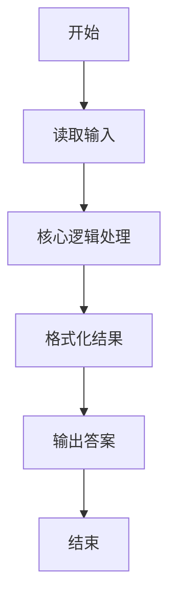
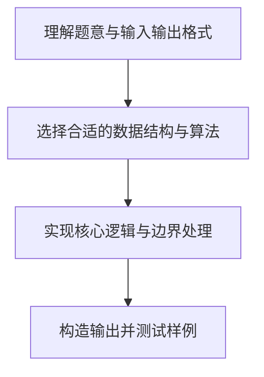

# L1-059 - 敲笨钟（20 分）

- **时间限制**: 400 ms
- **内存限制**: 65536 KB
- **代码长度限制**: 16 KB

---

## 题目描述


微博上有个自称“大笨钟V”的家伙，每天敲钟催促码农们爱惜身体早点睡觉。为了增加敲钟的趣味性，还会糟改几句古诗词。其糟改的方法为：去网上搜寻压“ong”韵的古诗词，把句尾的三个字换成“敲笨钟”。例如唐代诗人李贺有名句曰：“寻章摘句老雕虫，晓月当帘挂玉弓”，其中“虫”（chong）和“弓”（gong）都压了“ong”韵。于是这句诗就被糟改为“寻章摘句老雕虫，晓月当帘敲笨钟”。

现在给你一大堆古诗词句，要求你写个程序自动将压“ong”韵的句子糟改成“敲笨钟”。

### 输入格式:

输入首先在第一行给出一个不超过 20 的正整数 N。随后 N 行，每行用汉语拼音给出一句古诗词，分上下两半句，用逗号 `,` 分隔，句号 `.` 结尾。相邻两字的拼音之间用一个空格分隔。题目保证每个字的拼音不超过 6 个字符，每行字符的总长度不超过 100，并且下半句诗至少有 3 个字。

### 输出格式:

对每一行诗句，判断其是否压“ong”韵。即上下两句末尾的字都是“ong”结尾。如果是压此韵的，就按题面方法糟改之后输出，输出格式同输入；否则输出 `Skipped`，即跳过此句。

### 输入样例:
```in
5
xun zhang zhai ju lao diao chong, xiao yue dang lian gua yu gong.
tian sheng wo cai bi you yong, qian jin san jin huan fu lai.
xue zhui rou zhi leng wei rong, an xiao chen jing shu wei long.
zuo ye xing chen zuo ye feng, hua lou xi pan gui tang dong.
ren xian gui hua luo, ye jing chun shan kong.
```

### 输出样例:
```out
xun zhang zhai ju lao diao chong, xiao yue dang lian qiao ben zhong.
Skipped
xue zhui rou zhi leng wei rong, an xiao chen jing qiao ben zhong.
Skipped
Skipped
```

## 示例

### 示例 1

**输入:**
```
5
xun zhang zhai ju lao diao chong, xiao yue dang lian gua yu gong.
tian sheng wo cai bi you yong, qian jin san jin huan fu lai.
xue zhui rou zhi leng wei rong, an xiao chen jing shu wei long.
zuo ye xing chen zuo ye feng, hua lou xi pan gui tang dong.
ren xian gui hua luo, ye jing chun shan kong.
```

**输出:**
```
xun zhang zhai ju lao diao chong, xiao yue dang lian qiao ben zhong.
Skipped
xue zhui rou zhi leng wei rong, an xiao chen jing qiao ben zhong.
Skipped
Skipped
```

### 解题思路

本题的核心逻辑为：分别检查逗号前、句号前的最后一个拼音是否以 ong 结尾；满足时替换后半句最后三词。根据题意将输入转化为可计算的模型后，直接按规则求解即可。

数据结构上主要使用 正则/模式替换（`string.gsub`）、循环遍历。通过 Lua 的基础控制结构（条件与循环）配合字符串/数值处理完成核心判断与转换，逻辑直观易于实现。

关键步骤在于准确解析输入、按题面规则处理边界（如空格、符号、进制、整除等）并保证输出格式与样例完全一致。整体时间复杂度多为线性或常数级，满足限制。

### 代码流程说明

1. **读取输入**：通过 `io.read` 读取输入数据（按行或按 token 解析），并按需转换为数值或字符串。
2. **核心处理**：分别检查逗号前、句号前的最后一个拼音是否以 ong 结尾；满足时替换后半句最后三词。
3. **逻辑判断/计算**：通过循环与条件分支完成题面要求的判定或累计。
4. **输出结果**：按题目指定格式通过 `print`/`io.write` 输出答案。

### 代码实现

```lua
-- 实现原理：分别检查逗号前、句号前的最后一个拼音是否以 ong 结尾；满足时替换后半句最后三词。
local n = tonumber(io.read("*l"))
for _ = 1, n do
    local line = io.read("*l")
    local left, right = line:match("^(.-),%s*(.-)%.$")
    local left_last = left:match("(%S+)$")
    local right_last = right:match("(%S+)$")
    if left_last:sub(-3) == "ong" and right_last:sub(-3) == "ong" then
        line = line:gsub("%S+%s+%S+%s+%S+%.$", "qiao ben zhong.")
        print(line)
    else
        print("Skipped")
    end
end
```

### 代码流程图



### 解题流程图


