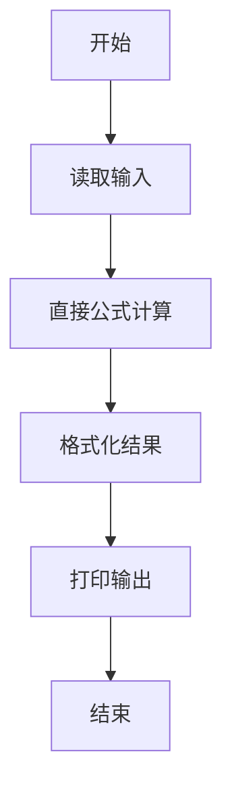
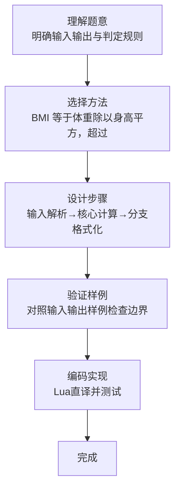

# L1-061 - 新胖子公式（10 分）

- **时间限制**: 400 ms
- **内存限制**: 65536 KB
- **代码长度限制**: 16 KB

---

## 题目描述


根据钱江晚报官方微博的报导，最新的肥胖计算方法为：体重(kg) / 身高(m) 的平方。如果超过 25，你就是胖子。于是本题就请你编写程序自动判断一个人到底算不算胖子。

### 输入格式:

输入在一行中给出两个正数，依次为一个人的体重（以 kg 为单位）和身高（以 m 为单位），其间以空格分隔。其中体重不超过 1000 kg，身高不超过 3.0 m。

### 输出格式:

首先输出将该人的体重和身高代入肥胖公式的计算结果，保留小数点后 1 位。如果这个数值大于 25，就在第二行输出 `PANG`，否则输出 `Hai Xing`。

### 输入样例 1：
```in
100.1 1.74
```

### 输出样例 1：
```out
33.1
PANG
```

### 输入样例 2：
```in
65 1.70
```

### 输出样例 2：
```out
22.5
Hai Xing
```

## 示例

### 示例 1

**输入:**
```
100.1 1.74
```

**输出:**
```
33.1
PANG
```

### 示例 2

**输入:**
```
65 1.70
```

**输出:**
```
22.5
Hai Xing
```
### 解题思路

本题属于新胖子公式题型，核心在于BMI 等于体重除以身高平方，超过 25 时判为 PANG。输入规模较小，可直接按题意模拟，无需复杂数据结构。

算法直接按公式或规则计算：读取输入后通过算术或字符串运算一次性得到结果，无需循环，体现为代码中的直算与格式化输出。

边界与精度方面，需处理输入首尾空格、空行及数值类型转换；输出按题面要求的格式（如保留小数、固定文案）使用 `string.format`/`print` 精确控制，确保样例一致。

### 代码流程说明

1. **输入解析**：使用 `io.read("*l"):match` 按模式提取字段并经 `tonumber` 转换，得到数值或字符串形式的原始数据，必要时做 `tonumber` 类型转换与去空格处理。
2. **核心计算**：BMI 等于体重除以身高平方，超过 25 时判为 PANG，通过一次算术或逻辑表达式直接求得结果。
3. **结果整理**：对计算结果进行格式化或拼接（如 `string.format`、`table.concat`），保证输出符合样例。
4. **输出**：通过 `print` 按行输出结果，含必要的换行与精度控制，完成题目要求的全部输出。

### 代码实现

```lua
-- 实现原理：BMI 等于体重除以身高平方，超过 25 时判为 PANG。
local weight, height = io.read("*l"):match("([%d.]+)%s+([%d.]+)")
local bmi = tonumber(weight) / tonumber(height) ^ 2
print(string.format("%.1f", bmi))
print(bmi > 25 and "PANG" or "Hai Xing")
```

### 代码流程图



### 解题流程图


